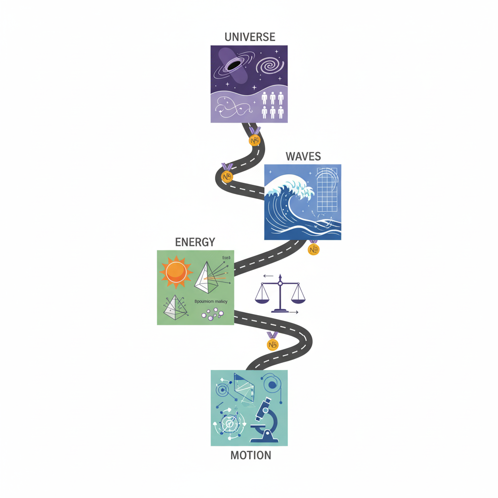

# Modern Physics by exploring Nobel Prizes

(Image credit: Gemini.AI)

***

A journey in Modern Physics based on the works of Physics Nobel Prize recipients.

## I.	[MOTION](./vol-I/volume-I.md)

### I.1 [Dictatorial and democratic conceptualizations of spaces ](./vol-I/vol-I-chap-1-sect-1.md)
### I.2 [Production and control of electronic motions](./vol-I/vol-I-chap-2-sect-1.md)
### I.3 [Detection of signals with the eye and the microscope](./vol-I/vol-I-chap-3-sect-1.md)
### I.4 [Geometrization of the description of motion](./vol-I/vol-I-chap-4-sect-1.md)
### I.5 Electron dynamics in matter (2023 Physics Nobel Prize) - TBD

## II.	[ENERGY](./vol-II/volume-II.md)

### II.6  [Energy quantization in the black body radiation](./vol-II/vol-II-chap-6-sect-1.md).
### II.7  [Spectroscopic studies of atomic structures](./vol-II/vol-II-chap-7-sect-1.md).
### II.8  [Brownian motion and specific heat](./vol-II/vol-II-chap-8-sect-1.md). 
### II.9  [Conservation and transformation of energy](./vol-II/vol-II-chap-9-sect-1.md).
### II.10 Experiments with entangled photons (2022 Physics Nobel Prize) - TBD

## III.	[WAVES](./vol-III/volume-III.md)

### III.11 [Matter waves and electron diffraction](./vol-III/vol-III-chap-11-sect-1.md).
### III.12 [Optical and gravitational waves](./vol-III/vol-III-chap-12-sect-1.md).
### III.13 [Collective waves in condensed matter](./vol-III/vol-III-chap-13-sect-1.md). 
### III.14 [Quantum waves and entanglement](./vol-III/vol-III-chap-14-sect-1.md).
### III.15 Microscopic quantum tunneling (2025 Physics Nobel Prize).

## IV.	[UNIVERSE](./vol-IV/volume-IV.md)

### IV.16 [Development of knowledge in high energy physics](./vol-IV/vol-IV-chap-16-sect-1.md).
### IV.17 [Evolution of cosmology](./vol-IV/vol-IV-chap-17-sect-1.md).
### IV.18 Understanding of complex physical systems (2021 Physics Nobel Prize) - TBD
### IV.19 Machine learning with artificial neural networks (2024 Physics Nobel Prize) - TBD
### IV.20 [Universes composed by humans and societies](./vol-IV/vol-IV-chap-20-sect-1.md).

***

Created: 2023-03-12; Updated: 2023-11-24 

Jorge Barojas-Weber, Carlos Lizárraga-Celaya

[Attribution-NonCommercial-ShareAlike 4.0 International](https://creativecommons.org/licenses/by-nc-sa/4.0/legalcode)

