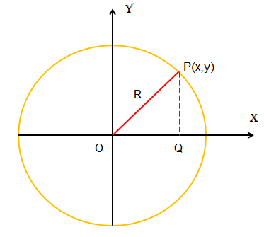
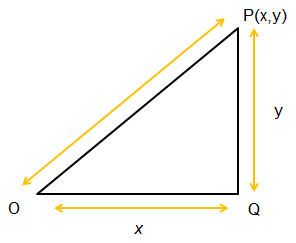

[**Volume I: Motion**](./volume-I.md)

***

# 1.   Dictatorial and democratic conceptualizations of spaces.

!!! abstract "Introduction."
	*What are the main characteristics of dictatorial or democratic conceptualizations?*
	
	We understand by conceptualization a style for creating concepts; it is a process concerning the formation of ideas. 

	After this Chapter you should be able to: 
	
	- Describe some ancient Greece contributions in mathematics and science in terms of democratic and dictatorial conceptualizations of space.
	
	- Explain the Nobel Prizes awarded to Wolfgang Pauli and Max Born for their development of quantum statistics.
	
	- Identify Archimedes steps followed by him to solve the golden crown problem presented by King Heron.

!!! abstract "Description of content of Chapter 1."
	**Section 1.1. Mathematics and science in ancient Greece.**

	We consider early Greek contributions to mathematics and science, in particular some works made by Archimedes. We present two possibilities for interpreting and teaching mathematics by following dictatorial and democratic approaches. We describe an example of these approaches in connection with the obtention of the equation of the circumference by applying Pythagoras theorem.

	**Section 1.2. Conceptualizations of spaces and quantum statistics.**

	We explain two ancient Greek conceptualizations concerning dictatorial or democratic approaches for building circular spaces in family life and community and for using the concept of circularity in the definition of astronomical spaces. 

	The same two conceptualizations of space are applied in a different context: the notion of quantum statistics in Physics. Elementary particles are classified as belonging to different families: fermions like electrons obey the exclusion principle according to a sort of dictatorial conceptualization and bosons like photons show condensation according to a sort of democratic conceptualization.  We consider Nobel Lectures by Wolfgang Pauli (1945 Prize) and Max Born (1954 Prize), awarded for their contributions to the development of quantum statistics.

	**Section 1.3. Context learning for conceptualizing cognitive spaces.**

	We apply the procedure *Context learning for conceptualizing cognitive spaces* to the description of the solution proposed by Archimedes to the problem of the golden crown asked by King Heron. Context learning requires three steps: exploring problematic situations, analyzing leading questions, and performing learning and evaluation activities.

## 1.1.	Mathematics and science in ancient Greece.

### Ancient Greece.

#### Important builders in ancient Greece.

According to Bernal (1954): *“modern science comes directly from Greeks science; they provided a scheme, a method and a language”.* Some of the most significative protagonists are indicated in Figure 1.1 and relevant contributions to mathematics, astronomy and physics are described in Table 1.1 (all dates are BC).

<table width="100%">
<tbody>
   <tr>
      <td>
        
     </td>
     <td>
        
     </td>
     <td>
        
     </td>
     <td>
        
     </td>
     <td>
        
     </td>
     <td>
        
     </td>
   </tr>
   </tr>
  <tr>
    <td>
    Pythagoras  
    (570?-495?)
  </td>
    <td>
    Pericles  
    (495-429)
  </td>
     <td>
    Socrates  
    (469?-399)
  </td>
    <td>
    Plato  
    (427-347)
  </td>
     <td>
    Aristotle  
    (384-322)
  </td>
    <td>
    Alexander the Great  
    (356-323)
  </td>
  </tr>
   </tbody>
</table> 

(Images credit: CC Wikimedia Commons)

**Figure 1.1.** Six important builders of mathematics, philosophy and politics in ancient Greece. 

#### Timeline of ancient Greece.

Principal social and cultural events as well as relevant contributions to mathematics, astronomy and physics are described in Table 1.1 (all dates are BC). Information has been obtained from Durant (1966) and Hellemans and Bunch (1988).

<!-- HTML Table 1.1.1-->
<table width="100%">
    <tr>
        <th colspan="2" style="text-align: center"> 
    Table 1.1. Timeline of ancient Greece 
        </th>
    </tr>
  <tr>
    <th width="50%" style="text-align: center">
  SOCIAL AND CULTURAL EVENTS
    </th>
    <th width="50%" style="text-align: center">
MATHEMATICS, ASTRONOMY 
AND PHYSICS
    </th>
  </tr>
  <tr>
        <th colspan="2" style="text-align: center">
		1.	The rise of Greece (1000 – 480)
		</th>
    </tr>
  <tr>
    <td >
    Foundation of Athens (1582) and Thebes (1313). 
    Siege of Troy (1192-1183). 
    Homer´s Iliad and Odyssey (around 840). 
    Hesiod´s Theogony (between 700 and 800). 
    Solon of Athens: political and social reforms (638-558). 
    Violent attack to Pythagoreans in Crotona (around 508).
    </td>
    <td>
    Thales of Miletus (624-546) predicted a solar eclipse (585). 
    Anaximander of Miletus (610-546) used a solar clock (570). 
    Pythagoras of Samos (529-475) taught that Earth is at the center of the universe. 
    Parmenides of Elea (514-470) published a philosphical poem On Nature.
    </td>
    </tr>
    <tr>
        <th colspan="2" style="text-align: center">2.	The Golden age (480 – 400)</th>
    </tr>
  <tr>
    <td>
    Pericles of Athens (495-429): politician and general that promoted social and cultural reforms.  
    Socrates of Athens (470-399): moral philosopher. His lectures have been published as Plato´s Dialogues.  
    Xenophon of Athens (431-354) wrote the Anabasis or Ten Thousand Expedition (between 385 and 368).  
    Empedocles of Akragas, Sicily (484-424): author of the theory of the four elements;his cosmic cycle referred to the conflict between love and strife.  
    </td>
    <td>
    Anaxagoras of Clazomenea, Ionia (500-428) taught that the Sun was not a god but an incandescent fire ball; he considered an ordering force called Nous (cosmic mind).  
    Philolaus of Croton (470-380) assumed that a central fire surrounded by the Sun, the Moon and the planets.  
    Leucippus of Miletus (siglo V a.C.) and his pupil Democritus of Abdera, Thrace (460-357) taught that atoms are indivisible, always in motion and different in size and shape.  
    </td>
  </tr>
    <tr>
        <th colspan="2" style="text-align: center">3.	 The decline and fall of Greek freedom and the helenistic dispersion (400 – 146)</th>
    </tr>
  <tr>
    <td>
    Plato of Athens (427-347): in 386-7 he created the Academy; he wrote innovative dialogues and dialectic forms in philosophy.  
    Aristotle of Stagira (384-322): around 334 he created the Lyceum, a peripatetic school of philosophy and a library; he tutored Alexander the Great around 343. 
    Heracleides of Pontus (387-312) wrote about grammar, music, poetry, rhetoric, history, geometry, logic and ethics; he suggested that Mercury and Venus were orbiting the Sun and that the earth itself rotates daily upon its axis. 
    Epicurus of Samos (341-270): around 306 he created the school of philosophy The Garden (Ho Kepos): a community that admitted women as a rule not as an exception. 
    </td>
    <td>
    Dicaearchus of Messana (370/323-320): a cartographer who around 355 built a map where the earth has a spherical form. 
    Euclide of Alexandria (325 -265??): author of the Elementos, thirteen books on geometry, arithmetic, and solid geometry.  
    Aristarchus of Samos (280-264) wrote On the Sizes and Distances of the Sun and the Moon. 
    Eratosthenes of Cyrene (276- 194) calculated the circumference of the Earth.  
    Apollonius of Perga (240-190): author of Conics and a theory of epicycles for describing planetary motions.  
    Archimedes of Syracuse (287-212): great mathematician, physicist, engineer, astronomer and inventor; he anticipated modern methods of calculus and analysis. 
    </td>
  </tr>
</table>

### Archimedes

The most outstanding scientist in ancient Greece is without any doubt Archimedes. Archimedes name means in Greek “superior mind”. He was born in Syracuse in 287 B.C and died in 212 B.C. when a roman soldier killed him during the assault to the city.  His father was the astronomer Pheidias. Archimedes studied in Alexandria under the successors of Euclid. 

According to Durant (1966), the ten Archimedes´ books that survived had the following purposes:
	
1. *The Method*: to explain how mechanical experiments can extend geometrical knowledge. 
	
2. *A Collection of Lemas*: to discuss alternative hypothesis in plane geometry. 
	
3. *The Measurement of a Circle*: to calculate de value of π by using the method of exhaustion: he obtained the following bound values: 3 + 10/71 < π < 3 + 10/70. 
	
4. *The Quadrature of the Parabola studies*: to calculate the area cut off from a parabola by a chord and the area of an ellipse. 
	
5. *On Spirals*: to define the procedure to draw a spiral and find the area enclosed by such a figure by methods approximating differential calculus. 
	
6. *The Sphere and the Cylinder*: to calculate the volume and the surface of these figures as well as those of a Pyramid and a cone. 
	
7. *On Conoids and Spheroids*: to study the solids generated by the revolution of conic sections about their axes. 
	
8. *The Sand-Reckoner*: to represent very large numbers like the number of sand grains in the universe. 
	
9. *On Plane Equilibrium*: to apply geometry to mechanics and to calculate the center of gravity of various bodies. 
	
10. *On Floating Bodies*: to find the position of equilibrium of a floating body. 

#### Archimedes´ contributions.

To calculate Archimedes made a kind of mental experiments by thinking about geometrical figures as physical objects made of very small components in equilibrium. He wrote a treatise on Statics where he explained the working principles of the balance and the lever. According to Durant (1966), in Proposition VI of this treatise Archimedes wrote that *“Commensurable magnitudes will balance at distances inversely proportional to their gravities”.*
	
Archimedes had great mechanical skills for designing and building machines while he tried to understand their functioning by making possible different energy transformations. Archimedes created a hydraulic screw to pump water, built a catapult for handling up to 80 kilos stones and prepared a pulley system to pull up ships with a hook and crush them against the walls of the city. He also organized an optical concave system with soldiers’ metallic shields to concentrate sun rays and burn enemy ships. (Figure 1.2).
	

	
	

	

(Images credit: CC Wikimedia Commons)

	
**Figure 1.2.**  An artistic representation of contributions made by Archimedes combining mathematics and physics. How Archimedes used sun light to burn enemy ships.

### Dictatorial and democratic approaches in mathematical reasoning.

#### Description of approaches.

Mathematics is a language for explaining nature, a way of thinking for doing science and a practical instrument for solving problems. We might teach by imposing rules of thinking and presenting solutions to problems according to prescribed procedures or we start by understanding what the students know and then build concepts and answer questions.

As an example of diametral approaches for interpreting mathematical concepts and procedures let us consider two possibilities for explaining the meaning of the equation of a circumference: (1) in a *dictatorial* approach all the distances between the center and any point in the curve must be a constant, and (2) in a *democratic* approach all the points in a circumference are at equal distances to the center. Dictatorial approaches are repulsive, restrictive, centrifugal and go from the center to the periphery. Democratic approaches are attractive, liberating, centripetal and go from the periphery to the center.  

!!! example "A geometrical example."
  The equation of a circumference can be obtained by applying Pythagoras theorem: in cartesian coordinates we have $x^2 + y^2 = R^2$. This equation could be described according to the previously mentioned approaches: in a dictatorial approach the distance from any point $P(x,y)$ to the center in $O$ must be equal to $R$; in a democratic approach the coordinates of all points $P(x,y)$ equally satisfy the same equation $x^2 + y^2 = R^2$ (Figure 1.3). The main steps to be followed are now described.

  **STEP 1**

  - Consider two perpendicular axes intersecting at point $O$: the horizontal axe $X$ for the abscissas and the vertical axe $Y$ for the ordinates.  
  - Draw a circumference of radio $R$ with center in $O$.
  - Select a point $P(x,y)$ whose coordinates are $x$ and $y$; then draw a parallel to axe $Y$ from point $P$ to the intersection $Q$ in axe $X$. 

  

	{width="300"}
	

  

  (Image credit: drawings made by the authors.)
  

  **STEP 2**

  - In the rectangular triangle $OQP$ segments $OQ$ and $QP$ correspond to the legs and segment $OP$ is the hypotenuse. 
  - Apply the theorem by Pythagoras to triangle $OQP$ and then get $(OQ)^2 + (QP)^2 = (OP)^2$.
  - Consider that any point $P(x,y)$ belonging to the circumference forms rectangular triangles similar to $OQP$ where the leg $OQ$ corresponds to the abscissa $x$, the leg $QP$ to the ordinate $y$ and the radio is $R$. Therefore $x^2 + y^2 = R^2$.

  

	{width="300"}
	

  

  (Image credit: drawings made by the authors.)
  

  **Figure 1.3** Geometrical meaning of Pythagoras theorem.

***

[**Next: 1.2. Conceptualizations of spaces and quantum statistics.**](./vol-I-chap-1-sect-2.md)

