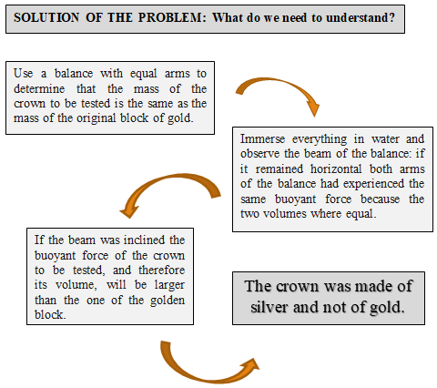

[**Volume I: Motion.**](./volume-I/)

[**Previous: 1.2.  Conceptualizations of spaces and quantum statistics.**](./vol-I-chap-1-sect-1.md)

***

## 1.3.  Contexts learning for conceptualizing cognitive spaces.

### Meaning of context.

Previous dicotomy in the conceptualization of spaces as dictatorial or democratic has been translated in Section 1.2 into the classification scheme for elementary particles that separates fermions from bosons. In Physics we also have other couples of interrelated concepts such as matter - energy, order - disorder, space - time, particles - waves, individuality - collectivity, objective - subjective, deterministic - probabilistic, antagonistic - complementary, particular - universal… 

In this section we deal with the procedure named *Context learning for conceptualizing cognitive spaces*. The word context,( *contexto* in Spanish), comes from Latin *contextus*, derived from the verb *téxere*, to knitt (*tejer* in Spanish). Playing with the words *con-texto* is what comes with the text. In connection to writings, and not to textiles, it means the conducting threads that communicate sense and meaning in written texts. It refers to material, human, and social conditions framing the generation of products or services.

### Components of context learning.

Context learning provides the texture of importance in organizing knowledge for what is thought and learnt. It implies both the conceptual structure of the subject matter and the operational criteria for managing contents, procedures, and resources. Context learning is a practical procedure for applying cognitive spaces by exploring problematic situations, analyzing leading questions and performing learning and evaluation activities. The steps required for context learning are the following:

1. Describe a **problematic situation** corresponding to a cognitive challenge to be understood and solved. 

2. Formulate **generating questions** to be answered to explain the context.

3. Propose **learning and evaluating activities** for answering these questions.

### Archimedes solution to the golden crown problem.

Next, we present an application of the context learning procedure to the buoyancy problem of the golden crown proposed to Archimedes by King Heron. A possible path of the solution, not necessarily the one implemented by Archimedes, will be considered as dictatorial or democratic conceptualizations. An analysis of the problem will be reviewed in terms of what do we know, and the solution of the problem will be presented in terms of what do we need to understand.

#### Context description.

The legend says that Archimedes shouted Eureka! when he understood the nowadays called principle of flotation: an object immersed in a liquid is pushed up by a buoyant force equal to the weight of the volume of the liquid displaced by the object. This means that any object submerged in a liquid experiment two forces: its downward weight and the upward push corresponding to the weight of the amount of water equivalent to the submerged volume of the object (the buoyant force). (Figure 1.6).  In this case, what are the three steps for context learning?

- King Heron of Alexandria (10 BC-70 BC) presented to Archimedes a **problematic situation** when he complained having asked a goldsmith to build a crown, but he suspected a fraud: he gave to the goldsmith a block of pure gold, but when he received the crown, he doubted that the crown was made of silver and not of gold.

- The following **leading questions** might had asked by Archimedes himself to answer the king´s suspicion: If the finished crown and the original block of gold weight the same but the crown is made of silver and not of gold, how much different the volume of a golden crown will be from the volume of a silver crown? How can I determine the volume of the probable falsified crown? 

- **Learning and evaluation** activities were those decisions and actions that were undertaken by Archimedes to solve the problem asked by King Heron.

#### Democratic or dictatorial Archimedes experimental procedures.

Archimedes experimental procedures could be considered as being democratic if he did focus on the universal definition of density as the quotient of mass divided by volume, because this definition applies to all bodies in the same manner. Furthermore, all submerged material must obey the floating principle. His approach to the experiment could be dictatorial in the sense that he referred to the particular result of applying Archimedes’ principle where the buoyant force will depend on the submerged volume of the crown under the assumption that this condition must be different for different materials if they did not have the same density.

The solution obtained by Archimedes can be summarized in terms of two processes: the analysis of the problem and the solution of the problem.

<figure markdown>
{width=480}

{width=480}

  <figcaption>The description of cognitive spaces for context learning serves for analyzing concepts to be proposed and tested as well as for comparing models to be contrasted and improved.</figcaption>
</figure>

- It can be assumed that Archimedes was involved in the following **activities**: he weighted the finished crown and took a block of gold of the same weight; therefore, they had the same mass. He knew that the density of a golden crown will be higher than the density of a silver crown.  Then, a crown made of gold will occupy a lesser volume than a crown made of silver.

- By applying his buoyancy principle, Archimedes knew that the crown to be tested and the block of gold could experience different buoyancy forces if they had different volumes. The weight of the water displaced by the object with the larger volume will be higher than the weight of water displaced by a smaller volume. 

CONCLUSION

- To determine the volume of the crown to be tested he might use a balance with equal arms. Then, he could control that the mass of the crown was the same as the mass of the block of gold and therefor observe that the beam of the balance remained horizontal. Afterwards, he might immerse everything in water and observe the beam of the balance: if it remained horizontal both arms of the balance had experienced the same buoyant force because the two volumes where equal. If the beam was inclined the buoyant force of the crown to be tested, and therefore its volume, will be larger than those of the block of gold, meaning that the crown was made of silver and not of gold.

- Anyhow, previous discussion of a result of an application of a general principle, shows the same result obtained by following different procedures related to one type of conceptualization or to another.

***

### REFERENCES
 
1. VERNANT, Jean-Pierre. Géométrie et astronomie sphérique dans la première cosmologie grecque. La Pensée (1963),109, p.82.
2. BERNAL, J. D., Science in History. Cambridge, Massachusetts, MIT Press, (1954).
3. KLEIN, M., El pensamiento matemático de la antigüedad a nuestros días. Vol.1. Madrid: Alianza Editorial. (1972).
4. DURANT, W., The story of civilization. Vol. 2 The Life of Greece, New York, Simon and Schuster, (1966).
5. HELLEMANS, A. y BUNCH, B. The Timetables of SCIENCE. A Chronology of the Most Important People and Events in the History of Science. , New York, Simon and Schuster, (1988).

***

[**Next: 2.1 Production and control of electronic motions.**](./vol-I-chap-2-sect-1/)

