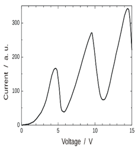

[**Volume I: Motion**](./volume-I.md)

[**Previous: 1.3. Contexts learning for conceptualizing cognitive spaces.**](./vol-I-chap-1-sect-3.md) 

***

## 2. Production and control of electronic motions. 

### Introduction

*What are the main characteristics of the electron?*

This Chapter deals with the principal characteristics of electronic motions under different experimental conditions; it concerns their production, detection, representation, and interpretations.

### Learning objectives of Chapter 2.

After this Chapter you should be able to: 

* Explain what happens on different interaction regions in those revolutionary experiments that were critical in the determination of electronic properties at the beginning of last century.
* Describe the Nobel Lectures presented by Thomson, Millikan, Franck, Hertz, and Compton in terms of the accepted knowledge or questions under discussion in laureates’ times and the personal contributions or explanations made by the laureates.
* Identify the knowledge domains (factual, analytic, conceptual, and operational) that have been applied for understanding experiments for the calculation of electronic properties and the description of interactions of radiation with electrons.

### Description of content of Chapter 2.

### 2.  Production and control of electronic motions.

* 2.1.  Regions for doing experiments.

        Experiments made by Thomson for discovering the electron. 

	Measurement of the elementary electric charge of the electron by Millikan.

	Stationary electronic energy levels demonstrated by Franck and Hertz. 

	Dispersion of radiation in collisions electron-photon explained by Compton.

* 2.2.  Physics Noble Lectures by Thomson, Millikan, Franck, Hertz, and Compton.

* 2.3.   Knowledge domains for understanding.

  	 Experiments for the calculation of electronic properties.

	 Experiments for the description of interactions of radiation with electrons.

#### Section 2.1. Regions for doing experiments.

We quote Richard Feynman who explains what Physics is about and what are the rules for applying the scientific method. Then we describe the regions required in experimental activities: *preparation* when the physical system in organized according to some initial conditions; *transformation* when specific interactions are produced, observed and measured, and finally, *detection and measurement* when results of those interactions are registered and interpreted.

We analyze what are those three regions in four experiments characterizing critical properties of the electron: the experiments performed by Joseph John Thomson (quantization of the electron mass and determination of its relation charge/mass), by Robert Andrews Millikan (quantization of the electron charge), by James Franck and Gustav Ludwig Hertz (quantization of the electron energy levels) and by Arthur Holly Compton (a relativistic collision of an electron with an incoming photon).

#### Section 2.2. Physics Noble Lectures by Thomson, Millikan, Franck, Hertz, and Compton.

We comment on the Physics Nobel Prizes awarded to the physicists previously mentioned:

- J.J. Thomson in 1906 “in recognition of the great merits of his theoretical and experimental investigations on the conduction of electricity by gases”, 
- R.A. Millikan in 1923 “for his work on the elementary charge of electricity and on the photoelectric effect”, 
- J. Franck and G.K. Hertz in 1925 “for their discovery of the laws governing the impact of an electron upon an atom”, 
- A.H. Compton in 1927 “for his discovery of the effect named after him”.

#### Section 2.3. Knowledge domains for understanding.

We present the procedure *Knowledge domains for understanding* and apply it to the analysis of two types of Nobel Prize documents: WORKS that describes the main contributions of each laureate and their Nobel Lectures. The four knowledge domains (Factual, Analytic, Conceptual, and Operational) serve to identify and classify the knowledge contained in the information obtained from the previously mentioned documents. Such knowledge is synthetically summarized in two tables related to the following aspects: Table 2.1 is for the calculation of electronic properties (experiments made by Thomson and Millikan) and Table 2.2 is for the description of electronic interactions (experiments made by Franck-Hertz, and Compton).

## 2.1. Regions for doing experiments.

### Rules of the game to understand nature.

According to Richard Feynman (1963), Physics deals with the nature of things as we see at this present moment. He compares the activity of doing Physics to the observation of a game that takes place in nature. Furthermore, Feynman affirms that to know the rules of the game is to understand nature and that there are three kinds of procedures to know if the proposed rules work effectively:

1)	To predict what will happen if the physical situation is relatively simple: the system has few components and can be verified if the rules in consideration are satisfied.*

2)	To analyze conditions when the proposed rules do not work and therefore to find the new rules that operate in regions up to now unknown or unexplored.*

3)	To make approximations to complex and diverse difficulties: to split, to classify and to simplify for understanding as much as possible with the minimum of requirements.*

### What does it mean to do an experiment?  

Experimenting implies the development of skills to analyze and approximate. Experimenting requires concrete questions to be asked to nature and solved by human interactions with apparatuses and devices. The physicists ask questions and make plans to prepare scenarios for obtaining answers: the experimental settings. Those are the conditions where the interactions with nature begin to produce, control and detect what will be observed, measured, registered, and interpreted. Data will be obtained, and conceptual relationships will be tested, changed, or formulated under new conditions or for the first time. This might imply new descriptions, predictions, calculations or explanations of concepts, models, laws, or theories. This is the way for learning Physics.3

### Interacting regions of the experimental setting.

To perform an experiment implies to arrange the experimental setting into three regions where physical interactions are produced: the input region of Preparation, the production region of Transformation and the outcome region of Detection and Measurement. Sometimes the borderlines between these regions are not sharp nor well defined; however, the corresponding assumptions and intentions must be clear to the experimenter. 

In the input region the system is prepared under controlled situations that correspond to given values of a set of parameters and variables describing the structure of the system and their external conditions; these are the initial conditions of the experiment.

Then it comes the crucial part of the experiment, the production region where interactions with external fields or other kind of agents modify the initial conditions producing effects to be observed and measured. It is in here that the experimentalists look carefully and try to understand what is happening. The experimentalist might be required to explain what seems to be new or in contradiction with what could be expected and needs to be corrected or disregarded. Observations and measurements must lead to understanding.

It is in such region of Transformation that the experimentalists play with the variables producing significative physical effects and the initial conditions are transformed with the purpose of exploring, experimenting, and evaluating. All these purposes are oriented to answer the questions previously asked. It has been said that “all experiments are charged of theory”: they are conceptualized according to what is known and unknown.

The final region is where Detection and Measurement are accomplished having in mind some form of mathematical representation, mostly algebraic or geometric, leading to propose or validate physical interpretations. Certain experiments work in the domain of what is understood and require a clear comprehension of procedures under different conditions. 

### Regions characterizing revolutionary experiments.

Revolutionary experiments penetrate the unknown; they generate new ideas and demand better and more complete explanations that open the access to unexpected windows for thinking and doors for understanding. Such has been the case of the experiments performed by Thomson, Millikan, Franck-Hertz and Compton. These experiments marked the beginning of modern Physics; they radically changed our understanding of what an electron is.

### Experiments made by Thomson for discovering the electron.

Thomson performed a sequence of three types of experiments: the first type for analyzing that a charged particle was leaving the atom; the second one for determining that these particles had negative electric charge and the third one for calculating the value of their ratio charge/mass. His results were presented in a paper titled *Cathode Rays*, published in the journal *Philosophical Magazine*, 44, 293 (1897). Next Figure 2.1 is an adaptation of the original one taken from Thomson´s paper.

<figure markdown>
{width="480"}
  <figcaption>**Figure 2.1.** Apparatus used by Thomson. (The vertical bars in blue indicate the borders separating the three regions for performing the experiment.)
</figcaption>
</figure>

Source: adaptation by the authors of the image taken [Wikipedia](https://upload.wikimedia.org/wikipedia/commons/b/b9/JJ_Thomson_crookes_tube.jpg)

In Figure 2.1 the letters indicate the following variables: 

* _d_ is the distance traveled by the electro inside the plates of the condenser where an external electric field (_E_) is applied. It is in this region that an external magnetic field (_B_) will be applied in the third type of experiments.

* _s_ is the distance traveled by the electron when the electron leaves the condenser and hits a phosphorescent screen at the end of the tube; when there are not external fields applied there is no deviation of the trajectory.

* _l_ is the distance on the screen between the arrival position when there are no external fields applied and the arrival position when an electric field (_E_) is applied. 

* _θ_ is the angle indicating the deviation of the trajectories followed by the electron between the arrival position without external field and the arrival position with the electric field. This deflection angle $θ$ is such that $\tan(θ) = l/s$.

The region of **Preparation** consisted in a vacuum tube containing a negative cathode (_C_), a positive anode (_A_) and a slit (_S_): when _C_ is heated, a radiation is emitted, attracted by _A_ and collimated trough _S_. The initial conditions are the following: a particle of mass $m$ and charge $q$ leaves the cathode and arrives at the condenser with a horizontal velocity $v_{horizontal} = v_0$ in a direction parallel to the plates _D_ and _E_.

The region of **Transformation** corresponds to the inside of two charged metallic plates of a condenser (_D_ and _E_) where the external electric and magnetic fields will be applied. If the electrostatic force $F_{\mathrm{electric}} = qE$. is applied, a transversal acceleration is generated in a direction perpendicular to the incident beam $a_{\mathrm{transversal}} = a_t = qE/m$. Such force acts during the time $t = d/v_0$ required by the particle to travel the distance $d$ inside the condenser with a transversal velocity $v_{\mathrm{transversal}}= (a_t)(t)= (\frac{qE}{m})(\frac{d}{v_0})=  \frac{qEd}{mv_0}$ is acquired by the particle.       

Inside this region of Transformation, the displacement of the particle has two components: the horizontal component $x = v_0t$ due to the constant velocity $v_0$ and the variable vertical component $y = \frac{1}{2} (a_t)t^2$ produced by the transversal acceleration $a_t$. Taking into account these two components of the displacement, the resulting equation of the trajectory inside the condenser is a parabola $y =  \frac{1}{2} (a_t)t^2 =  \frac{1}{2} (\frac{qE}{m})[(\frac{x}{v_0})^2] =  \frac{1}{2} (\frac{qE}{m{v_0}^2})(x^2)$ which correspond to the form $y = Ax^2$.

The region for **Detection and Measurement** is active when the electron leaves the condenser and arrives at the screen. To calculate the angle of deflection $θ$ when the particle leaves the condenser at $x = d$ we must calculate the derivative of the parabola $(dy/dx)$ at that point  $\tan(θ) = \frac{dy}{dx} =  \frac{1}{2} (\frac{qE}{m{v_0}^2})(2x)=\frac{qEx}{m{v_0}^2}$. Then, using the result $\tan(θ) = l/s$ it can be obtained $\tan(0) =(\frac{qEd}{mv_0 ^2})=\frac{l}{s}$. This equation indicates that the relation $q/m$ could be calculated if we knew the values of the distances $d$, $l$ and $s$, the intensity of the electric field E and the initial velocity $v_0$.

To calculate $v_0$ Thomson performed the third type of experiment: in the transformation region he applied a second external field, a magnetic field **B** in a direction perpendicular to **E**. He made equal the magnitudes of these forces: $F_{magnetic} = qv_0 B = F_{\mathrm{electric}} = qE$ from which $v_0 = E/B$. Replacing this value into the equation $(\frac{qEd}{mv_0 ^2}) = \frac{l}{s}$ we get 

$$
\frac{q}{m}=\frac{El}{B^2ds}
$$

It is interesting to observe that in this equation the ratio of two very small and unknown quantities (_q/m_) can be calculated by measuring three distances (_l_, _s_ and _d_) and the intensity of two fields (_E_ and _B_). These experiments made possible to change a very difficult question into a feasible and relevant procedure.   

### Measurement of the elementary electric charge of the electron by Millikan.

Since 1907 Robert Millikan (1868 - 1953) and his student Harvey Fletcher (1884 – 1981) were looking for a procedure for determining the value of the charge of an electron. They were experimenting first with drops of water and after with drops of oil. Their experimental setting is described in what follows and illustrated in Figures 2.2a and 2.2b. 

<!-- HTML Table 1.1.1-->
<table width="100%">
  <tr>
    <th width="50%">
   
    </th>
    <th width="50%">

    </th>
  </tr>
</table>
(Images credit: CC Wikimedia Commons)

**Figure 2.2.** Setting for the oil-drop experiment (a) and amplified view of a drop inside the microscope (b). Here, in (Figure 2.2a)the Preparation region is in blue, the Transformation region is in green, and the Measurement region is in red.

In the region of **Preparation** an atomizer produces drops that go through a hole on a metallic plate that covers a cylindric chamber.

In the region of **Transformation** a condenser inside the chamber has two metallic plates separated by a distance $d$; the upper cap of the cylinder has four holes, three of them illuminate the interior of the plates and the four hole is for measuring the positions of the drop through a microscope. An external X ray source is applied for charging the oil droplets by ionizing them. Inside the chamber a potential $V$ generated by an external battery produces a uniform electric field of intensity $E = V/d$. Changes in the polarity of this battery made the charged drops to go down or to go up.

In the region of **Detection and measurement**: an external microscope measures with a scale the positions of the drops when they travel in between the plates.

Inside the chamber the drop experiments three forces (Figure 2.2b): the weight due to its mass $m$ ($F_{\mathrm{gravity}} = mg$), the viscous drag force ($F_{\mathrm{viscosity}}$) produced by friction with the air inside the chamber, and the electric force $F_{\mathrm{electric field}} = qE$ exerted by the external field _E_. 

According to Stokes law, the force of fluid friction is $F_{\mathrm{viscosity}} = κηv_t$, where $v_t$ is the terminal velocity, $η$ is the viscosity of the air, $κ = 6πr$ is a drag coefficient and $r$ is the radio of a spherical drop; then $v_t = (F_{\mathrm{viscosity}})/κη$. If the external field _E_ is zero the force $F_{\mathrm{electric field}} = 0$. For a stationary drop the resultant force must add to zero and therefore $F_{\mathrm{viscosity}} = F_{\mathrm{gravity}} = mg$. Then, in the absence of an external field the terminal velocity is $v_t = v_a = mg/(κη)$. This is the velocity for free fall when the electric field is switched off.

However, when the external field is not zero the net force $F_{\mathrm{viscosity}} = qE - mg$ and therefore, the terminal velocity in the presence of the field is $v_p = (qE – mg)/(κη)$. After addition of the previous two terminal velocities we obtain $q = [(v_a + v_p)κη]/E = [(v_a + v_p)(6πrη)]/E$. When variations in the terminal velocity $Δv_a$ are considered the changes in the charge are $Δq = [(6πrη)/E](Δ v_a)$.

The terminal velocities $v_a$ and $v_p$ are determined by measuring the time the drop takes to travel a given distance marked in the scale of the microscope (Figure 2.2b). Furthermore, to calculate the radio $r$ of a drop of mass $m$ it is assumed that the drop has a spherical form and that the density is uniform $ρ = m/[4/3πr^3]$. Therefore, the terminal velocity in absence of external field can be measured as $v_a = mg/(κη)$, with $κ = 6πr$; then $r^2 = (9/2)(ηv_a)/(ρg)$.                

### Stationary electronic energy levels demonstrated by James Franck and Gustav Hertz.

Spectral lines are observed in atoms because certain transitions between electronic discrete energy levels are produced. Is this a consequence of the emission or absorption of photons or is it a quantized property that electrons have by themselves?

In 1914 Franck and Hertz provided experimental evidence of the existence of stationary electronic energy levels without considering any incident radiation as the cause of such structural behavior. They determined the separation between electronic energy levels in complete agreement with spectroscopic measurements, confirming predictions made by the Bohr atomic model. According to this model the quantized energy levels were mere hypothesis but not experimentally proved facts. 

The experimental setting used by Franck and Heertz is described in terms of the usual three regions: Preparation (in blue), Transformation (in green) and Detection and Measurement (in red). (Figure 2.3a). 

<figure markdown>
  { width="400" }
  { width="400" }
  <figcaption>Image credit: Wikimedia Commons [Fig 11](https://upload.wikimedia.org/wikipedia/commons/e/e9/Exp_franck_hertz.JPG), [Fig 12](https://upload.wikimedia.org/wikipedia/commons/9/9a/FHZ_katse_tulemused.jpg)
</figcaption>
</figure>

**Figure 2.3.** Apparatus used by Franck-Hertz (a) and a sample of their results (b).

The region of **Preparation** contains a triode with a heated filament (_F_) for emitting electrons, a negative cathode (_C_), a collecting anode (_A_) and in between them a polarized grid (_G_).

The region of **Transformation** is the space surrounding _F_ and _G_ filled with atoms of Mercury vapor. An external variable potential (_V_) accelerates the electrons from _F_ towards _G_ provoking multiple collisions with electrons belonging to Mercury atoms. Besides a small retarding potential $V_R$ was applied between _G_ and _A_.

The region of **Detection and Measuremet** consisted in an external galvanometer (GALV) to register the variations of the intensity of the current I generated by those electrons that arrived at _A_ after colliding with the electrons inside the atoms. In order to be detected by the galvanometer, the excited electrons must have a kinetic energy higher than $V_R$.

In normal conditions an atom has its electrons in their lowest energy state; they go to a higher energy level when they receive extra energy for their excitation. Franck and Hertz accomplished this effect by generating inelastic collisions between two types of electrons: the external electrons produced by the filament F that have been accelerated by the potential V and the internal electrons belonging to the atoms of Mercury contained inside the triode. Franck and Hertz changed the accelerating voltage (_V_) and then measured in the galvanometer the intensity of the current (_I_) produced by those electrons that arrived at the anode A (Figure 2.3b). 

What was observed in the experiment was the following: When the accelerating potential V started to increase the current, I also increased. At a critical value $V_c = 4.9$ volts the current went down sharply; however, when the voltage increased again the current increased also. In arriving at a new critical value $2V_c = 9.8$ volts, the same strong diminution of the current was observed. These observations can be interpreted as follows:

- When $V < V_c = 4.9$ volts the accelerated electrons have low kinetic energy and their collisions with the atoms are elastic ones: the mass of the electron is much smaller than the mass of the atom, therefore the incident electron rebounds and does not give energy to the electrons in the atom.

- When $V = V_c$ the Mercury atom receives the exact amount of energy to excite their electrons to higher energy levels. Under this condition the collision is inelastic because the incoming electron lost the energy that gives up to the electrons inside the atom; therefore, the current I diminishes.

- If now $V > V_c$ the current I increases until $V = 2V_c$ and the collisions become inelastic again. These fluctuations in the current repeat when the voltage V attains a multiple value of $V_c$.

It is interesting to note that in the atom of Mercury the difference between the lowest energy level and the first excited energy level corresponds to a spectral line whose wavelength is $λ = 2536 Å$.  For photons $E = hν = hc/λ$, if now we make $E = qV_c$ where $q$ is the charge of the electron, we can get $λ = (hc)/(qV_c) = 2,536 \times 10^{-10} m = 2536 Å$.

More details concerning Bohr´s atomic theory will be discussed in section 6.1. *Electronic energy levels in the hydrogen atom* corresponding to chapter *6. Spectroscopical studies of atomic structures.* Also, in section 6.3 of that chapter the Bohr´s Nobel Lecture *The structure of the atom* will be considered. 

Nevertheless, as a great help in understanding the implications of their experiment, in what follows we include some excerpts taken from Hertz´s Nobel Lecture *The Results of the Electron-Impact Tests in the Light of Bohr’s Theory of Atoms*. [MLA style: Gustav Hertz – Nobel Lecture. NobelPrize.org. Nobel Prize Outreach AB 2023. Thu. 2 Mar 2023. <https://www.nobelprize.org/prizes/physics/1925/hertz/lecture/>].

*The Ritz combination principle states that the frequencies of the individual series al spectral lines are always represented as differences between one or more series of discrete numerical values…. The frequency of every spectral line is equal to the difference between two terms. Thus, a certain combination of two terms is associated with each line.* 

*The minimum level energy is associated with the stationary state of the atom from which further transitions to states of still lower energy are impossible. The term associated with this energy level is called the ground term of the spectrum, and corresponds to the normal state of the atom. In contrast with this normal state, the states richer in energy are called excited states. To lift the atom from its ground state into a given excited state a certain work is required, and this is called the excitation energy:* $A = h(T_0 – T)$.

*The term* $T_0$ *corresponds to the state of the atom in which an electron is completely removed, i.e. the state of the positive ion. The associated excitation energy is the work required to remove an electron, the so-called ionization energy. Thus Bohr’s theory requires that the ionization energy of an atom and the ground term of its series spectrum should be simply interrelated by* $A_{ioniz} = hT_0$. 

*The possibility to check this relationship experimentally by means of an electron-impact test follows from Bohr’s theory. The identity of the energy difference between the terms of the series spectrum and of the energy of the atom in its various stationary states, leads to the conclusion that the amounts of energy transmitted during collisions between electrons and atoms can be measured directly, and that phenomena which occur when given amounts of energy are imparted to the atom, can be observed. What can we expect on the basis of Bohr’s theory, when electrons of a given velocity collide with atoms? If energy is imparted to the atom during such a collision, the result can only be that the atom will be lifted from its ground state to a stationary state of higher energy.*

*Among the excited states of an atom, there is always one state for which the excitation energy is a minimum. Thus, the excitation energy associated with this state represents the minimum amount of energy that can be imparted to the atom as a result of an electron impact. So long as the energy of the colliding electron is smaller than this minimum excitation energy, no energy will be transferred to the atom by this collision, which will be a purely elastic one, and the electron will then lose only the extraordinarily small amount of energy which owing to the conservation of momentum takes the form of kinetic energy of the atom.*

### Dispersion of radiation in collisions electron-photon explained by Compton.

The so-called Compton effect was produced, observed and calculated in 1920 by Arthur Compton. This effect consists in the dispersion of X rays produced by a collision with an electron. After this relativistic collision both colliding particles change their directions and magnitudes of their velocities: the incoming photon scatters in a different direction with a lower frequency (larger wavelength) and the initially stationary electron recoils and acquires some velocity up to about 80% of the velocity of light, This effect demonstrates the corpuscular properties of photons; they behave as particles of zero mass.

What follows is a scheme describing the experimental setting where the three regions of production, transformation and detection and measurement are shown (Figure 2.4a). A vectorial diagram indicates the collision condition (Figure 2.4b). 

<figure markdown>
  { width="400" }
   { width="400" }
  <figcaption>Image credit: [Wikimedia Commons](https://upload.wikimedia.org/wikipedia/commons/c/c2/Compton-en.svg)</figcaption>
</figure>

**Figure 2.4.**  Setting for the Compton experiment: (a) regions for preparation (in blue), for transformation (in green) and for detection and measurement (in red); (b) vectorial diagram of the collision.

The photons are first produced in a X ray tube with a wavelength in between $0.1 Å$ and $100 Å$. After colliding with an atom in the Graphite target the photons are scattered at a definite angle and then they pass through the slit.  The energy of the scattered photon is measured using a crystal and a ionization chamber.

Initially the energy of the photon is $Q_0$, its linear momentum is $(Q_0/c)n_i$ and has no rest mass ($m_0 = 0$). After the collision it has an energy Q and momentum $(Q/c)n_f$.  (The unitary vectors $n_i$ and $n_f$ indicates, respectively, the incoming and scattered directions of the photon.) These vectors are not orthogonal and therefore $(n_i) \cdot (n_f)=(\cos θ)$.

Assume that the electron has an energy at rest $m_0c^2$ and does not move; it is free to do so because it is not bounded to any nucleus. After the collision the electron is scattered with an energy E and a linear momentum $p$ in the direction of the angle $Φ$.

According to special relativity the total energy of a particle is $E = [m_0^2c^4 + p^2c^2]^{1/2}$ where $m_0$ is its mass at rest, $p$ is the magnitude of its momentum $p$ and $c$ the velocity of light.

The equations for the conservation of energy and momentum are  

$Q_0+ m_0c^2=E+Q$  and $(\frac{Q_0}{c}) n_i= (\frac{Q}{c}) n_f+ p$

Such equations can be rearranged as $(Q_0-Q)+ m_0c^2=E$ and $(Q_0n_i- Qn_f )= cp$

Then, taking into account that $(n_i).(n_f)=(\cos θ)$, we obtain in previous equation: 

$(Q_0- Q)^2+ 2(Q_0-Q)(m_0c^2 )+ (m_0c^2 )^2 = E^2$ ..... (1)

$(Q_0)^2- 2(Q_0Q)(\cos θ)+ (Q)^2 = c^2p^2$ ..... (2)

Now if equation (2) is subtracted from equation (1), use that $E^2 = [m_0^2c^4 + p^2c^2]$, then we obtain $(Q_0 Q)(1- \cos θ)= (Q_0-Q)(m_0c^2 )$.

For the electron $Q_0=\frac{hc}{λ_0}$ and for the photon $Q=hν=\frac{hc}{λ}$. Previous equation is now transformed into the following $(\frac{hc}{λλ_0})(1- \cos θ)=(\frac{λ- λ_0}{λλ_0})(m_0c^2 )$

If $Δλ= λ- λ_0$ is the Compton shift and $Λ_C=\frac{h}{m_0 c}$ is the Compton length for electrons, finally it can be obtained $Δλ= (Λ_C )(1- \cos θ)$.

Taking into account the values of the Planck constant $h = 6.63 \times 10^{-34} Js$, the mass at rest of the electron $m_0 = 9.11 \times 10^{-31} kg$ and the velocity of light $c = 3 \times 10^8 m/s$, the calculated Compton length is $Λ_C = 0.02426 Å = 2.426 \times 10^{-12} m$ quite in agreement with experimental data.  Previous equation can be interpreted in another way: the Compton length $Λ_C=\frac{h}{m_0c}$ can be obtained if $Δλ$ is measured for different values of the angle $θ$, then introducing the values of $m_0$ and $c$ the Planck constant can be determined.

***

[**Next: 2.2. Physics Noble Lectures by Thomson, Millikan, Franck, Hertz, and Compton.**](./vol-I-chap-2-sect-2.md)

