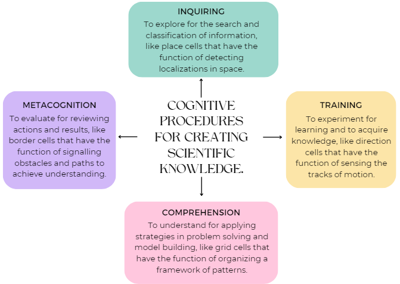

[**Volume I: Motion**](./volume-I.md)

[**Previous: 3.2.  Generation of a mental Global Positioning System (GPS).**](./vol-I-chap-3-sect-2.md) 

***

## 3.3. Cognitive procedures for creating scientific knowledge.

### Elements of a cognitive procedure.

May-Britt Moser and Edvard I. Moser identified around 2005 another nerve cells: the grid cells which were arranged in hexagonal structures in the entorhinal cortex of the brain by forming a kind of coordinate system for navigation and path integration. These grid cells were embedded in a network containing other cells in charge of head direction and border functions. Their experiments demonstrated the existence of a computational center for spatial representation useful for recognizing and remembering precise positions and pathfinding. They have shown the existence of a sort of mental GPS.

Nobel Lectures described in the appendices indicate that memory and learning depend on cognitive functions that are involved in the collective activity of a system of interconnected neuronal cells. The existence of a GPS generator of cognitive maps that integrate four neural cells allow us to associate the functions of these cells to four cognitive procedures for creating scientific knowledge by building and using cognitive mental maps for learning purposes. 

In this Section 3.3. we deal with the process *Cognitive procedures for creating scientific knowledge*. The elements of this process have been organized in a similar way as a GPS in the brain where cognitive maps are created by integrating four neural cells whose functions are related to place, grid, direction and border. In what follows we consider how the functions of each one of those four neural cells studied by previous laureates can be associated with the cognitive procedures required for creating scientific knowledge through Inquiring, Training, Comprehension, and Metacognition.

{width="640"}

	
The working of a typical GPS, like those used in common cellular phones, must satisfy the following technological conditions: 
	
•	A system of satellites surrounding Earth for the generation of signals indicating their positions as well as the time measured in their clocks (this corresponds to an Inquiring procedure).

•	The cellular phones of the users that capture the signals from the satellites looking for visualizations of places and trajectories (this corresponds to a Training procedure). 

•	A system of radars on Earth for localization and orientation of the satellites as well as for the registration of their orbits around Earth (this corresponds to a Comprehension procedure). 

•	A fourth Metacognition procedure implies in this case to take into account two relativistic corrections to the oscillatory frequency of the atomic clocks located inside the satellites: one is because the intensity of the gravitational field varies with altitude and the other is because the clock moves at high velocities with respect to the observer on Earth.

### Description of the perihelion precession of the planet Mercury.

What follows is an example of application of the previously described *Cognitive procedures for creating scientific knowledge.* We consider the evolution in the geometrical and physical explanations concerning the planetary orbits of Mercury. We focus on the learning outcomes derived from different levels of explanations of how, when and why the first planet in our planetary system moves. 

**Inquiring procedure:** to identify what is understood according to the three laws of motion formulated by Johannes Kepler (1571-1630). The first two laws were published in 1609 in *Astronomia Nova* and the third law in 1619 in *Harmonice Mundi*. 

- First Kepler´s law (the law of the orbits):  The planets move around the sun in orbits which are ellipses, with the sun at one focus. 

- Second Kepler´s law (the law of the areas): A line joining a planet to the sun sweeps over equal areas in equal times.

- Third Kepler’s law (the law of the harmonies): The squares of the periods of revolution of the planets around the sun are proportional to the cubes of the (mean) radii of their respective orbits.

The formulation of these laws introduced new concepts regarding planetary movements: the motion trajectories were described in terms of elliptic orbits instead of the Ptolemaic notions of epicycles and deferents, and the speed of motion did not correspond to uniform circular orbits but was assumed to vary inversely as the planet distance to the sun.

**Training procedure:** to make clear Newton´s scientific reasonings for explaining what previously has been observed, registered and interpreted.
	
Isaac Newton (1642-1727) published in 1687 three books called *Philosophiae Naturalis Principia Mathematica*; the first two dealt with general theorems concerning the motions of bodies and the third one contained applications to the solar system. Newton proposed that a gravitational attractive force $F_G = G [\frac{(m_S m_P)}{r^2}]$ interacted instantly and at distance when the two interacting bodies, the sun of mass $m_S$ and a planet of mass $m_P$, were separated by a distance $r$; $G$ was a constant. Also, he defined force as “the rate of change of momentum” $F=\frac{d_p}{d_t}$, where the linear momentum was defined as $p = mv$, $m$ representing the mass and $v$ the velocity. 

By replacing the expression of $F_G$ in the general equation $F=\frac{d_p}{d_t}$, Kepler´s laws can be explained in terms of the following mathematical considerations:  

- The first law is a consequence of the fact that the force $F_G$ is central, it is oriented in the direction of the sun to the planets. 

- The second law is a consequence of the conservation of angular momentum $l = r \times p$. In the case of planar elliptic orbits this implies that the quantity mvr is constant. This means that the planet moves faster at short distances in the perihelion (the distance sun-planet is the shortest) and it moves slower at long distances in the aphelion (the distance sun-planet is the largest). 
	
- The third law is a consequence of the assumption that gravitational force is inversely proportional to the square of the distance ($F \thicksim 1/r^2$). 

Newton could explain what Kepler predicted but without describing how the gravitational force was produced. He was able to change the magic approach due to Kepler into a mysterious explanation that promoted understanding but left open questions about the origins of the forces that produced the observed planetary movements.

**Comprehension procedure:** to describe Einstein´s relativity theories which consider that the physical properties of the universe can be explained in terms of geometrical properties. 

Careful measurements have shown that the position of the perihelion of Mercury appeared to be delayed after completing one full year of revolution around the Sun.  During a century the principal axe of the elliptic orbit of Mercury had a very small deviation of 43 seconds of arc. According to the theory of general relativity this physical effect was produced by the geometrical circumstance that a curvature of space was produced by the enormous concentration of matter existing in the Sun. This explanation indicates that the gravitational force has a geometrodynamic nature.

**Metacognition procedure:** to define the frontiers of ignorance after reviewing assumptions, procedures and results as well as contrasting them with the experimental tests of calculated predictions. Concerning the real structure of physical spaces, according to the available results of observations, experiments and calculations, it is now clear that the mathematical structure of such spaces is not Euclidean. Nevertheless, up to now a quantum theory of gravity is still under development.

The explanations given by Kepler, Newton and Einstein are elements in a chain of concepts, models and theories that solve some problems but leave open other questions.  All kinds of explanations have their own region of validity. More about gravitation will be discussed in next Chapter 4. *Geometrization of the description of motion.*

***

[**Appendix**](./vol-I-chap-3-apendix.md)