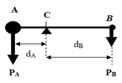

[**Volume I: Motion**](./volume-I.md)

[**Previous: 3.3. Cognitive procedures for creating scientific knowledge.**](./vol-I-chap-3-sect-3.md) 

***

# 4. Geometrization of the description of motion.

!!! abstract "Introduction"

	*What kind of space represents the physical properties of the universe?*

	This is the last Chapter of the first Volume on Motion. It deals with the mathematical nature of space by considering different types of geometries and the physical geometrodynamical interpretation of the properties of the space-time scenario.
	
	**Learning objectives of Chapter 4.**
	
	After this Chapter you should be able to: 

	- Describe the characteristics of Euclidean and no-Euclidean geometries and connect the lever principle with conservation laws.
	- Explain the content of Einstein´s Nobel Lecture *Fundamental ideas and problems of the theory of relativity*.
	- Analize how the descriptions of motion by Kepler, Galileo, Newton and Einstein can be interpreted in terms of the aspects and factors distinguishing scientific theories.            

!!! abstract "Description of content of Chapter 4."
	**Section 4.1.  On Euclidean geometry and non-Euclidean geometries.**

	We consider the geometrical understanding of space due to Euclid and by the creators of non-Euclidean geometries like Gauss, Lobachesvsky, Bolyai, and Riemann. Afterwards we describe an explanation attributed to Joseph Louis Lagrange who applied the mechanical principle of the lever to show that Euclid´s fifth postulate of the parallels is satisfied. Next, we deal with the lever principle in connection with three natural states of motion: uniform translation, uniform accelerated translation, and uniform rotation. Each one of these cases is related to a conservation law, respectively to: the linear momentum in collisions, the kinetic energy in falling bodies, and the angular momentum of levers in equilibrium with respect to rotations.

	**Section 4.2.  Einstein´s theories of relativity.**

	We refer to Einstein´s theories of relativity and comment on his Nobel Lecture presented in 1922: *Fundamental ideas and problems of the theory of relativity*. Nevertheless, he was awarded in 1921 with the Nobel Prize in Physics "for his services to Theoretical Physics, and especially for his discovery of the law of the photoelectric effect".

	**Section 4.3.  Aspects and Factors distinguishing scientific theories.**		

	We consider the process *Aspects and Factors distinguishing scientific theories* and apply it to the descriptions of motion as proposed by Kepler, Galileo, Newton, and Einstein.

## 4.1.  On Euclidean geometry and non-Euclidean geometries.

!!! info "Euclidian geometry."

	Euclid (323-285 a.C.) organized the mathematical knowledge understood in his time and created a closed, complete, and consistent system for the axiomatic construction of theorems, which are logically derived from definitions and five assumptions, also called postulates or axioms. His work *Elements* characterized a method of proposition, diagrammatic illustration, prove, and conclusion. His systematic and well-organized demonstrations constitute a classical manual for learning geometry that has been used during many centuries. Euclid’s five postulates are next indicated:

	1. To draw a straight line from any point to any point.
	2. To produce a finite straight line continuously in a straight line.
	3. To describe a circle with any center and distance.
	4. That all right angles are equal to one another.
	5. That, if a straight line falling on two straight lines make the interior angles on the same side less than two right angles, the two straight lines, if produced indefinitely, meet on that side on which are the angles less than the two right angles.

	The first three postulates deal with the possibilities for building straight lines and circles and affirm that such geometrical figures exist. The first four postulates have been considered as self-evident. However, the fifth postulate implies implicitly that space is infinite when the parallel straight lines are extended without limitation in both directions.  

!!! info "Alternative versions to the fifth Euclidean postulate."

	Some efforts have been dedicated to change the fifth postulate into a more satisfactory form or even to derive it from the other four postulates. For instance, alternative versions of the fifth postulate have been proposed in next publications:

	- In 1795 by John Playfair (1748-1819) published *Elements of geometry* where the so called Playfair´s axiom is presented.

	- In 1794 by Adrien-Marie Legendre (1752-1833) published *Éléments de géométrie* where he demonstrated that if the three internal angles of a planar triangle add to 180° then it follows the fifth postulate.

	- In 1899 by David Hilbert (1862-1943) published *Grundlagen der Geometrie (Foundations of geometry)* where he proposed a set of 21 axioms that includes the parallel postulate. By using the axiomatic method, he wanted to develop the required tools for solving any mathematical problem. He worked also on the general theory of relativity. 

	According to Reichenbach (1958), in Euclidean geometry the theorems were known first, and the axiomatic foundation was developed later. Nevertheless, by following a sort of contradictory procedure, in non-Euclidean geometries the axiomatic constructions were the instruments for the discovery of geometrical proofs. Such a contradiction was a consequence of the required self-consistent reformulations of the fifth postulate of the parallels. 

	Two non-Euclidean geometries can be considered depending on the curvature of the space and therefore, the corresponding number of parallel lines will be different than just one when the curvature is zero as in Euclidean geometry: it is infinite when the curvature is negative as in hyperbolic geometry where the lines never intersect (all the lines are parallel), or it is null when the curvature is positive as in elliptic geometry where all the lines converge (there are no parallel lines). In non-Euclidean geometries the internal angles of a triangle do not add exactly to 180° (Figure 4.1).

	
	
	(Image credit: CC Wikimedia Commons)

	**Figure 4.1.**  . Geometric properties of surfaces of different curvature; C indicates the value of the circunference and   corresponds to the addition of the three internal angles in a triangle.

	It is not clear who was the first mathematician writing about non-Euclidean geometries. The merit is shared by next four mathematicians:

	Johann Carl Friedrich Gauss (1777-1855): in two letters to friends published in 1816 and in 1822 as well as in some notes written in 1831 he referred to a geometry called by him as antiEucledean, astral or non-Euclidean. 

	Nikolái Ivánovich Lobachevski (1792-1856): he wrote about imaginary geometry in these publications: *On the Origin of Geometry* (1829-1830), *New Principles of Geometry with Complete Theory of Parallels* (1835-1837), *Geometrical Researches on the Theory of Parallels* (1840) and *Pangeometry* (1855).

	János Bolyai (1802-1860) named his geometry as absolute in his essay written in 1825 *The science of absolute space*, which was published as an appendix in a book edited by his father Wolfgang Farkas Bolyai (1775 - 1856). This work was called *“Tentamen Juventutem Studiosam in Elementa Matheseos" (Essays on mathematical elements for young students)* and was published until 1832-1833.

	Georg Friedrich Bernhard Riemann (1826-1866): there are indications that in 1854 Gauss proposed to Riemann the following theme for his dissertation *Ueber die Hypothesen, Welche der Geometrie zu Grunde liegen (On the Hypotheses on which Geometry is Based)*. In that thesis Riemann dealt with the relation between geometry and the world where we live in.  He demonstrated that Euclid axioms were of empirical nature and not self-evident truths.

	The hyperbolic geometry was developed by Gauss, Bolyai and Lobachebsky, and the elliptic geometry was worked out by Riemann. Such approach was used by Einstein because for the formulation of the general relativity theory he required that the geometrical characterizations of space were not unique and local as in the Euclidean space.

!!! info "The lever principle and the fifth parallel postulate."

	Archimedes considered that mechanical experiments could be used to extend geometric knowledge and he dedicated many efforts to build mechanisms to capture the principles of their operation. He contributed both to the development of technological applications and to an incipient mathematization of physics. Unlike Aristotle, Archimedes used geometric arguments to make demonstrations about physical situations; he was the first to mathematically demonstrate the law of the lever by reasoning and not by experimenting. 

	Archimedes stated his law as follows: “commensurable magnitudes will balance at distances inversely proportional to their gravities”. The phrase *“Pa bo, kai tan gan kino”* is attributed to Archimedes, which in the Doric dialect spoken in Syracuse means *“Give me a foothold and I will move the world”*. The proof of this principle is presented below. 

	Consider a mechanical system made up of two bodies A and B of unequal masses $m_A$ and $m_B$ joined by a linear bar of zero mass and with the possibility of rotating about a turning point C (Figure 4.2). Since the masses are under the action of the same gravitational field, the points of suspension of the masses experience a downward vertical force corresponding to their weights $P_A$ and $P_B$ with magnitudes $[P_A] = m_Ag$ and $[P_B] = m_Bg$, where $g$ is the constant of gravitational attraction.

	<figure markdown>
	{width="250"}
	<figcaption> (Image credit: elaborated by the authors.)
	</figcaption>
	</figure>

	**Figure 4.2.** Diagram of distances and weights on the lever.

	The distances from each mass to the center of rotation C are measured in the horizontal direction and correspond to the magnitudes $d_A$ and $d_B$, while the weights act in the vertical direction along lines that are parallel to each other. 

	The forces $P$ acting on the ends of the lever produce torques $τ = r \times P$. The magnitude of these vectors is $[τ] = [r][P](sin θ)$ where $θ$ is the angle between the vectors $r$ and $P$; $r$ is the vector that joins the center C with the point where each weight $P$ is applied. As can be seen in Figure 4.3, the angle $θ$ is 90° for each weight. The rotations produced by each torque are usually assigned a sign that is positive for the clockwise rotation of the mass $m_B: [τ_B] = (+)[d_B][P_B]$, while it is negative for the leftward rotation of the mass $m_A: [τ_A] = (-)[d_A][P_A]$. 

	When the complete mechanical system is in equilibrium- the lever does not turn and do not translate- the resulting torque is null and $[τ_A] + [τ_B] = 0$. Then $(-)[d_A][P_A] (+)[d_B][P_B] = 0$, From this, the principle of the lever indicates that the products of the distances of the masses $m_A$ and $m_B$ to the center of balance C multiplied by the magnitude of the corresponding weights are equal for both bodies:

	$d_AP_A = d_BP_B$

	As in any mathematical approach involving geometric figures, it will be assumed that lines and points have no mass and their dimensions are one and zero, respectively. Furthermore, the lever principle applies only in a plane and not on surfaces with non-zero curvature.

	The explanation that the lever principle serves to justify that the parallel postulate is satisfied is contained in an annex of the book *Non-Euclidean Geometries: Historical-Critical Exposure of its Development*, published by Roberto Bonola (1874-1911) in 1912. According to Bonola, this explanation, which is not a demonstration, was made by Joseph Louis Lagrange (1736 - 1813) and was published in volume XI of his complete works. This work was commented in a publication by Pepe, L. and Borgato, M. T.: *Una memoria inedita di Lagrange sulla teoria delle parallele*. Boll. Storia Sci. Mat. 8(2),307–335 (1988). The explanation made by Lagrange is considered in Appendix 4.1.

!!! info "Conservation laws about linear momentun, kinetic energy and angular momentum."

	Following Don Juan Bautista de Oyarzabal Orueta (1913-1977) we connect the principle of the lever with what Galileo called the three natural states of bodies in motion: *(1) the uniform movement of bodies on Earth, (2) the uniformly accelerated motion of bodies falling from heaven to Earth, and (3) the circular motion of the stars in the sky*. We concentrate on the first two states, since the third natural state of bodies in motion refers to celestial bodies.

	**First natural state of bodies in motion**: the uniform translational motion of bodies on Earth.

	Consider the collision between two bodies approaching in a straight line with constant velocities: body A with mass $m_A$ and velocity $v_A$ and body B with mass $m_B$ and velocity $v_B$. If the sum of the external forces on the system of the two colliding bodies is zero, then the total linear momentum before and after the collision is conserved. Under such conditions, the expression corresponding to the principle of the lever can be obtained.
	
	**Second natural state of bodies in motion**: the uniformly accelerated motion of bodies falling from heaven to Earth.

	This case deals with the free fall of two bodies that are at different heights from the ground: body A is at height $h_A$, while body B is at height $h_B$. According to Galileo, the height of the free fall of these bodies depends on the square of the velocity and on the acceleration of gravity (g): $h_A = (v_A)^2/(2g)$ and $h_B = (v_B)^2/(2g)$. 

	If the works done by those falling bodies are equal, the expression that corresponds to the principle of the lever is obtained. Equality in such works is equivalent to the conservation of kinetic energy for falling bodies.

	**Variation of the first natural state of bodies in motion**: the uniform rotational movement of bodies on the Earth.

	The lever shown in Figure 4.2 contains bodies A and B at its ends, with weights $p_A$ and $p_B$ at distances $d_A$ and $d_B$ from the center of balance C, which will be considered fixed. If we assume now that the weight of each body acts independently because they are not joined by a rigid bar, there will be two rotational movements. Depending on the direction of rotation a different sign is usually assigned: the rotation from left to right of the body A in the counterclockwise direction has a negative sign and the right-to-left rotation of body B in the clockwise direction has a positive sign.

	In a new consideration of the first natural state of moving bodies, the equilibrium condition of a lever which weights are applied at each of its ends would produce rotations in opposite directions. From this condition the law of the lever can be obtained again. From the condition that the lever remains in equilibrium of rotation, it follows that the sum of the torques produced by such forces is zero, which corresponds to the law of conservation of angular momentum.

***

[**Next: 4.2. Einstein´s theories of relativity**](./vol-I-chap-4-sect-2.md)