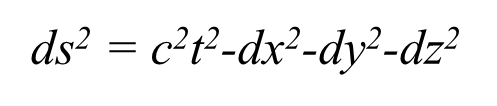
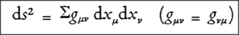

[**Volume I: Motion**](./volume-I.md)

[**Previous: 4.1.  On Euclidean geometry and non-Euclidean geometries.**](./vol-I-chap-4-sect-1.md) 

***

## 4.2. Einstein´s theories of relativity.

In Section 4.3 we will compare the descriptions of motion proposed by Kepler, Galileo, Newton and Einstein. We now consider first the Einsteinian approach to motion. Albert Einstein (1879-1955) created relativity theories in two moments: the special theory of relativity in 1905 when he introduced the fourth dimensional space-time description of motion and postulated that the velocity of light is a constant, and the general theory of relativity in 1915 when he reformulated the concept of gravity by proposing the equivalence principle: gravitational actions are equivalent to the effects produced in accelerated frames of reference. Under these conditions the appropriate geometry is non-Euclidean like the one proposed by Riemann. 

!!! info "Einstein´s Nobel Lecture Fundamental ideas and problems of the theory of relativity."

	Next, we include some excerpts from this Lecture. Subtitles do not come in the original; they are inserted and numbered for identifying the components of the Lecture. Some external NOTES are introduced to make clear certain issues, based on information obtained in Pais (1982). When the excerpts correspond to complete quotations, we write the corresponding texts in cursive format. The lecture was delivered to the Nordic Assembly of Naturalists at Gothenburg, July 11, 1923.  

	MLA style: Albert Einstein – Nobel Lecture. NobelPrize.org. Nobel Prize Outreach AB 2023. Mon. 20 Mar 2023. https://www.nobelprize.org/prizes/physics/1921/einstein/lecture/

	**(1)	Aspects considered in the theory of relativity**

	- "Physics problem: whether there are physically preferred states of motion in Nature?"

	- "Stipulation **of meaning: concepts and distinctions are only admissible to the extent that observable facts can be assigned without ambiguity."

	- "In classical mechanics, for any material point there exists a physically preferred state of motion which is the one that corresponds to an inertial frame of reference."

	** NOTE: Stipulate: To specify as a requirement or condition for agreement.

	**(2)	The preferred states of motion**

	- "States of motion are preferred when, relative to the formulation of the laws of Nature, coordinate systems are distinguished by their simplicity. In classical mechanics the states of motion of the inertial frames are physically preferred."

	- "Euclidian geometry is valid for the laws governing the position of rigid bodies, the inertial frame and the law of inertia."

	- "In classical mechanics a distinction is made (absolutely) between unaccelerated and accelerated motions. Velocities have only a relative existence (dependent on the selection of the inertial frame), while accelerations and rotations have an absolute existence (independent of the selection of the inertial frame). This means that "velocity relativity" exists, but not "acceleration relativity"."

	**(3)	Formulation of the law of inertia in classical mechanics**

	- "In an inertial frame the time is fixed and the state of motion to the system of coordinates is such that force-free material points undergo no acceleration. There is a lack of experimental criterion for whether a material point is force free."

	- "Time is absolute, it is independent of the choice of the particular inertial frame. Time can be measured without disagreement by identical clocks which run down periodically in any arbitrary state of motion."

	- "There are an infinite number of inertial frames which are in uniform translational motion relative to each other, and hence there is an infinite number of mutually equivalent, physically preferred states of motion."

	**(4)	Stipulation of meaning concerning motion**

	- "Motion can only be conceived as the relative motion of bodies with respect to some system of coordinates."

	- "The coordinate system is invariably represented by a practically rigid measuring body, not as something purely imaginary."

	- "In Euclidean geometry, rigid bodies can be positioned in rest relative to one another. This concept is only approximately achieved in Nature: interatomic distances change."

	- "It is physically significant that Euclidean geometry is valid in classical mechanics as well as in the special theory of relativity, but it is not in the general theory of relativity."

	**(5)	The concept of rigid body**

	- "It is logically unjustifiable to base all physical consideration on the rigid body and then finally reconstruct that body atomically by means of elementary physical laws which in turn have been determined by means of the rigid measuring body."

	- "It would be logically more correct to begin with the whole of the laws and to apply the "stipulation of meaning" to this whole first, i.e. to put the unambiguous relation to the world of experience last instead of already fulfilling it in an imperfect form for an artificially isolated part, namely the space-time metric."

	NOTE: The concept of metric refers to the distance between two points. In Euclidean geometry this is represented as $ds^2= (dx^2 + dy^2 + dz^2)$. In the four dimensions of relativity the **space time metric** corresponds to $ds^2= (c dt)^2 - (dx^2 + dy^2 + dz^2)$.

	**(6)	Principles of the special theory of relativity**

	- "Relativity principle: all inertial frames are equivalent for the formulation of the laws of Nature."

	- "Light principle: the velocity of light in a vacuum is invariant."

	- "The special theory of relativity is an adaptation of physical principles to Maxwell-Lorentz electrodynamics."

	- "To harmonize the relativity principle and the light principle, the assumptions that space and time are absolute do not apply."

	**(7)	 Measurements in the special theory of relativity**

	- "The state of motion and the time of the inertial frame are defined, in accordance with the stipulation of meaning, by the requirement that the light principle should apply to it."

	- "The Lorentz transformations for space coordinates and time apply for the transition from one inertial frame to another. The laws of physics remain invariant with respect to these transformations; they stay the same for all observers moving within different inertial frames of reference."

	- "Consequences: the time for each inertial frame is measured by identical clocks that are stationary relative to the frame, the object's length of a moving object is shorter than the length measured in the object's own rest frame, energy and inertial mass are of like nature."…

	**(8)	Preferred reference systems**

	- "According to the theory of light only a single state of motion is preferred: the one that remains stationary with respect to the light ether. In classical mechanics and in the special theory of relativity only states of motion are preferred in inertial frames."

	- "A profound modification of the geometric-kinematical principles is required if the laws of Euclidian geometry governing the position of rigid bodies do not apply, the Cartesian system of coordinates loses its significance in terms of the stipulation of meaning and the time can no longer meaningfully be defined by the indication on identical clocks at rest."

	- "A more general principle needs to be applied if in the formulation of the laws of Nature any arbitrarily moved frame of reference is equivalent to any other, meaning that there are not preferred states of motion at all in respect of regions of finite extension."

	**(9)	Equivalence principle in the general theory of relativity**

	"General relativity principle: let K be an inertial frame without a gravitational field and K’ a system of coordinates accelerated uniformly relative to K. The behavior of material points relative to K’ is the same as if K’ were an inertial frame in respect of which a homogeneous gravitational field exists."

	- "This principle implies that the systems of equations expressing the general laws of Nature are equivalent for all such systems of coordinates."

	- "The principle of equivalence means that gravitational attractions are of geometrodynamic nature:  the force of gravity is due to space-time deformations produced by strong concentration of matter. Physical interactions are explained in terms of geometrical properties."

	**(10)	The special theory as an approximation of the general theory**

	- "For each infinitesimal point-environment in an arbitrary gravitational field a local frame of coordinates can be given such that no gravitational field exists; it is a local inertial frame. The results of the special relativity theory are correct to a first approximation for such infinitesimally small regions."

	- "There are an infinite number of such local inertial frames at any space-time point; they are associated by Lorentz transformations. If x, y, z, t represent coordinates and time measured with reference to a local inertial frame; Lorentz transformations leave invariant the "distance" ds of two infinitely adjacent point events such that:"

	<figure markdown>
	{width="300"}
	</figure>

	**(11)	The gravitational field equations**

	- "In Riemannian geometry two infinitely adjacent points are at a "distance" ds, the square of which is such that"

	<figure markdown>
	{width="300"}
	</figure>

	- "The gravitational potentials gμν describe the gravitational field. They determine the space-time metric ds which is defined as an (absolute) parameter measurable by means of rigid scales and clocks."

	- "In mathematical terms the search for the field equations amounts to ascertaining the simplest generally covariant differential equations to which the gravitational potentials gµv can be subjected. To complete the basis of the general theory of relativity, the field equations must incorporate the electromagnetic field as well as the structure of matter."
  
	**(12)	Problems with the law of inertia**

	- "According to Newton theory the observable material bodies are responsible for the gravitational behaviour of a material point. However, the material cause for the inertial behaviour of the material point is not indicated but attributed to the absolute space or to the inertial ether."
  
	- "Mach demanded a modification of the law of inertia in the sense that the inertia should be interpreted as an acceleration resistance of the bodies against one another and not against "space"."

	- "In the general relativity theory, the distinction between inertial and gravitational effects is eliminated when the gravitational potentials $g_{μν}$ are completely determined by the matter."

	**(13)	Affine correlations in Riemannian geometry**

	- "The characteristic assumption of Riemannian geometry is the attribution to two infinitely adjacent points of a "distance" ds."

	- "To every line element (or vector) at a point P is assigned a parallel and equal line element (or vector) through any given infinitesimally adjacent point P’; this defines an affine correlation. Riemannian metric determines an affine correlation."

	- "The most important concept of Riemannian geometry, "space curvature", on which the gravitational equations are also based, is based exclusively on the "affine correlation"."

	**(14)	Further developments**

	- "By seeking the simplest differential equations which can be obeyed by an affine correlation there is reason to hope that a generalization of the gravitation equations will be found which includes the laws of the electromagnetic field."

	- "A mathematically unified field theory is sought in which the gravitational field and the electromagnetic field are interpreted only as different components or manifestations of the same uniform field."

	- "Moreover it should not be forgotten that a theory relating to the elementary electrical structures is inseparable from the quantum theory problems."

	See as another reference the English version of Einstein´s book *Über die spezielle und die allgemeine Relativitätstheorie (Relativity: The Special and General Theory*, published in 1920).

[**Next: 4.3. Aspects and Factors distinguishing scientific theories.**](./vol-I-chap-4-sect-3.md)

