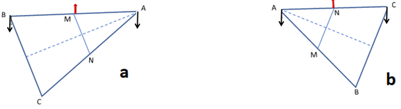
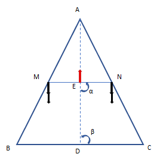

[**Volume I: Motion**](./volume-I.md)

[**Previous: 4.2. Einstein´s theories of relativity.**](./vol-I-chap-4-sect-2.md) 

***

## 4.3 Aspects and Factors distinguishing scientific theories.

	
According to Piaget and Garcia (1989) there are seven elements that characterize a scientific theory: the following four Aspects (A) and three Factors (F); 
	
$A_1$: *Type of questions to be addressed by the theory.*

$A_2$: *Type of non-demonstrated premises that are implicitly or explicitly accepted.*
	
$A_3$: *Type of relationships between theory and experience.*
	
$A_4$: *Role of mathematics in the formulation of a physical theory.*
	
$F_1$: *Methodology or procedure employed in the analysis of facts and in the verification of hypothesis.*
	
$F_2$: *Epistemological points of view characterizing general concepts in connection with experimental facts.*

$F_3$: *Building of a coherent system that logically integrates facts and concepts.*

!!! info "Descriptions of motion according to Kepler, Galileo, Newton, and Einstein."

	For each one of the previous seven elements characterizing a scientific theory we now compare the descriptions of motion that correspond to the concepts, models and theories developed by Kepler (K), Galileo (G), Newton (N) and Einstein (E). 

	***A1:*** *Type of questions to be addressed by the theory.*

	**K:**  Is there any behavioral pattern that can be inferred from observational data concerning the positions and motions of the planets registered by Tycho Brahe? 
	
	**G:**  What happens to the motion of a body when no interaction modifies its velocity during a certain time interval? 
	
	**N:**  How can we get the position as a function of time when we introduce the law of the force in the low of motion? 
	
	**E:**  How the physical properties of a system depend on the geometrical characteristics of space-time? 

	
	***A2:*** *Type of non-demonstrated premises that are implicitly or explicitly accepted.*
 
	**K:**  The symmetry and regularity of the platonic solids are manifestations of the harmony and simplicity of the planet trajectories in the sky. 

	**G:**  Any assumption or prediction concerning physical phenomena needs to be tested by experiments. The validity of the hypothesis depends on how objective the mechanisms interpreting experimental results are. 

	**N:**  The mathematical tools of calculus can be used to solve the differential equations describing motion when the analytical functions of the forces are given.

	**E:**  Both theories of relativity are derived from principles: for the special theory the principles of relativity and of the constancy of the speed of light; for the general theory the principle of equivalence, meaning that gravitational attractions are of geometrodynamic nature.

	
	***A3:*** *Type of relationship between theory and experience*. 

	**K:**  What is observed and measured is described by theoretical considerations involving mystical and geometric assumptions. 
	
	**G:**  Pure theoretical speculations explain almost nothing; logical reasoning is not enough for understanding the physical reality which requires appropriate explanations of measured experiences. 
	
	**N:**  Once we know the present initial conditions of the systems and all the interactions operating on the system, we can predict the future and explain the past because time and space are independent as well as universal and homogeneous. 
	
	**E:**  If the concepts involved in explaining some experimental results are inside the domains of validity of the theory but nevertheless some observations or measurements do not agree with theoretical calculated predictions, then it is necessary to review the experimental procedures and interpretations.

	
	***A4:*** *Role of mathematics in the formulation of a physical theory*. 

	**K:**  Three laws express the observed results, namely, that the trajectories of the planets around the Sun are ellipses: the Sun is in one of the focuses, the angular speed of the planet is greater in the aphelion than in the perihelion, and the squares of the periods of revolution are proportional to the cubes of the average distances to the Sun. 
	
	**G:**  Quantitative formal relationships between physical variables lead to numerical results that can be compared with observational data and experimental measurements. 
	
	**N:**  Classical mechanics consists in a series of approximations and mathematical solution methods with which experimental data can be predicted with great accuracy and precision, because for the representation and interpretation of physical phenomena Euclidean geometry is the appropriate framework. 
	
	**E:**  The physics of motion and the transformation between matter and energy are explained in terms of a geometrodynamical approach that is not Euclidean because the structure of the four-dimensional space-time is determined by high concentrations of masses.	

	
	***F1:*** *Methodology or procedure employed in the analysis of facts and in the verification of hypothesis.*		

	**K:**  Careful analysis of regularities in observational data leads to a new conceptual organization of the positions and motions of celestial bodies according to the Copernican model of the universe. 
	
	**G:**  The rationality and scope of the theoretical models depend on the fact that calculated predictions must correspond up to a certain precision with experimental measurements. 
	
	**N:**  The validity of the hypothesis and of the mathematical equations describing the properties of physical systems are consistent with a mechanical conception of the universe. 
	
	**E:**  The agreement and coherence among theory and experiments considers that motion is relative to the reference system, that the law of transmission of light in vacuo is satisfied, and that the principle of equivalence is valid.

	
	***F2:*** *Epistemological points of view characterizing general concepts in connection with experimental facts.* 

	**K:**  Scientific truths describing natural phenomena are presented in beautiful and precise mathematical forms in order to systematize the observations made by Brahe. 
	
	**G:**  Asking questions to nature by means of experimental procedures and devices serves to describe natural phenomena by providing asymptotic explanations to physical phenomena. 
	
	**N:**  Once the theory is completely and satisfactory according to mathematics, the explanations of phenomena is a logic consequence that can be experimentally tested. 
	
	**E:**  Scientific explanations can be formulated in terms of three kinds of levels: the Intra level describing objects like elementary particles and energy radiations, the Inter level proposing relationships like those connecting space with time, matter with energy and gravitational fields with accelerated frames of reference, and the Trans level dealing with structures like those describing the kinematics and dynamics aspects of motion in a gravitational theory corresponding to a non-Euclidean geometry.
	
	
	***F3:*** *Building a coherent system that logically integrates facts and concepts.*  

	**K:**  Kepler´s laws form a consistent theoretical structure that describes but does not explain; it will require a complete justification as the one formulated by Newton. 
	
	**G:**  Galileo’s law of inertia is a particular case of Newton´s first law of motion. This implies that the motion of a body can continue to be rectilinear and uniform if there is no force that modifies that state of motion. 
	
	**N:**  Once the theory of gravitation was formulated and tested there remained the need for connection and integration with other branches of Classical Physics, like Thermodynamics and Electromagnetism. 
	
	**E:**  Theories of relativity present a fruitful synthesis of concepts and principles explaining mechanical and electromagnetic phenomena, but it still needs to include quantum effects. Furthermore, it must be research is required concerning phenomena such as the motion of the perihelion of Mercury, the deflection of light by a gravitational field, and the displacement of spectral lines towards the red, as well as the production and detection of black holes.

***

### REFERENCES

1. PAIS, A. *Subtle is the Lord…! The Science and the Life of Albert Einstein*, Oxford University Press. (1982).

2. REICHENBACH, H. *The Philosophy of Space and Time*. New York. Dover Publications. (1958).

3. PIAGET J. and Garcia R. *Psychogenesis and the History of Science*. New York. Columbia University Press. (1989).

***

### APPENDIX 4.1. How the lever principle serves to justify that the postulate of the parallels is satisfied.

In what follows we describe the explanation made by Lagrange. Figure 4.3 expresses the content of Euclid's fifth postulate and figures 4.4 to 4.7 correspond to the explanation attributed to Lagrange.

<figure markdown>
{width="800"}
<figcaption> (Image credit: elaborated by the authors.)
</figcaption>
</figure>

**Figure 4.3.** The two lines are parallel only when α + β = 180º.

Lagrange's triangle consists in the following (Figure 4.4):

Let ABC be an isosceles triangle whose sides AB and AC are equal by construction.

Line AD is perpendicular to side BC and intersects this side at point D, which is in the middle of segment BC, that is, BD = DC.

Points M and N are in the middle of respective sides AB and AC so that BM = MA in one side and AN = NC in the other side.

<figure markdown>
{width="300"}
<figcaption> (Image credit: elaborated by the authors.)
</figcaption>
</figure>

**Figure 4.4.** Characteristics of the triangle ABC, the so-called Lagrange’s triangle.

Now consider that Lagrange's triangle is suspended from point A and that a weight 2P is applied to point A and a weight P is applied to each endpoint B and C, as shown in Figure 4.6. Under such conditions, the triangle BAC is in equilibrium with respect to the axis that passes through the line AD: the weight 2P in A does not intervene because it is at a zero distance from the axis AD. The weights that hang from B and C satisfy the condition of the lever:

Suspension point in A: (P) x (BD) {left side of D} = (P) x (DC) {right side of D}.

<figure markdown>
{width="300"}
<figcaption> (Image credit: elaborated by the authors.)
</figcaption>
</figure>

**Figure 4.5.** Application of the principle of the lever when the suspension is in A: (P) x (BD) = (P) x (DC).

Now consider that the weight 2P that was hanging at A is divided in two parts: a weight P is applied at point A to a lever to be suspended from the point M (which is in the middle of segment BA) and the other weight P is applied at that same point A but to the lever that is suspended from point N (which is in the middle of segment AC) (Figures 4.6a and 4.6b). Under these conditions we obtain 

Suspension in M: (BM x P) {left side of M} = (MA x P) {right side of M}.

Suspension in N: (AN x P) {left side of N} = (NC x P) {right side of N}.

<figure markdown>
{width="800"}
<figcaption> (Image credit: elaborated by the authors.)
</figcaption>
</figure>

**Figure 4.6.** Levers with suspension centers in M (a) and in N (b).

Then suppose that the weights on B and A in Figure 4.6a are applied to M and the weights on A and C in Figure 4.6b are applied to N. Superposing these two conditions, we have in the triangle ABC that each one of the weights on M and on N are 2P. The aforementioned distribution of weights also maintains the balance of triangle ABC with respect to an axis passing through points M, E, and N. This is shown in Figure 4.8 where the triangle is placed vertically and suspended from point E, which is the intersection of line AD. with the line MN.

<figure markdown>
{width="300"}
<figcaption> (Image credit: elaborated by the authors.)
</figcaption>
</figure>

**Figure 4.7.** Redistribution of the weight on M and on N corresponding to the superpositions of previous figures 4.6a and 4.6b. Now the triangle ABC is suspended from E.

The situation of the triangle ABC in a vertical position and in equilibrium with respect to the suspension point E is equivalent to a lever along the axis MN, with center in E and with weights equal to 2P on each side. If the distances from the center E to the ends M and N are $d_1 = ME$ y $d_2 = EN$. Applying the principle of the lever, we obtain:

Suspension in E: (ME x 2P) {left side of E} = (EN x 2P) {right side of E}.

Since the above condition is satisfied because the lever is in equilibrium, we get ME = EN and therefore E is the midpoint of the segment MN. Under these conditions, the line AD, which is perpendicular to the line BC because it bisects the angle BAC, is also perpendicular to the line MN at point E. This implies the equality between the angles DEM = DEN and ADB = ADC, all of them having 90° which indicates that lines MN and BC are parallel to each other.

The previous affirmation is identified with the fifth postulate of parallels, which indicates that the sum of the angles α = NED and β = CDE is two right angles, each of these angles being equal to 90° and that therefore $α + β = 180°$. This means that the static equilibrium in Lagrange's triangle is explained in terms of the lever principle, showing that the applicability of such a principle justifies Euclid's parallel postulate. Certainly, this implies that the lever principle is applicable only in flat spaces of zero curvature corresponding to Euclidean spaces.

### APPENDIX 4.2. Connections of the lever principle with the natural states of motion as well as with conservation laws.

**First natural state of bodies in motion**: the uniform translational motion of bodies on Earth.

The conservation of linear momentum ($p_{total}$) is a consequence of the fact that the resultant of the forces is zero: if $F_{resultant} =  \frac{d(p_{total})}{dt}=0$, then $p_{total}$  is constant. The linear momentum of the total system is $m_Av_A + m_Bv_B$. If before the collision $v_B = 0$ and after the collision $v_A = 0$, the conservation of linear momentum implies that before the collision we have $m_Av_A+0 = m_Av_A$, and after the collision $0 + m_Bv_B = m_Bv_B$. Therefore $m_Av_A = m_Bv_B$. (We omit the vector notation since the motion is uniform and in a straight line.)

We make two substitutions in the relation expressing the conservation of linear momentum: $m_Av_A = m_Bv_B$. In the first substitution each mass is indicated as the quotient of the weight divided by the acceleration of gravity (g): $m_A = p_A/g$ y $m_B = p_B/g$. For the second substitution we consider that the movement is rectilinear and uniform and that each velocity is the quotient of the distance traveled divided by the time used to cover it. If the times are equal $t_A = t_B = t$, then $v_A = d_A/t$ y $v_B = d_B/t$. For body A: $m_Av_A = (p_A/g)(d_A/t) = (p_Ad_A)/(gt)$ and for body B: $m_Bv_B = (p_Bd_B)/(gt)$. Equating the total linear moments and simplifying the common factor (gt) the well-known lever principle $p_Ad_A = p_Bd_B$ is obtained.

**Second natural state of bodies in motion**: the uniformly accelerated motion of
bodies falling from heaven to Earth.

Equations $h_A = (v_A)^2/(2g)$ and $h_B = (v_B)^2/(2g)$ are based on the following: 

1. The movement of free fall is rectilinear.

In this movement, the object that is released from a certain height (h) and is allowed to fall without pushing it, at first has zero initial velocity ($v_{initial} = 0$) and when it falls it follows a rectilinear trajectory that corresponds to the vertical, if there is no air friction. However, such movement does not correspond to a uniform velocity because this physical quantity changes with time due to the action of the acceleration of gravity that causes the speed of fall to increase with time. When the object reaches the ground in a fall time ($t_c$) it will have reached the velocity $v_{final} = gt_c$.

2.  Free fall motion is not uniform but uniformly accelerated.

If the initial point from which the displacements are measured corresponds to the place from where the object is dropped out, the distance traveled will be the height (h) from which it is released. If the movement were uniform with velocity $v_{constant}$, the distance traveled (h) would depend linearly on time $h = (v_{constant})(t)$. However, since there is an acceleration that modifies the initial velocity, the distance traveled is $h = (v_{average})(t)$ where $v_{average} = (½)(v_{initial} + v_{final})$ is the average velocity. Then, as $v_{initial} = 0$, it results $v_{average} = (½)(v_{final})$.

As in the previous case $v_{final} = gt$, therefore $h = (v_{average})(t) = ½(v_{final})(t) = ½(gt^2)$. Solving for time in $v_{final} = gt$ and substituting into the previous expression $h = (½)(gt^2)$ it can be obtained $h = (½)(g)(v/g)^2 = (v^2)/(2g)$. This allows us to write that in the case of free fall of bodies A and B we have $h_A = (v_A)^2/(2g)$ and $h_B = (v_B)^2/(2g)$.

If bodies A and B reach the heights $h_A$ and $h_B$ it is because some work has been done previously to move both bodies from the ground to their corresponding heights. Since the work (T) is defined as the product of the force (the weight) multiplied by the distance moved (d), which in this case is in the same direction in which the force is applied, it follows that $T_A = (p_A)(d_A)$ and $T_B = (p_B)(d_B)$. If these works are equal ($T_A = T_B$) the well-known law of the lever is obtained again: $p_Ad_A = p_Bd_B$.

Now consider that the weights of the two bodies are $p_A = m_Ag$ and $p_B = m_Bg$, that the distances traveled are $d_A = h_A$ and $d_B = h_B$, and that for each body the expression $h = (v^2)/(2g)$ is used. Therefore, the corresponding works are $T_A = p_Ad_A = [m_Ag][(v_A)^2/(2g)] = (½)(m_A)(v_A)^2$, and $T_B = p_Bd_B = [m_Bg][(v_B)^2/(2g)] = (½)(m_B)(v_B)^2$. Therefore, the equality of the total work done by the two falling bodies ($T_A = T_B$) corresponds to the conservation of kinetic energy: $(½)(m_A)(v_A)^2 = (½)(m_B)(v_B)^2$. 

Previous equation is known as the work-energy theorem, which can be derived from the definition of work as the integral of the scalar product of the force multiplied by the displacement $T= \int F∙dr = \int (m \frac{dv}{dt}) ∙dr =m \int (\frac{dr}{dt}) ∙dv = m \int vdv= (\frac{m}{2})(v^2)$.

**Variation of the first natural state of bodies in motion**: the uniform rotational movement of bodies on the Earth.

If there is balance on the lever, there is no rotation with respect to C and the combined action of the torques produced by each of the weights is cancelled. Each torque is the product of the weight of the body by the distance from the point of application of the weight to the axis of rotation: $Torque_{left} = (–p_Ad_A)$ and $Torque_{right} = (+p_Bd_B)$. In the equilibrium condition with respect to the rotational movement, it must be that $Torque_{left} + Torque_{right} = 0$. From this condition it follows that $(– p_Ad_A) + (+p_Bd_B) = 0$ and $p_Ad_A = p_Bd_B$, which is the law of the lever.

For a body of mass $m$ and velocity $v$ the linear momentum is $p=mv=m(dr⁄dt)$ and the angular momentum is $l=r \times p$, If the force is F the torque is  $τ=r \times F$. It can be shown that $dl⁄(dt=( d[r \times p])⁄(dt=(dr⁄dt) )) \times p+r \times [dp⁄dt]=[r \times (dp⁄dt)]=r \times F=τ$. Then if $τ=0$, $dl⁄dt=0$ mens that $l$ is constant.

[The product $(dr⁄dt)  \times p$ is zero since the vectors $dr⁄dt$ and $p=mv$ are parallel.] Then, if the torque resulting from the action of two or more forces is zero the angular momentum is constant (conserved).

***

[**Next: 5.1.  Kinetic theory of gases and Thermodynamics.**](https://modphysnobel.github.io/vol-II/vol-II-chap-5-sect-1/)