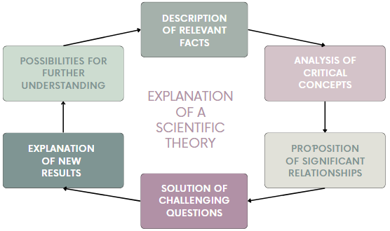

[**Volume II: Energy**](./volume-II.md)

[**Previous: 5.2.  The photon as a quantum of energy.**](./vol-II-chap-5-sect-2.md) 

***

## 5.3.  Components of the explanation of scientific theories.

In this section we apply the components of the explanation of scientific theories to describe the content of the Nobel Lectures by Wien and by Planck (see Figure 5.9). 

	</img>

(Image credit: drawings made by the authors.)

**Figure 5.9.** Components of the explanation of scientific theories.

In the following. for explanatory purposes, we arbitrarily divide the content of the Nobel lectures by Wien and by Planck into the previous six components of the explanation of a scientific theory. This division does not pretend to correspond to a unique form of considering that the content of these lectures has been organized according to these six components. Next, for  each component, we describe the main ideas contained in their corresponding texts. The full contents of both Lectures are included in Appendices 5.1 and 5.2.

!!! info "Wien´s Nobel Lecture *On the Laws of Thermal Radiation*."

	**Description of relevant facts.**

	•	Using known physical laws, a general law of radiation theory (the displacement law) was derived by considering ideal processes as in a mental experiment. This procedure is like the one followed by Kirchhoff, when he assumed an ideal perfectly reflecting body in his derivation of the theorem about the constancy of the ratio of emission and absorption power. If a small aperture is made in the walls surrounding a cavity that is heated, through this hole a radiation can come out. This radiation is independent of the nature of the emitting body and is wholly determined by the temperature. 

	**Analysis of critical concepts.**

	•	The Kirchhoff theorem is not limited to radiation caused by thermal processes. Furthermore, when a radiation is in thermal equilibrium with a hot body, every radiation has a certain temperature for every color. According to Stefan-Boltzmann Law, that has been derived from thermodynamics, the radiation of a black body is proportional to the fourth power of the absolute temperature.

	**Proposition of significant relationships.**

	•	The colors (frequencies) of a black body radiation change with temperature. Wien based his calculation on an ideal process: the black body was a cylindric oven at a certain temperature, containing in one end a movable piston and in the other end a perfect reflecting wall with a very small hole for the entrance of incident radiation. If an external electromagnetic radiation exercises a pressure on the walls of the piston, it produces a work that moves the piston at a certain velocity. By Doppler effect, the frequency of the radiation reflected by the movable piston is different from the incident radiation already contained inside the cylinder. Afterwards, the change with temperature undergone by the spectral composition of the total black-body radiation in the cavity can be calculated. From this result the displacement law is derived: there is a maximum value of the black body radiation curve for each temperature such that the peak frequency is directly proportional to temperature. This is the same as saying that the peak wavelength is inversely proportional to temperature, meaning that the value of this peak is displaced towards shorter wavelengths.
 
	**Solution of challenging questions.**
	
	•	According to Lorentz, if in Maxwell electromagnetic equations all spatial dimensions are displaced in time in the same ratio as the changes in the wavelength due to changes in temperature, the electromagnetic energy must decrease in proportion to the fourth power of displacement. Also, according to the Stefan-Boltzmann law, energy increases with the fourth power of absolute temperature, so the linear dimensions must vary inversely proportionately to the absolute temperature. Therefore, “the radiation energy of a certain wavelength varies with changing temperature so that the product of temperature and wavelength remains constant.”

	•	As a consequence of Wien displacement law, the color of a star is determined by its temperature. This means that the maximum of solar radiation is in the visible range of wavelengths.

	•	Calculating of the wavelength of X-rays, which are produced by the impact of electrons on solid bodies. The electric energy of these rays would be a measure of their temperature. By applying the displacement law the wavelength of the maximum of the intensity will indicate a wavelength range of X-rays.

	•	Thermodynamics is not enough to determine the distribution of the intensity of radiation in terms of individual wavelengths; therefore, the mechanism of the radiation process requires a statistical approach. One possibility is to consider that radiations result from gas molecules moving according to laws of probability. Another possibility is to assume that when electrons generate radiation on striking molecules, they follow a velocity distribution satisfying Maxwell’s law. Any how the resulting equation deviates from experimental results for large wavelengths.

	•	Rayleigh proposed a different approach by applying to the radiation problem the equipartition theorem according to which all the degrees of freedom in a system in equilibrium have the same contribution to the kinetic energy. He calculated the number of free electromagnetic vibration modes per unit volume in the cavity and per unit wavelength. The resulting law indicates that the emission of radiation of a given wavelength is directly proportional to the absolute temperature, and inversely proportional to the fourth power of the wavelength. Measurements of the spectral emission of black bodies revealed that the emission agreed with Rayleigh's calculation at low frequencies but diverged at high frequencies.

	**Explanation of new results.**

	•	Planck´s hypothesis about the quantum of energy assumes that energy is not infinitely divisible but can only be distributed in discrete quantities which cannot be divided further. Planck´s radiation equation accommodates all observed data; it includes the Rayleigh and Wien laws as limiting cases; Rayleigh’s law is satisfied for very long wavelengths and Wien´s law for short wavelengths.
	
	**Possibilities for further understanding.**

	•	Experimental values of the specific heats in solids do not obey the Dulong-Petit law which assumes that the solid is set of classical oscillators. Even if the energy of these oscillators is quantized, as Einstein proposed, the model is not valid at very low temperatures. Although the theory of specific heats is not derived from the radiation formula, Planck radiation theory provides the first step to the theory of specific heats.

	•	Einstein considered the fluctuations to which radiation is continuously subjected due to irregularities of the thermal processes. If both sides of a small plate placed inside a cavity filled with radiation are subjected to the radiation pressure, the irregularities of the radiation will produce irregular movements in the plate that can be calculated in probabilistic terms. Two terms contribute to the fluctuations depending on the density of radiation energy: for higher densities one term corresponds to radiation that obeys Rayleigh’s law and when the density is low the second term corresponds to radiation that obeys Wien´s law.

	•	Sommerfeld attempted to invest the universal constant h of the Planck radiation theory with physical significance: the constant h expresses a universal characteristic of the atoms. By determining how the period in which an electron entering the atom comes to a stop is a function of its velocity, Sommerfeld calculated the wavelength of X-rays with the aid of electromagnetic theory.

	•	The problem of thermal radiation still requires a complete solution. …. “Far-reaching and new thoughts will have to set to work, but the result will be great, because we shall obtain a profound insight into the world of the atom and the elementary processes within it.”

!!! info "Planck´s Nobel Lecture *The Genesis and Present State of Development of the Quantum Theory*."

	**Description of relevant facts.**

	•	Purpose of the Lecture: “to describe the story of the origin and the development of the quantum theory and consider its present-day significance for physics”.

	•	The study of the physical quantum of action began twenty years ago when Planck tried to solve the problem of the distribution of energy in the normal spectrum of radiating heat.

	•	According to Kirchhoff, the state of the heat radiation which takes place in a cavity bounded by any emitting and absorbing substances of uniform temperature is entirely independent upon the nature of the substances. 

	**Analysis of critical concepts.**	

	•	Planck considered the laws of emission and absorption of linear resonators as those proposed by Hertz. When such oscillators are inside a cavity surrounded by a sphere of reflecting walls, they exchange their energy by emitting and absorbing electromagnetic waves. The black-body radiation is the produced stationary radiation corresponding to Kirchhoff’s Law. 

	**Proposition of significant relationships.**

	•	There is a general connection, independent on the nature of the resonator, between the energy of a resonator and the energy radiation of the corresponding spectral region in the surrounding field under conditions of stationary energy exchange. The resonators exercise an irreversible effect upon the energy in the surrounding radiation field. 

	**Solution of challenging questions.**

	•	Planck considered the entropy of the resonator and its energy, not the temperature. He used existing experimental results: the proof of the energy distribution law established by Wien that was effective for small values of the energy and for short waves. 

	•	Discrepancies with experimental results: for small values of the energy and for short waves the Wien’s law was satisfactorily confirmed but not the case for larger wavelengths.

	•	A new proposed interpolation radiation formula contained two terms, one of the first power of the energy predominant for small energies and one of the second power of the energy, predominant for larger energies. 

	•	According to Boltzmann the entropy is a measure for physical probability. In Nature entropy and energy are not measured as absolute quantities but as differences; however, for a description in terms of probabilities, quantities defined as absolute values must be considered and two additive constants are required. In connection with the energy distribution of the resonator, the first constant is related to the definition of temperature which corresponds to the average kinetic energy of a molecule in an ideal gas. Corresponding to entropy, the second constant represents action, the product of energy and time.

	**Explanation of new results.**

	•	The quantum of action appeared suitable for explaining experiments involving the action of light. Planck refers to the following phenomena that Einstein explained by considering the quantum of action as a general characteristic of electromagnetic radiation not only an assumption describing the black body radiation: the diffusion of spherical particles through a liquid as described by Stokes´Law, the electron emission in the photoelectric effect, the gas ionization produced by ultraviolet light, and the specific heat of solids where the energy of the solid was identified with the energy of a system of resonators.

	**Possibilities for further understanding.**

	•	Calculation of the specific heat of gases by considering that, in addition to the quantized vibrational motion of the molecules, their rotational energy is also quantized. Also, as affinity properties of a substance are determined by its entropy, the quantum-theoretical calculation of the entropy opens up the way to study chemical relationships.

	•	When an electron impacts a neutral atom, it causes emission of a light quantum or photon. This is a reverse process to that of electron emission through irradiation by quantized light as in Röntgen or gamma rays.

	•	The quantum hypothesis is fundamental in the interpretation of spectra and in the derivation of formula describing spectroscopic series. It has been applied in atomic systems with several degrees of freedom and when the variability of the inertial mass is considered according with relativity theory. It is also critical in the calculations of the fine structure of spectra and in the splitting of spectral lines produced by external perturbations.

	•	The same value of the quantum of action ($6.52 \times 10^{-27}$ erg sec) has been obtained from different process, meaning that it is a universal physical constant. Nevertheless, the introduction of the quantum of action into classical theories makes difficult to understand that the electron only moves in quantized circular orbits without radiating energy. The old framework for understanding must change.

	•	The energy of a photon after complete emission could serve for its propagation both in a form described as a boundless field capable of producing wave like interferences or like a punctual projectile being able to concentrate energy in a small space region.

***

### Appendix 5.1. Transcription of Wien´s Nobel Lecture.

!!! info "On the Laws of Thermal Radiation."

	**Description of relevant facts.**

	“The kind recognition which my work on thermal radiation has received in the views of your ancient and famous Academy of Sciences gives me particular pleasure to speak to you about this subject which is again attracting the attention of all physicists because of the difficulty of the problems involved. As soon as we step beyond the established boundaries of pure thermodynamic theory, we enter a trackless region confronting us with obstacles which even the most astute of us are almost at a loss to tackle.”

	“If, as is the custom, I speak mainly about my own researches, I must say that I was fortunate in finding that not everything had yet been gleaned in the field of general thermodynamic radiation theory. Using known physical laws it was possible to derive a general law of radiation theory which has, under the name of the displacement law, been acclaimed by fellow workers. In applying thermodynamics to the theory of radiation, we make use of the ideal processes which have been found so fruitful elsewhere. These are mental experiments whose realization is frequently impracticable and which nevertheless lead to reliable results. Such deliberations can only be undertaken if all the processes on which, governed by laws, the mental experiments are based, are known, so that the effect of any change can be stated accurately and completely. Further, to be allowed to idealize, we must neglect all non-essential secondary phenomena, while considering only everything indissolubly connected with the processes under examination. In the application of mechanical heat theory, this method has proved to be extremely fruitful. Helmholtz used it in the theory of concentration flows, Van ‘t Hoff used it in applying thermodynamics to the theory of solutions. It is necessary, in these deliberations, to presuppose the existence of a so-called semi-permeable membrane which permits the solvent to pass, but not the substance dissolved. Although it is impossible to prepare membranes which strictly satisfy this requirement, we can assume them as possible in the ideal processes, because the laws of Nature set no limit to approximation to semipermeability. The conclusions drawn from these assumptions have in any case always been in agreement with experience. In radiation theory, analogous deliberations can be made if we assume perfectly reflecting bodies as possible in the ideal processes. Kirchhoff used them for proving his famous theorem of the constancy of the ratio of emission and absorption power. This theorem has become one of the most general of radiation theory and expresses the existence of a certain temperature equilibrium for radiation. According to it, there must exist, in a cavity surrounded by bodies of equal temperature, a radiation energy that is independent of the nature of the bodies. If in the walls surrounding this cavity a small aperture is made through which radiation issues, we obtain a radiation which is independent of the nature of the emitting body, and is wholly determined by the temperature. The same radiation would also be emitted by a body which does not reflect any rays and which is therefore designated as completely black, and this radiation is called the radiation of a black body or black-body radiation.”

	**Analysis of critical concepts.**

	“The Kirchhoff theorem is not limited to radiation caused by thermal processes. It seems to be valid for most, if not all luminous processes. That the temperature concept can be applied to all luminous processes is beyond doubt. Since we can produce all types of light by means of hot bodies, we can ascribe, to the radiation in thermal equilibrium with hot bodies, the temperature of these bodies, and thus every radiation, even that issuing from a phosphorescent body, has a certain temperature for every colour. This temperature has however no connection whatever with that of the body, nor is it possible as yet to state how e.g. a phosphorescent body comes into equilibrium with radiation. These conditions are bound to be very complicated, in particular in the case of bodies which convert the absorbed radiation and emit it after a long interval of time.”

	“Again using ideal processes and assuming radiation pressure, which at that time had been deduced from the electromagnetic theory of light, Boltzmann derived from thermodynamics the law, previously empirically formulated by Stefan, that the radiation of a black body is proportional to the fourth power of the absolute temperature.”

	**Proposition of significant relationships.**

	“This did not exhaust the conclusions to be drawn from thermodynamics. There remained the determination of the changes undergone by the colours present in radiation with changes of temperature. Computation of this change is again based on an ideal process. For this, we must assume wholly reflecting bodies as possible that scatter all incident radiation and which can therefore be described as completely white. If we allow the radiation coming from a black body to enter a space of this kind, it will in the end propagate exactly as if the walls of the space were themselves radiant and had the same temperature as the black body. If we then seal off the black body from the white space, we obtain the unrealisable case of a radiation permanently reciprocated between mirroring walls. In our thoughts, we continue the experiment. We imagine the volume of our space to be reduced by movement of the walls, so that the entire radiation is concentrated in a smaller space. Since radiation exercises a certain pressure, the pressure of light, on the walls it strikes, it follows that some work must have been expended in size reduction, as if we had compressed a gas. Because of the low magnitude of the pressure of light, this work is very small, but it can be computed accurately, which is all that matters in the case under discussion. In accordance with the principle of the conservation of energy, this work cannot be lost, it is converted into radiation, which further increases the radiation concentration. This change of radiation density due to the movement of the white walls is not the only change to which the radiation is subjected. When a light ray is reflected by a moving mirror, it undergoes a change of the colour dictated by the oscillation frequency. This change in accordance with the so-called Doppler principle plays a substantial part in astrophysics. The spectrum line emitted by an approaching celestial body appears to be displaced in the direction of shorter wavelengths in the ratio, its velocity: the velocity of light. This is also the case when a ray is reflected by a moving mirror, except that the change is twice as great. We are therefore able to calculate completely the change undergone by the radiation as a result of the movement of the walls. The pressure of light which is essential to these deliberations was demonstrated at a much later date, Lebedev being the first to do so. Arrhenius used it to explain the formation of comet tails. Before that, it was only a conclusion drawn from Maxwell’s electromagnetic theory. We now calculate both the change of radiation density due to movement, and the change of the various wavelengths. From this mental experiment, we can draw an important conclusion. We can conclude from the second law of mechanical heat theory that the spectral composition of the radiation which we have changed by compression in the space with mirror walls is exactly the same as it would be had we obtained the increased density of radiation by raising the temperature, because we would otherwise be able to produce, by means of colour filters, unequal radiation densities in the two spaces, and to generate work from heat without compensation. Since we can calculate the change of individual wavelengths due to compression, we can also derive the manner in which the spectral composition of black-body radiation varies with temperature. Without discussing this calculation in detail, let me give you the result: the radiation energy of a certain wavelength varies with changing temperature so that the product of temperature and wavelength remains constant.”

	“Using this displacement law it is easy to calculate the distribution of the intensity of thermal radiation over the various wavelengths for any temperature, as soon as it is known for one temperature.”

	**Solution of challenging questions.**
	
	“The shift of the maximum of intensity in particular is directly accessible to observation. Since the wavelength at which the maximum intensity lies also defines the principal area of the wavelength which is most intense at this temperature, we can, by changing the temperature, shift the principal area of radiation in the direction of short or long wavelengths of any desired magnitude. Of the other derivations of the displacement law, I shall only mention that by H.A. Lorentz. If, in the electromagnetic equations of Maxwell, we imagine all spatial dimensions as being displaced in time in the same ratio, these equations show that the electromagnetic energy must decrease in proportion to the fourth power of displacement. Since, according to the Stefan-Boltzmann law, energy increases with the fourth power of absolute temperature, the linear dimensions must vary inversely proportionately to the absolute temperature. Each characteristic length must vary in this ratio, from which the displacement law follows.”
	
	“From the displacement law, we can calculate the temperature of the sun if we are entitled to assume that the radiation of the sun must be ascribed to heat, and if we know the position of the maximum of the energy of solar radiation. Different figures are given for this position by different observers, i.e. 0.532 m according to Very, and 0.433 m according to Abbot and Fowle. Depending on the figure used, the temperature of the sun works out at 5,530° and 6,790°. However much the observers may differ, there can be no doubt that the maximum of solar radiation is situated in the visible range of wavelengths. This is to say that the temperature of the sun is the most favourable utilization of the radiant energy of a black body for our illumination and that, in our artificial light sources which utilize thermal radiation we must aim at achieving this temperature, from which we are admittedly far removed as yet.”

	“I wish to discuss yet another application of the displacement law, i.e. the possibility of calculating the wavelength of X-rays. As we know, X-rays are produced by the impact of electrons on solid bodies, and their wavelength must be a function of the velocity of the electrons. According to the kinetic theory of gases, the mean kinetic energy of a molecule is a measure of absolute temperature. If, as is done in the theory of electrons, we assume that this is also valid for the kinetic energy of the electrons, the electric energy of the cathode rays would be a measure of their temperature. If we substitute the temperature thus calculated in the displacement law, we find that the wavelength of the maximum of the intensity indicates a wavelength range of X-rays which agrees well with the wavelengths found by other arguments. It might be objected that we must not ascribe a temperature to the electrons. The permissibility of our procedure can however be justified by an inversion of the above argument. Radiation in an enclosed space must necessarily release electrons whose velocity according to Einstein’s law is proportional to the oscillation frequency. The energy maximum of radiation generates electrons whose velocity is so great that their kinetic energy comes very close to the temperature associated with the maximum of energy.”

	“The displacement law exhausts the conclusions that can be drawn from pure thermodynamics with respect to radiation theory. All these conclusions have been confirmed by experience. The individual colours present in the radiation are mutually wholly independent. The manner in which at a given temperature the intensity of radiation is distributed over the individual wavelengths cannot be determined from thermodynamics. For this, one must examine the mechanism of the radiation process in detail. Similar conditions obtain in the theory of gases. Thermodynamics can tell us nothing about the magnitude of the specific heat of the gases; what is required, is to examine molecular motion. But the kinetic theory of gases which is based on probability calculations has made much greater progress than the corresponding theory of radiation. The statistical theory of gases has set itself the task of accounting also for the laws of thermodynamics. I do not wish to discuss here the extent to which the task may be considered as having been solved, and whether we are entitled to consider the reduction of the second law to probability as a wholly satisfactory theory. It has in any case been very successful, in particular since a theoretical explanation has been found of the deviations from the thermodynamic state of equilibrium, the so-called fluctuations, e.g. in Brownian movement. None of the statistical theories of radiation has however as yet even attempted to derive the Stefan-Boltzmann law and the displacement law, which must always be introduced into theory from outside. Quite apart from this, we are as yet far removed from a satisfactory theory to account for the distribution of radiation energy over the individual wavelengths.” 

	“I myself made the first attempt in this direction. I endeavoured to bypass the problem of applying probability calculation to radiation theory by imagining radiation as resulting from gas molecules moving according to laws of probability. Instead of these we could also imagine electrons generating radiation on striking molecules. What is essential is the further assumption that such a particle will only emit radiation of a certain wavelength dictated by velocity, and that the velocity distribution of the particles obeys Maxwell’s law. With the assistance of the radiation laws derived from thermodynamics we obtain a radiation law which shows good agreement with experience for a wide range of wavelengths, i.e. for the range in which the product of temperature and wavelength is not unduly large.”

	“Imperfect as this first attempt was, a formula had been obtained which considerably deviates from reality for large wavelengths only. Since observations however establish these deviations beyond doubt, it was clear that the formula had to be modified.”

	“Lord Rayleigh was the first to approach the problem from an entirely different angle. He made the attempt to apply to the radiation problem a very general theorem of statistical mechanics, i.e. the theorem of the uniform distribution of energy over the degrees of freedom of the system in the state of statistical equilibrium. The meaning of this theorem is as follows:”

	“In the state of thermal equilibrium, all movements of the molecules are so completely irregular that there exists no movement which would be preferred over any other. The position of the moving parts can be established by geometrical parameters which are mutually independent and in the direction of which the movement falls. These are called the degrees of freedom of the system. As regards the kinetic energy of movement, no degree of freedom is preferred over another, so that each contains the same amount of the total energy.”

	“Radiation present in an empty space can be represented so that a given number of degrees of freedom is allocated to it. If the waves are reflected back and forth by the walls, systems of standing waves are established which adapt themselves to the distances between two walls. This is most easily understood if we consider a vibrating string which can execute an arbitrary number of individual vibrations, but whose half wavelengths must be equal to the length of the string divided by an integer.”

	“The individual standing waves possible represent the determinants of the processes and correspond to the degrees of freedom. If we allocate to each degree of freedom its proper amount of energy, we obtain the Rayleigh radiation law, according to which the emission of radiation of a given wavelength is directly proportional to the absolute temperature, and inversely proportional to the fourth power of the wavelength. The law agrees with observation at exactly the point where the law discussed above failed, and it was at first considered to be a radiation law of limited validity. But if the process of radiation obeys the general laws of electromagnetic theory or of the theory of electrons, we must necessarily arrive at Rayleigh’s radiation law, as Lorentz has shown. Viewed as a general radiation law, it directly contradicts all experience, because, according to it, energy would have to accumulate increasingly at the shortest wavelengths. The possibility that we are not dealing in reality with a true state of equilibrium of radiation, but that it very gradually approaches the state where all energy is only present in the shortest wavelengths, is also contradicted by experience. In the case of the visible rays, to which the Rayleigh formula no longer applies at attainable temperatures, we can easily calculate, according to the Kirchhoff law, that the state of equilibrium must be attained in the shortest time, which state however remains far removed from the Rayleigh law. We thus obtain an inkling of the extraordinary difficulties which confront exact definition of the radiation formula. The knowledge that current general electromagnetic theory is insufficient, that the theory of electrons is inadequate, to account for one of the most common of phenomena, i.e. the emission of light, remains purely negative as yet. We only know how the thing cannot be done, but we lack the signposts that would enable us to find our way. We do however know that none of the models whose mode of action is based on purely electromagnetic principles can lead to correct results.”

	**Explanation of new results.**

	“It is the merit of Planck to have introduced new hypotheses which enable us to avoid Rayleigh’s radiation law. For long waves, this law is undoubtedly correct, and the right radiation formula must have a form such that, for very long waves, it passes into Rayleigh’s law, and for short waves into the law formulated by me. Planck therefore retains as starting point the distribution of energy over the degrees of freedom of the system, but he subjects this distribution of energy to a restriction by introducing the famous hypothesis of elements of energy, according to which energy is not infinitely divisible, but can only be distributed in rather large quantities which cannot be divided further. This hypothesis would probably have been accepted without difficulty, if unchangeable particles, e.g. atoms of energy had been involved. It is an assumption that has proved inevitable for matter and electricity. The energy elements of Planck are however no atoms of energy; on the contrary, the displacement law requires that they are inversely proportional to the wavelength of a given vibration. This represents great difficulty for the understanding of these energy elements. Once we accept the hypothesis, we arrive at an entirely different distribution of energy over the radiating centres, if we search for them according to the laws of probability. This does not however give us the radiation law. All we know is how much energy the radiating molecules possess on average at a certain temperature, but not how much energy they emit. To derive emission at a given energy, we need a definite model which emits radiation. We can only construct such a model on the foundation of the known electromagnetic laws, and it is at this early point that the difficulty of the theory starts. On the one hand we relinquish the electromagnetic laws by introducing the energy elements; on the other hand we make use of these same laws for discovering the relationship between emission and energy. It could admittedly be argued that the electromagnetic laws are only valid for mean values taken over extended periods, whereas the energy elements relate to the elementary radiation process itself. An oscillator radiating in accordance with the electromagnetic laws will indeed have little similarity with the real atoms. Planck however rightly argues that this does not matter precisely because radiation in the equilibrium state is independent of the nature of the emitting bodies. It will however be required of a model which is to stand for the real atoms that it should lack none of the essential characteristics of the event under consideration. Every body that emits thermal rays has the characteristic that it is able to convert thermal rays of one wavelength into thermal rays of a different wavelength. It is on this that there rests the possibility of a specific spectral composition being established in the radiation at all times. The Planck oscillator lacks this ability, and doubts are bound to be raised as to whether it can properly be used for establishing the relationship between energy and emission. This difficulty can be avoided, and the oscillator can be done without, if, with Debye, we decompose the radiation energy in a hollow cube into Planck energy elements and distribute these energy elements over the oscillation frequencies of the standing waves formed in the cube according to the laws of probability. The logarithm of this probability will then be proportional to entropy, and the law of radiation results, if we search for the maximum of this entropy. This result is proof of the extremely general nature of Planck’s concepts.”

	“There are however further difficulties. The energy elements increase with decreasing wavelength, and an oscillator exposed to incident radiation will, at low intensity, need a very long time before it absorbs a full energy element. What happens if the incident radiation ceases, before an entire energy element has been absorbed? The difficulties implicit in answering this question have recently induced Planck to reformulate his original theory. He now assumes of emission only that it can occur exclusively by whole energy elements. Absorption is assumed to occur continuously according to the electromagnetic laws, and the energy content of an oscillator is assumed to have energy values capable of continuous change. The difficulty of the long absorption time is indeed avoided in this manner. On the other hand the close relationship between emission and absorption for the elementary process is relinquished, and this relationship now becomes valid statistically only. Every atom which only emits whole energy elements and absorbs continuously would therefore in the event of emission suddenly expend energy from its own reserve and would supplement this but little in the event of short irradiation. The special hypothesis must be made that, taken as a whole for many atoms in the stationary state, the absorbed energy after all becomes equal to that emitted. Whereas in the original form of the Planck theory the introduction of the hypothesis of energy elements was sufficient to permit the radiation laws to be derived, the new theories include uncertainties which can only be removed by further hypotheses. On the other hand the new fundamental hypothesis provides the possibility of further application, e.g. to electron emission.”

	“It will be seen from the few observations I am able to offer in this context how great are the difficulties that remain in radiation theory. But the reference to these difficulties which it is the duty of the scientific approach to emphasize must not prevent us from paying tribute to the great positive achievements which the Planck theory has already accomplished.”

	“It has produced a law of radiation which accommodates all observed data and includes the Rayleigh formula and my own formula as limiting cases. In addition, it has thrown unexpected light on an entirely different subject, i.e. the theory of specific heats.”

	**Possibilities for further understanding.**

	“It has long been known that the specific heats do not strictly obey the Dulong-Petit law and that they decrease at low temperatures. Diamonds do not obey the Dulong-Petit law even at normal temperatures. This law can be derived from the theorem of the distribution of kinetic energy over the degrees of freedom and states that, in solid bodies, every atom possesses, in accordance with its three degrees of freedom, three times the amount of energy, and, because of the potential energy, altogether six times the amount of energy of a degree of freedom. If however we apply Planck’s distribution of energy by energy elements, we obtain, according to Einstein, a formula for the specific heat which does in fact show the drop of temperature. This result is characteristic of the Planck theory. This theory of specific heats is not derived from the radiation formula, but from the formula for the mean energy of an oscillator which is based directly on the hypothesis of the energy elements. Unfortunately, difficulties are beginning to appear. The exact measurements of specific heats at low temperatures made in Nernst’s laboratory have shown that the Einstein formula does not agree with observation. The formula which satisfies the experimental data contains half energy elements in addition to the whole energy elements, which cannot be interpreted satisfactorily as yet. There can however be no doubt that the Planck radiation theory provides the first step to the theory of specific heats.”

	“That the theory should remain in many respects incomplete and provisional, is in the nature of the problem which is perhaps the most difficult which has ever confronted theoretical physics. What is involved is to leave behind the laws of theoretical physics confirmed by direct observation, which alone have been applied in the past, and to enter areas which are beyond the reach of direct observation.”

	“The difficulties which beset radiation theory also emerge in an entirely different approach. Einstein investigated the fluctuations to which radiation is continuously subjected even in the state of equilibrium as a result of the irregularities of the thermal processes. If we imagine a small plate in a cavity filled with radiation, this plate will be subjected to a radiation pressure which is the same on average on both sides of the plate. Since the radiation must contain irregularities, the pressure will alternately be greater on one or the other side so that the plate will execute small irregular movements, similar to the Brownian movement of a dust particle suspended in a liquid. These fluctuations can be derived from probability calculations. According to the Boltzmann theorem there is a simple relationship between entropy and probability. The entropy of radiation is known from the radiation law, so that the probability of state is also known, from which the fluctuations can be calculated. The mathematical expression for these fluctuations consists, in a peculiar manner, of two members. The first is readily understandable: it is due to irregularities which arise as a result of the mutual interference of the many independent beams which meet in one point. Where the density of radiation energy is high, this term alone predominates; it corresponds to the radiation range that obeys Rayleigh’s law.”

	“The other term, which cannot be directly explained by the undulation theory, predominates at low density of radiation energy, where the radiation obeys the law formulated by me. It would be understandable if the radiation consisted of the Planck energy elements which would be localized even in an empty space. We cannot however pursue this line of thought. We cannot shake the undulation theory of light, which is one of the most firmly established constructions in the whole of physics. Moreover, the term to be explained by localized energy elements, is not present by itself, and it is *a priori* impossible to introduce a dualistic approach into optics, e.g. to assume simultaneously Huyghens’ wave theory and Newton’s emanation theory. All we can do is to relinquish the Boltzmann method of applying probability calculations to this type of fluctuations, or to assume that a new irregularity is introduced into radiation with the process of reflection.”

	“In view of the magnitude of the difficulties it is natural that opinions about the path to be pursued should differ greatly. Some are of the opinion that the fundamental principles of electrodynamics must be changed. And yet, previous theory embraces a vast range of facts, it accounts for events even in the most rapid movements of the b-rays, it has proved itself in the most precise optical measurements. In my view, all the signs suggest that the deviations from current theory are due to events within the atom. None of the processes in which the interior of the atom participates are amenable to current theory.”

	“Sommerfeld made an attempt in this direction: He would ascribe to the constant *h* of the radiation law, which together with the oscillation frequency dictates the magnitude of the energy element, a simple significance for the interior of the atom. It is alleged to determine the period in which an electron entering the atom comes to a stop, as a function of its velocity. On this view, the constant *h* expresses a universal characteristic of the atoms. This theory permits calculation of the wavelength of X-rays, and it connects two previously independent attempts made by me to carry out this calculation. One method is based on the Planck theory of energy elements in that it assumes that the energy of the so-called secondary electrons released by Xrays is dictated by the energy element. The second method is based on the theory of electrons by means of which it calculates the energy radiated in the X-rays by sudden braking of an electron. From the determination of the energy of the cathode rays and the X-rays we can then calculate the brake path of the electrons and consequently the wavelength of the X-rays. The Sommerfeld theory connects these two theories. It has the great advantage of explaining the generation of X-rays with the aid of electromagnetic theory. A number of conclusions can then be drawn from this which are in complete agreement with observation, e.g. the polarisation of X-rays, the diversity of emission and of hardness in various directions.”

	“The Sommerfeld theory has the great advantage that it attempts to invest the universal constant *h* of the Planck radiation theory with physical significance. It has the disadvantage that it has been applied so far only to electron emission and absorption, but cannot yet solve the problem of thermal radiation.”

	“We must admit that the result of radiation theory todate is not a very good one for theoretical physics. As we have seen, only the general thermodynami theories have proved satisfactory as yet. The theory of electrons has come to grief over the radiation problem, the Planck theory has not yet been brought into a definite form. Research is faced with exceptional difficulties and we cannot discern when and how they can be overcome. In science, the redeeming idea often comes from an entirely different direction, investigations in an entirely different field often throw unexpected light on the dark aspects of unresolved problems. We must base our hope in the future in the expectation that the present era which has proved so fruitful for physics may not pass without a complete solution being found for the problem of thermal radiation. Far-reaching and new thoughts will have to set to work, but the result will be great, because we shall obtain a profound insight into the world of the atom and the elementary processes within it.”

### Appendix 5.2. Transcription of Planck Nobel Lecture.

!!! info "The Genesis and Present State of Development of the Quantum Theory."

	**Description of relevant facts.**

	“If I take it correctly that the duty imposed upon me today is to give a public lecture on my writings, then I believe that this task, the importance of which I am well aware through the gratitude felt towards the noble-minded founder of our Foundation, cannot be more suitably fulfilled than by my trying to give you the story of the origin of the quantum theory in broad outlines and to couple with this, a picture in a small frame, of the development of this theory up to now, and its present-day significance for physics.”

	“When I look back to the time, already twenty years ago, when the concept and magnitude of the physical quantum of action began, for the first time, to unfold from the mass of experimental facts, and again, to the long and ever tortuous path which led, finally, to its disclosure, the whole development seems to me to provide a fresh illustration of the long-since proved saying of Goethe’s that man errs as long as he strives. And the whole strenuous intellectual work of an industrious research worker would appear, after all, in vain and hopeless, if he were not occasionally through some striking facts to find that he had, at the end of all his criss-cross journeys, at last accomplished at least one step which was conclusively nearer the truth. An indispensable hypothesis, even though still far from being a guarantee of success, is however the pursuit of a specific aim, whose lighted beacon, even by initial failures, is not betrayed.”

	“For many years, such an aim for me was to find the solution to the problem of the distribution of energy in the normal spectrum of radiating heat. Since Gustav Kirchhoff has shown that the state of the heat radiation which takes place in a cavity bounded by any emitting and absorbing substances of uniform temperature is entirely independent upon the nature of the substances, a universal function was demonstrated which was dependent only upon temperature and wavelength, but in no way upon the properties of any substance. And the discovery of this remarkable function promised deeper insight into the connection between energy and temperature which is, in fact, the major problem in thermodynamics and thus in the whole of molecular physics. To attain this there was no other way but to seek out from all the different substances existing in Nature one of known emissive and absorptive power, and to calculate the properties of the heat radiation in stationary energy exchange with it. According to Kirchhoff’s Law, this would have to prove independent of the nature of the body.”

	**Analysis of critical concepts.**

	“Heinrich Hertz’s linear oscillator, whose laws of emission, for a given frequency, Hertz had just previously completely developed, seemed to me to be a particularly suitable device for this purpose. If a number of such Hertzian oscillators are set up within a cavity surrounded by a sphere of reflecting walls, then by analogy with audio oscillators and resonators, energy will be exchanged between them by the output and absorption of electromagnetic waves, and finally stationary radiation corresponding to Kirchhoff’s Law, the so-called black-body radiation, should be set up within the cavity. I was filled at that time with what would be thought today naively charming and agreeable expectations, that the laws of classical electrodynamics would, if approached in a sufficiently general manner with the avoidance of special hypotheses, be sufficient to enable us to grasp the most significant part of the process to be expected, and thus to achieve the desired aim. I, therefore, developed first the laws of emission and absorption of a linear resonator on the most general basis, in fact I proceeded on such a detour which could well have been avoided had I made use of the existing electron theory of H.A. Lorentz, already basically complete. But since I did not quite trust the electron hypothesis, I preferred to observe that energy which flowed in and out through an enclosing spherical surface around the resonator at a suitable distance from it. By this method, only processes in a pure vacuum came into account, but a knowledge of these was sufficient to draw the necessary conclusions however, about the energy changes in the resonator.”

	**Proposition of significant relationships.**
 
	“The fruit of this long series of investigations, of which some, by comparison with existing observations, mainly the vapour measurements by V. Bjerknes, were susceptible to checking, and were thereby confirmed, was the establishment of the general connection between the energy of a resonator of specific natural period of vibration and the energy radiation of the corresponding spectral region in the surrounding field under conditions of stationary energy exchange. The noteworthy result was found that this connection was in no way dependent upon the nature of the resonator, particularly its attenuation constants – a circumstance which I welcomed happily since the whole problem thus became simpler, for instead of the energy of radiation, the energy of the resonator could be taken and, thereby, a complex system, composed of many degrees of freedom, could be replaced by a simple system of one degree of freedom.”

	“Nevertheless, the result meant no more than a preparatory step towards the initial onslaught on the particular problem which now towered with all its fearsome height even steeper before me. The first attempt upon it went wrong, for my original secret hope that the radiation emitted from the resonator can be in some characteristic way or other distinguished from the absorbed radiation and thereby allow a differential equation to be set up, from the integration of which one could gain some special condition for the properties of stationary radiation, proved false. The resonator reacted only to those rays which it also emitted, and was not in the slightest bit sensitive to the adjacent spectral regions.”

	“Furthermore, my hypothesis that the resonator could exercise a unilateral, i.e. irreversible, effect upon the energy in the surrounding radiation field, was strongly contested by Ludwig Boltzmann, who, with his riper experience in these problems, proved that according to the laws of classical dynamics each of the processes observed by me can proceed in exactly the opposite direction, in such a way, that a spherical wave emitted from the resonator, returns and contracts in steadily diminishing concentric spherical surfaces inwards to the resonator, and is again absorbed by it, thereby allowing the formerly absorbed energy to be re-transmitted into space in the direction from which it came. And when I excluded this kind of singular process, such as an inwardly directed wave, by means of the introduction of a limiting definition, the hypothesis of natural radiation, all these analyses still showed ever more clearly that an important connecting element or term, essential for the complete grasp of the core of the problem, must be missing.”

	**Solution of challenging questions.**

	“So there was nothing left for me but to tackle the problem from the opposite side, that of thermodynamics, in which field I felt, moreover, more confident. In fact my earlier studies of the Second Law of Heat Theory stood me in good stead, so that from the start I tried to get a connection, not between the temperature but rather the entropy of the resonator and its energy, and in fact, not its entropy exactly but the second derivative with respect to the energy since this has a direct physical meaning for the irreversibility of the energy exchange between resonator and radiation. Since I was, however, at that time still too far oriented towards the phenomenological aspect to come to closer quarters with the connection between entropy and probability, I saw myself, at first, relying solely upon the existing results of experience. In the foreground of interest at that time, in 1899, was the energy distribution law established by W. Wien shortly before, whose experimental proof was taken up, on the one hand, by F. Paschen at the Technische Hochschule in Hannover, and, on the other hand, by O. Lummer and E. Pringsheim at the State Institution in Charlottenburg. This law brought out the dependence of the radiation intensity on the temperature, representing it by an exponential function. If one calculates the connection between the entropy and the energy of a resonator, determined by the above law, the remarkable result is obtained that the reciprocal value of the above-mentioned differential coefficient, which I will call R, is proportional to the energy. This extremely simple relationship can be considered as the completely adequate expression of Wien’s energy distribution law; for with the dependence upon the energy, the dependence upon the wavelength is always directly given through the general, well-established displacement law by Wien.”

	“Since the whole problem concerned a universal law of Nature, and since at that time, as still today, I held the unshakeable opinion that the simpler the presentation of a particular law of Nature, the more general it is – though at the same time, which formula to take as the simpler, is a problem which cannot always be confidently and finally decided – I believed for a long time that the law that the quantity R is proportional to the energy, should be looked upon as the basis for the whole energy distribution law. This concept could not be maintained for long in the face of fresh measurements. Whilst for small values of the energy and for short waves, Wien’s law was satisfactorily confirmed, noteworthy deviations for larger wavelengths were found, first by O. Lummer and E. Pringsheim, and finally by H. Rubens and F. Kurlbaum, whose measurements on the infrared residual rays of fluorite and rock salt revealed a totally different, though still extremely simple relationship, characterized by the fact that the quantity R is not proportional to the energy, but to the square of the energy, and in fact this holds with increasing accuracy for greater energies and wavelengths.”

	“So, through direct experiment, two simple limits were determined for the function R: for small energies, proportionality with the energy; for greater energies, proportionality with the square of the energy. There was no better alternative but to make, for the general case, the quantity R equal to the sum of two terms, one of the first power, and one of the second power of the energy, so that for small energies the first is predominant, whilst for the greater energies the second is dominant. Thus the new radiation formula was found, which, in the face of its experimental proof, has stood firm to a reasonable extent until now. Even today, admittedly, we cannot talk of final exact confirmation. In fact, a fresh attempt at proof is urgently required.”

	“However, even if the radiation formula should prove itself to be absolutely accurate, it would still only have, within the significance of a happily chosen interpolation formula, a strictly limited value. For this reason, I busied myself, from then on, that is, from the day of its establishment, with the task of elucidating a true physical character for the formula, and this problem led me automatically to a consideration of the connection between entropy and probability, that is, Boltzmann’s trend of ideas; until after some weeks of the most strenuous work of my life, light came into the darkness, and a new undreamed-of perspective opened up before me.”

	“I must make a small intercalation at this point. According to Boltzmann, entropy is a measure for physical probability, and the nature and essence of the Second Law of Heat Theory is that in Nature a state occurs more frequently, the more probable it is. Now one always measures in Nature the difference in entropies, never the entropy itself, and to this extent one cannot speak of the absolute entropy of a state, without a certain arbitrariness. Nevertheless, it is useful to introduce the suitably defined absolute value of entropy, namely for the reason that with its help certain general laws can be particularly easily formulated. The case seems to be parallel, as I see it, with that of energy. Energy itself cannot be measured, only its difference. For that reason one used to deal, not with energy, but with work, and even Ernst Mach, who had so much to do with the Law of Conservation of Energy, and who in principle kept away from all speculations beyond the field of observation, has always avoided speaking of energy itself. Likewise, in thermochemistry, one has always stuck to the thermal effect, that is, to energy differences, until Wilhelm Ostwald in particular emphatically showed that many detailed considerations could be significantly abbreviated if one dealt with energy itself instead of with calorimetric numbers. The additive constant which was at first still undetermined in the expression for energy, has later been finally determined through the relativistic law of the proportionality between energy and inertia.”

	“In a similar way to that for energy, an absolute value can be defined also for entropy and, as a result thereof, for the physical probability too, e.g. by so fixing the additive constant that energy and entropy disappear together. On the basis of a consideration of this kind a specific, relatively simple combinatorial method was obtained for the calculation of the physical probability of a specified energy distribution in a system of resonators, which led exactly to that entropy expression determined by the radiation law, and it brought me much-valued satisfaction for the many disappointments when Ludwig Boltzmann, in the letter returning my essay, expressed his interest and basic agreement with the train of thoughts expounded in it.”

	“For the numerical treatment of the indicated consideration of probability, knowledge of two universal constants is required, both of which have an independent physical meaning, and whose subsequent evaluation from the law of radiation must provide proof as to whether the whole method is to be looked upon as a mere artifice for calculation, or whether it has an inherent real physical sense and interpretation. The first constant is of a more formal nature and is connected with the definition of temperature. If temperature were to be defined as the average kinetic energy of a molecule in an ideal gas, that is, as a tiny, little quantity, then the constant would have the value 2/3. In conventional temperature measure, on the contrary, the constant has an extremely small value which stands, naturally, in close association with the energy of a single molecule, and an exact knowledge of which leads, therefore, to the calculation of the mass of a molecule and those parameters related to it. This constant is often referred to as Boltzmann’s constant, although, to my knowledge, Boltzmann himself never introduced it – a peculiar state of affairs, which can be explained by the fact that Boltzmann, as appears from his occasional utterances, never gave thought to the possibility of carrying out an exact measurement of the constant. Nothing can better illustrate the positive and hectic pace of progress which the art of experimenters has made over the past twenty years, than the fact that since that time, not only one, but a great number of methods have been discovered for measuring the mass of a molecule with practically the same accuracy as that attained for a planet.”

	“At the time when I carried out the corresponding calculation from the radiation law, an exact proof of the number obtained was quite impossible, and not much more could be done than to determine the order of magnitude which was admissible. It was shortly afterward that E. Rutherford and H. Geiger succeeded in determining, by direct counting of the alpha particles, the value of the electrical elementary charge, which they found to be 4.65 x 10-10 electrostatic units; and the agreement of this figure with the number calculated by me, $4.69 \times 10^{-10}$, could be taken as decisive confirmation of the usefulness of my theory. Since then, more sophisticated methods have led to a slightly higher value, these measurements being carried out by E. Regener, R. A. Millikan, and others.”

	“The explanation of the second universal constant of the radiation law was not so easy. Because it represents the product of energy and time (according to the first calculation it was $6.55 \times 10^{-27}$ erg sec), I described it as the elementary quantum of action. Whilst it was completely indispensable for obtaining the correct expression for entropy – since only with its help could the magnitude of the “elementary regions” or “free rooms for action” of the probability, decisive for the assigned probability consideration, be determined – it proved elusive and resistant to all efforts to fit it into the framework of classical theory. As long as it was looked upon as infinitely small, that is, for large energies or long periods of time, everything went well; but in the general case, however, a gap yawned open in some place or other, which was the more striking, the weaker and faster the vibrations that were considered. The foundering of all efforts to bridge the chasm soon left little doubt. Either the quantum of action was a fictional quantity, then the whole deduction of the radiation law was in the main illusory and represented nothing more than an empty non-significant play on formulae, or the derivation of the radiation law was based on a sound physical conception. In this case the quantum of action must play a fundamental role in physics, and here was something entirely new, never before heard of, which seemed called upon to basically revise all our physical thinking, built as this was, since the establishment of the infinitesimal calculus by Leibniz and Newton, upon the acceptance of the continuity of all causative connections.”

	**Explanation of new results.**

	“Experiment has decided for the second alternative. That the decision could be made so soon and so definitely was due not to the proving of the energy distribution law of heat radiation, still less to the special derivation of that law devised by me, but rather should it be attributed to the restless forward thrusting work of those research workers who used the quantum of action to help them in their own investigations and experiments. The first impact in this field was made by A. Einstein who, on the one hand, pointed out that the introduction of the energy quanta, determined by the quantum of action, appeared suitable for obtaining a simple explanation for a series of noteworthy observations during the action of light, such as Stokes’ Law, electron emission, and gas ionization, and, on the other hand, derived a formula for the specific heat of a solid body through the identification of the expression for the energy of a system of resonators with that of the energy of a solid body, and this formula expresses, more or less correctly, the changes in specific heat, particularly its reduction with falling temperature. The result was the emergence, in all directions, of a number of problems whose more accurate and extensive elaboration in the course of time brought to light a mass of valuable material. I cannot give here even an approximate report on the abundance of the work carried out. Only the most important and characteristic steps along the path of progressive knowledge can be high-lighted here.”

	**Possibilities for further understanding.**

	“First come thermal and chemical processes. As far as the specific heat of solid bodies is concerned, Einstein’s theory, which rested upon the assumption of a single natural vibration of the atom, was extended by M. Born and Th. von Kármán to the case of various kinds of natural vibrations, which approached more nearly to the truth. P. Debye succeeded, by means of a bold simplification of the stipulations for the character of natural vibrations, in producing a relatively simple formula for the specific heat of solid bodies which, particularly for low temperatures, not only satisfactorily reproduces the measurements obtained by W. Nerst and his pupils, but is also compatible with the elastic and optical properties of these substances. The quantum of action also comes to the fore in considering the specific heat of gases. W. Nernst had earlier suggested that to the quantum of energy of a vibration there must also correspond a quantum of energy of a rotation, and accordingly it was to be expected that the rotational energy of the gas molecules would disappear with falling temperature. The measurements by A. Eucken on the specific heat of hydrogen confirmed this conclusion, and if the calculations of A. Einstein and O. Stern, P. Ehrenfest and others have not until now afforded any completely satisfactory agreement, this lies understandably in our, as yet incomplete knowledge of the model of a hydrogen molecule. The fact that the rotations of the gas molecules, as specified by quantum conditions, do really exist in Nature, can no longer be doubted in view of the work on absorption bands in the infrared by N. Bjerrum, E. von Bahr, H. Rubens, G. Hetmer and others, even though it has not been possible to give an all-round exhaustive explanation of this remarkable rotation spectra up to now.”

	“Since, ultimately, all affinity properties of a substance are determined by its entropy, the quantum-theoretical calculation of the entropy opens up the way to all the problems of chemical relationships. The Nerst chemical constant, which O. Sackur calculated directly through a combinatorial method as applied to oscillators, is characteristic for the absolute value of the entropy of a gas. H. Tetrode, in close association with the data to be obtained by measurement, determined the difference in entropy values between vapour and solid state by studying an evaporation process.”

	“Whilst in the cases so far considered, states of thermodynamic equilibrium are concerned, for which therefore the measurements can only yield statistically average values relating to many particles and lengthy periods of time, the observation of electron impacts leads directly to the dynamic details of the process under examination. Thus the determination of the so-called resonance potential carried out by J. Franck and G. Hertz, or that concerning the critical velocity is the minimum an electron must possess in order to cause emission of a light quantum or photon by impact with a neutral atom, supplied a method of measuring the quantum of action which was as direct as could be wished for. The experiments by D.L. Webster and E. Wagner and others resulted in the development of methods suitable for the Röntgen spectrum which also gave completely compatible results.”

	“The production of photons by electron impact appears as the reverse process to that of electron emission through irradiation by light-, Röntgen-, or gamma-rays and again here, the energy quanta, determined by the quantum of action and by the vibration frequency, play a characteristic role, as could be recognized, already at an early time, from the striking fact that the velocity of the emitted electrons is not determined by the intensity of radiation, but only by the colour of the light incident upon the substance. Also from the quantitative aspect, Einstein’s equations with respect to the light quantum have proved true in every way, as established by R.A. Millikan, in particular, by measurements of the escape velocity of emitted electrons, whilst the significance of the photon for the initiation of photochemical reactions was discovered by E. Warburg.”

	“If the various experiments and experiences gathered together by me up to now, from the different fields of physics, provide impressive proof in favour of the existence of the quantum of action, the quantum hypothesis has, nevertheless, its greatest support from the establishment and development of the atom theory by Niels Bohr For it fell to this theory to discover, in the quantum of action, the long-sought key to the entrance gate into the wonderland of spectroscopy, which since the discovery of spectral analysis had obstinately defied all efforts to breach it. And now that the way was opened, a sudden flood of new-won knowledge poured out over the whole field including the neighbouring fields in physics and chemistry. The first brilliant acquisition was the derivation of Balmer’s series formula for hydrogen and helium including the reduction of the universal Rydberg constant to merely known numerical quantities, whereby even the small discrepancies for hydrogen and helium were recognized as essentially determined by the weak motion of the heavy atom nucleus. Investigation then turned to other series in the optical and the Röntgen spectrum using the extremely fruitful Ritz combination principle, which was at last revealed clearly in all its fundamental significance.”

	“Whoever, in view of the numerous agreements which in the case of the special accuracy of spectroscopic measurements could lay claim to particularly striking confirmatory power, might have been still inclined to feel that it was all attributable to the play of chance, would been forced, finally, to discard even his last doubt, as A. Sommerfeld showed that from a logical extension of the laws of quantum distribution in systems with several degrees of freedom, and out of consideration of the variability of the inertial mass in accordance with the relativity theory, that magic formula arose before which both the hydrogen and the helium spectrum had to reveal the riddle of their fine structure, to such an extent that the finest present-day measurements, those of F. Paschen, could be explained generally through it – an achievement fully comparable with that of the famous discovery of the planet Neptune whose existence and orbit was calculated by Leverrier before the human eye had seen it. Progressing further along the same path, P. Epstein succeeded in fully explaining the Stark effect of the electrical splitting up of the spectral lines, P. Debye produced a simple explanation of the K-series of the Röntgen spectrum, which had been investigated by Manne Siegbahn, and now followed a great number of further experiments, which illuminated with more or less success the dark secrets of the construction of the atom.”

	“After all these results, towards whose complete establishment still many reputable names ought essentially to have been mentioned here, there is no other decision left for a critic who does not intend to resist the facts, than to award to the quantum of action, which by each different process in the colourful show of processes, has ever-again yielded the same result, namely, $6.52 \times 10^{-27}$ erg sec, for its magnitude, full citizenship in the system of universal physical constants. It must certainly appear a unique coincidence that just in that time when the ideas of general relativity have broken through, and have led to fantastic results, Nature should have revealed an “absolute” in a place where it could be least expected, an invariable unit, in fact, by means of which the action quantity, contained in a space-time element, can be represented by a completely definite non-arbitrary number, and thereby divested itself of its (until now) relative character.”

	“To be sure, the introduction of the quantum of action has not yet produced a genuine quantum theory. In fact, the path the research worker must yet tread to it is not less than that from the discovery of the velocity of light by Olaf Römer to the establishment of Maxwell’s theory of light. The difficulties which the introduction of the quantum of action into the well-tried classical theory has posed right from the start have already been mentioned by me. During the course of the years they have increased rather than diminished, and if, in the meantime, the impetuous forward-driving research has passed to the order of the day for some of these, temporarily, the gaps left behind, awaiting subsequent filling, react even harder upon the conscientious systematologist. What serves in Bohr’s theory as a basis to build up the laws of action, is assembled out of specific hypotheses which, up to a generation ago, would undoubtedly have been flatly rejected altogether by every physicist. The fact that in the atom, certain quite definite quantum-selected orbits play a special role, might be taken still as acceptable, less easily however, that the electrons, circulating in these orbits with definite acceleration, radiate no energy at all. The fact that the quite sharply defined frequency of an emitted photon should be different from the frequency of the emitting electron must seem to a theoretical physicist, brought up in the classical school, at first sight to be a monstrous and, for the purpose of a mental picture, a practically intolerable demand.”

	“But numbers decide, and the result is that the roles, compared with earlier times, have gradually changed. What initially was a problem of fitting a new and strange element, with more or less gentle pressure, into what was generally regarded as a fixed frame has become a question of coping with an intruder who, after appropriating an assured place, has gone over to the offensive; and today it has become obvious that the old framework must somehow or other be burst asunder. It is merely a question of where and to what degree. If one may make a conjecture about the expected escape from this tight corner, then one could remark that all the signs suggest that the main principles of thermodynamics from the classical theory will not only rule unchallenged but will more probably become correspondingly extended. What the armchair experiments meant for the foundation of classical thermodynamics, the adiabatic hypothesis of P. Ehrenfest means, provisionally, to the quantum theory; and in the same way as R. Clausius, as a starting point for the measurement of entropy, introduced the principle that, when treated appropriately, any two states of a material system can, by a reversible process, undergo a transition from one to the other, now the new ideas of Bohr’s open up a very similar path into the interior of a wonderland hitherto hidden from him.”

	“There is in particular one problem whose exhaustive solution could provide considerable elucidation. What becomes of the energy of a photon after complete emission? Does it spread out in all directions with further propagation in the sense of Huygens’ wave theory, so constantly taking up more space, in boundless progressive attenuation? Or does it fly out like a projectile in one direction in the sense of Newton’s emanation theory?  In the first case, the quantum would no longer be in the position to concentrate energy upon a single point in space in such a way as to release an electron from its atomic bond, and in the second case, the main triumph of the Maxwell theory – the continuity between the static and the dynamic fields and, with it, the complete understanding we have enjoyed, until now, of the fully investigated interference phenomena – would have to be sacrificed, both being very unhappy consequences for today’s theoreticians.”

	“Be that as it may, in any case no doubt can arise that science will master the dilemma, serious as it is, and that which appears today so unsatisfactory will in fact eventually, seen from a higher vantage point, be distinguished by its special harmony and simplicity. Until this aim is achieved, the problem of the quantum of action will not cease to inspire research and fructify it, and the greater the difficulties which oppose its solution, the more significant it finally will show itself to be for the broadening and deepening of our whole knowledge in physics.”

***

### REFERENCES

**5.1. Kinetic theory of gases and Thermodynamics.**
 
Chemistry Nobel Prizes.

MLA style: Award ceremony speech. NobelPrize.org. Nobel Prize Outreach AB 2023. Tue. 10 Jan 2023. https://www.nobelprize.org/prizes/chemistry/1920/ceremony-speech/

MLA style: Walther Nernst – Facts. NobelPrize.org. Nobel Prize Outreach AB 2023. Tue. 31 Jan 2023. https://www.nobelprize.org/prizes/chemistry/1920/nernst/facts/

MLA style: Walther Nernst – Nobel Lecture. NobelPrize.org. Nobel Prize Outreach AB 2023. Tue. 10 Jan 2023. https://www.nobelprize.org/prizes/chemistry/1920/nernst/lecture/

MLA style: Award ceremony speech. NobelPrize.org. Nobel Prize Outreach AB 2023. Sun. 24 Sep 2023. https://www.nobelprize.org/prizes/chemistry/1949/ceremony-speech/

MLA style: William F. Giauque – Facts. NobelPrize.org. Nobel Prize Outreach AB 2023. Tue. 31 Jan 2023. https://www.nobelprize.org/prizes/chemistry/1949/giauque/facts/

MLA style: William F. Giauque – Nobel Lecture. NobelPrize.org. Nobel Prize Outreach AB 2023. Tue. 31 Jan 2023. <https://www.nobelprize.org/prizes/chemistry/1949/giauque/lecture/>

MLA style: Award ceremony speech. NobelPrize.org. Nobel Prize Outreach AB 2023. Tue. 10 Jan 2023. https://www.nobelprize.org/prizes/chemistry/1968/ceremony-speech/

MLA style: Lars Onsager – Facts. NobelPrize.org. Nobel Prize Outreach AB 2023. Tue. 31 Jan 2023. <https://www.nobelprize.org/prizes/chemistry/1968/onsager/facts/>

MLA style: Lars Onsager – Nobel Lecture. NobelPrize.org. Nobel Prize Outreach AB 2023. Tue. 31 Jan 2023. https://www.nobelprize.org/prizes/chemistry/1968/onsager/lecture/

MLA style: Award ceremony speech. NobelPrize.org. Nobel Prize Outreach AB 2023. Tue. 10 Jan 2023. https://www.nobelprize.org/prizes/chemistry/1977/ceremony-speech/

MLA style: Ilya Prigogine – Facts. NobelPrize.org. Nobel Prize Outreach AB 2023. Tue. 31 Jan 2023. <https://www.nobelprize.org/prizes/chemistry/1977/prigogine/facts/>

MLA style: Ilya Prigogine – Nobel Lecture. NobelPrize.org. Nobel Prize Outreach AB 2023. Sun. 29 Jan 2023. https://www.nobelprize.org/prizes/chemistry/1977/prigogine/lecture/

**5.2. The photon is a quantum of energy.**

Physics Nobel Prizes. 

MLA style: Wilhelm Wien – Facts. NobelPrize.org. Nobel Prize Outreach AB 2024. Tue. 16 Jan 2024. https://www.nobelprize.org/prizes/physics/1911/wien/facts/

MLA style: Wilhelm Wien – Nobel Lecture. NobelPrize.org. Nobel Prize Outreach AB 2023. Sun. 24 Sep 2023. https://www.nobelprize.org/prizes/physics/1911/wien/lecture/

MLA style: Max Planck – Facts. NobelPrize.org. Nobel Prize Outreach AB 2024. Wed. 17 Jan 2024. https://www.nobelprize.org/prizes/physics/1918/planck/facts/

MLA style: Max Planck – Nobel Lecture. NobelPrize.org. Nobel Prize Outreach AB 2023. Tue. 10 Jan 2023. https://www.nobelprize.org/prizes/physics/1918/planck/lecture/

KUHN, T. The Structure of Scientific Revolutions. University of Chicago Press. (1962).

***

[**Next: 6.1. Electronic energy levels according to atomic models.**](./vol-II-chap-6-sect-1.md)

