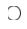
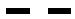
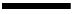
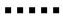

[**Volume II: Energy**](./volume-II.md)

[**Previous: 5.3. Components of the explanation of scientific theories.**](./vol-II-chap-5-sect-3.md) 

***

## 6.   Spectroscopic studies of electronic levels.	

!!! abstract "Introduction."

	*What happens when an electron changes its energy levels?* 

	Spectroscopic studies have been very useful to determine, understand and practically use transitions between quantized electronic levels in atoms. Atomic spectroscopy studies began with the discovery made by Isaac Newton when he observed the decomposition of visible light in different colors produced when that radiation traversed a prism. 
	
	**Learning objectives of Chapter 6.**

	After this Chapter you should be able to: 
	
	- Describe the Bohr´s atomic model, analyze the energy levels of the hydrogen atom and explain the functioning of lasers.
	- Explain the experimental steps required to produce, measure and interpret the Lamb shift.
	- Describe the main concepts and models contained in the Nobel Lectures corresponding to the Physics Nobel Prizes awarded to Bohr, Lamb, Townes, and Schawlow.

!!! abstract "Description of content of Chapter 6."

	**Section 6.1. Electronic energy levels according to atomic models.**

	We deal with the spectroscopic description of the hydrogen electronic levels as well as the processes of emitting and absorbing radiation by considering Bohr´s atomic model. We also describe the production of the laser effect (LASER means Light Amplification by Stimulated Emission of Radiation).

	**Section 6.2.  Splitting of degenerated electronic energy levels in the hydrogen atom.**
    
	We consider how external perturbations split electronic levels even when there are no external photons present: the vacuum of the electromagnetic field is not empty because it is full of virtual photons. We describe the experiments realized by Lamb and Retherford showing that certain degenerated energy levels in the hydrogen atom are separated when the self-energy of the electron is considered. 

	**Section 6.3. Identification of concepts and descriptions of models.**
	
	We apply the procedure Identification of concepts and descriptions of models to the analysis of the content of four Physics Nobel Lectures: *The Structure of the Atom* by Niels Bohr, *Fine Structure of the Hydrogen Atom* by Willis E. Lamb, *Production of Coherent Radiation by Atoms and Molecules* by Charles Townes, and *Spectroscopy in a new light* by Arthur A. Schawlow.
	
## 6.1. Electronic energy levels according to atomic models.

The simplest atom is the hydrogen: only one proton forms the nucleus, and one electron surrounds it. Hydrogen means *generator of water*. Antoine-Laurent de Lavoisier (1743-1794) named as such in 1783 because he observed that water was produced during hydrogen gas burning. The properties of hydrogen as a chemical element were first studied by Henry Cavendish (1731-1810); in 1766 he also discovered the composition of water, indicating that "water was composed of dephlogisticated air (oxygen) joined to phlogiston (hydrogen)".

Isaac Newton was one of the firsts to demonstrate the scattering of light when he passed visible light through a prism and watched it break up into a continuous spectrum of bands of different colors (Figure 6.1). 

(Images credit: CC Wikimedia Commons)

**Figure 6.1.** Production of three types of spectra: continuous, emission and absorption.

The intensity and frequency (ν) or wavelength (λ) of the spectral lines determine the properties of the atomic structure of the corresponding element, once the observed regularities in each series of spectral lines are interpreted. The different regions of the electromagnetic spectrum have the following wavelengths (λ) expressed in nanometers: X-rays ($λ<10$), ultraviolet ($10<λ<400$), visible ($400< λ<750$), infrared ($λ>750$). A nanometer is one billionth of a meter ($1 nm = 10^{-9} m$).

Systematic studies of atomic spectroscopy began when a Swiss school teacher, Johann Jacob Balmer (1825 – 1898) published in 1885 (*Ann. Physik*, vol 25, p. 80) the spectra of the series that now bears his name. The values of the wavelengths in the visible region of the spectral lines designated as $H_α$, $H_β$, $H_γ$ and $H_δ$ were summarized by Balmer using an empirical formula $λ=B(\frac{m^2}{m^2-2^2})$, where $B = 3.6456 \times 10^{-7} m = 364.56 nm$ and the index $m$ is greater than 2.

In 1888 Johannes Robert Rydberg (1854 –1919) generalized Balmer's formula: he took the reciprocal of Balmer's formula, defined $R_H = 4/B$, and expressed the result in terms of the wavenumber $ῦ$ (the number of wavelengths per unit of distance, measured in reciprocals of distances: $m^{-1}$):

$ῦ = \frac{1}{λ} = \frac{1}{B} (\frac{m^2-2^2}{m^2}) =  \frac{1}{B} (1- \frac{4}{m^2}) =  \frac{4}{B} (\frac{1}{4} - \frac{1}{m^2}) = R_H (\frac{1}{2^2} -\frac{1}{m^2})$ 

This is a particular case for $n = 2$ in the general equation $ῦ = \frac{1}{λ} = R_H (\frac{1}{n^2} - \frac{1}{m^2})$ where $m>n$.

The quantity $R_H = 4/B = 1.097 \times 10^7 m^{-1} = 0.01097 nm^{-1}$ is the Rydberg constant for the hydrogen atom. Figure 6.2 shows the alpha lines of each hydrogen series as a function of the wavelength expressed in nanometers; the following abbreviations are used: Lyman (Ly- α), Balmer (Ba- α), Paschen (Pa- α), Brackett (Br- α), Pfund (Pf- α), and Humphreys (Hu- α).

(Images credit: CC Wikimedia Commons)

**Figure 6.2.** Spectral series of the hydrogen atom in logarithmic scale.

The manifest regularity of the values of the spectral lines that satisfied the Rydberg formula posed serious problems of theoretical interpretation in the first decades of the 20th century. New approaches were necessary regarding the atomic structure and the processes by which the spectral lines were produced. It is here where Niels Henrik David Bohr (1885-1962) makes his entrance.

### Bohr's model.

In 1913 Niels Bohr considered Rutherford's atomic model as a starting point for his interpretation of atomic spectra. According to such model, the atom	 is electrostatically neutral but not indivisible; it is composed of a heavy positively charged nucleus, surrounded by negative electrical charges, the electrons. Bohr assumed that under stable conditions the electron does not emit radiation even when it circulates in closed orbits around the nucleus. He connected the frequencies of the spectral lines with transitions between different electronic states and proposed a frequency condition: the difference in the energies of the orbits from an initial electronic state ($E_i$) to a final state ($E_f$) should be proportional to the frequency $ν_{if}$ of the photon of the quantized radiation emitted or absorbed. This means that $E_f - E_i = hν_{if}$, where $h$ is Planck's constant.

In such circumstances, the emission lines will be due to transitions from a higher energy state to a lower energy state, while the absorption lines will be the reverse, from lower energy states to higher energy excited states. However, Rutherford's model presented a strong electromagnetic contradiction: if there is a Coulomb attractive force between the positive nucleus and the negative electrons, why don't the electrons rush towards the nucleus and the atom doesn't lose energy continuously?

To avoid previous contradiction and explain atomic spectra, Bohr proposed two postulates:

(1) the stability of atoms is due to the fact that the electron occupies stationary states and

(2) the transitions between stationary states are accompanied by emission or absorption of a quantum of electromagnetic radiation (a photon).
	
According to Bohr the angular momentum ($L$) of the electron was quantized in such a way that $L = m_evr = nh/2π = nђ$, where $ђ = h/2π$ is Dirac's constant and $h$ is Planck's constant; $m_e$ is the mass of the electron, $v$ its speed, $r$ the radius of its orbit and $n$ an index with values 1, 2, 3...; this will be called the principal quantum number.

Classically, the force by which the electron describes a circular orbit is $F = (m_ev^2)/r$ where $F$ is the Coulomb force of attraction $F= -κq^2/(r^2)$, with $κ$ a constant of proportionality that depends on the system of units. If we make $κ = 1$ we have that $(m_ev^2)/r = F = q^2/(r^2)$ therefore $(m_ev^2) = q^2/r$ and the kinetic energy is $E_c = ½m_ev^2 = q^2/(2r)$. The potential energy $E_p$ is such that $F = - dE_p/dr$, whence $E_p = - q^2/r$ and the total energy is $E = Ec + Ep = - q^2/(2r)$.

By definition, the magnitude of the angular momentum is $L = m_evr$, whence $v = L/(m_er)$. Using the expression $(m_ev^2) = q^2/r$ it results $r = (L^2)/(m_eq^2)$ and applying the quantization condition $L_n = nђ$ it can be obtained  $r_n = (L_n)^2/(m_eq^2) = ((ђ^2)/(m_eq^2))(n^2) = a_0(n^2)$. The Bohr radius is defined as $a_0 = (ђ^2)/(m_eq^2) = 5.292 \times 10^{-11} m ≈ 0.53 Å$. This radio corresponds to the shortest distance an electron has in the first electronic orbit and measures almost half an Angstrom for the hydrogen atom ($1 Å = 10^{-10} m$, one tenth of a nanometer).  

If the quantized radius $r_n$ is considered in the value of the total energy $E = - q^2/(2r)$ then the quantized energy is $E_n = - q^2/(2r_n) = -((m_eq^4)/(2 ђ^2))(1/n^2)= - R_H/(n^2)$, where the Rydberg constant for the hydrogen atom is $R_H = [(m_eq^4)/(2ђ^2)]$.

If the energy of the initial state $E_i$ characterized by the quantum number $m$ is $E_m = - R_H/(m^2)$ and the energy of the final state $E_f$ characterized by the quantum number $n$ is $E_n = - R_H/(n^2)$, then the energy of the transition from the initial state to the final state $E_f- E_i$ will be $hν_{if}$. (See Figure 6.3.).

$hν_{if}= E_f- E_i = E_n- E_m = [\frac{-R_H}{n^2}]- [\frac{-R_H}{m^2}]=R_H [\frac{1}{m^2} - \frac{1}{n^2} ]$.

	
	

	(Images credit: CC Wikimedia Commons)
	

**Figure 6.3.**  First spectral emission lines in the Balmer series.

However, the intensities of the atomic spectral lines of elements heavier than hydrogen were different from those predicted by Bohr's theory. These deficiencies were corrected in 1916 by Arnold Sommerfeld (1868-1951), who considered that electrons moved at relativistic speeds (close to the value of the speed of light) and in quasi-elliptical orbits; he also incorporated the motion of the nucleus.

Quantum mechanics was initially called wave mechanics because the movements of electrons, previously considered as tiny corpuscles with quantized mass but non quantized radii and energies, should be associated with matter waves and probabilistic descriptions. This was enough to calculate transitions between quantized energy levels. Later, a wave equation was proposed to describe the behavior of those matter waves and to calculate the behavior of electrons as quantum particles. By solving such equation, the expressions of the energies and quantized radii derived by Bohr were obtained.
	
The development of quantum mechanics lead to a completely quantized treatment of radiation and matter when radiation had discrete values expressed in terms of photons and matter was considered as made up of atoms containing electrons in states with quantized energies. An example where radiation and electronic levels are quantized is the laser (Light Amplification by Stimulated Emission of Radiation).

### Laser effect.

According to classical electromagnetism, any accelerated charge emits electromagnetic radiation and the absorption of energy results from the work done on the charged particles by the force applied by an external electric field. However, the quantum point of view gives a very different explanation of emission and absorption processes: such processes are due to radiative transitions between electronic levels of different quantized energies. This was explained by Einstein in an article published in Phys. Zeitschr. 18, 121, 1917, where, in addition to considering spontaneous absorption and emission processes, he proposed the existence of stimulated emission processes that years later will be used in the production of the laser.

Transitions between electronic levels are radiative if the energy $hν$ of the absorbed or emitted photon is equal to the energy change $ΔE$ between an initial state whose principal quantum number is $n_i$ and a final state of different energy represented by $n_f$. Here Planck´s relation indicates that $hν = ΔE = En_f – En_i$. Since the electron experiences a Coulomb interaction with the proton in the nucleus, its negative energy corresponds to bound states and carries a negative sign. Remember that in the Bohr energy expression $E_n = -R_H/n^2$, with $n ≥ 1$.

The quantum processes of radiative transitions are of two types: spontaneous when it is in the absence of external radiation and induced or stimulated by the presence of external photons. Spontaneous absorption occurs if $ΔE< 0$, when the electron rises to a level whose energy is less negative ($n_f > n_i$) and the final level is closer to the ionization energy at which $E_∞ = 0$. There is emission when $ΔE > 0$ and the electron passes to a more negative level ($n_f < n_i$), so that now the final level is closer to the ground state, where the expression $E_n = -R_H/n^2$ has the value $E_1 = - R_H$ when $n=1$.

Consider an atom whose electrons occupy only two levels such that $n_2 > n_1$, with respective energies $E_2$ and $E_1$, where $E_2 > E_1$ corresponds to an excited state and $E_1$ to a ground state with the lowest possible energy. Under such conditions, $N_2$ and $N_1$ will indicate the numbers of atoms with electrons in each of the two levels of the system; these are the so-called occupation numbers of the corresponding electronic populations. Also, $g_2$ and $g_1$ are the respective degeneracies at those levels (the degeneracy is the number of electrons with the same energy). If the system is in thermodynamic equilibrium at a temperature $T$, the relative number of particles in such states is described by the Boltzmann factor $exp[-(E_2 – E_1)/k_BT]$, where $k_B$ is Boltzmann's constant.

For the atomic system described above, in spontaneous emission the electron goes from the excited state to the ground state and emits a photon of energy $hν = E_2 - E_1$. (The half-life of an excited state is usually of the order of $10^{-8}$ sec, while in the so-called metastable states it is of the order of $10^{-3}$ sec.) In spontaneous absorption the opposite occurs due to a transition of the electron from the ground state to the excited state; here the atom absorbs a photon of energy $hν_{ext}$ coming from an electromagnetic field external to the system.

The stimulated emission is a completely quantum process that occurs when the electron is in the excited state $E_2$, the atom is in the presence of external photon of energy $hν_{ext}$ and a transition to the ground state $E_1$ is produced. This process is accompanied by the emission of a photon whose energy is $hν = E_2 - E_1 = hν_{ext}$. The incident external photon – a virtual photon- corresponds to the action of an effective electromagnetic field that is external to the atomic system. Virtual photons are generated by the quantum effect of vacuum fluctuations.

In the stimulated emission processes, there is synchronization in the frequency and phase of both photons, the incident photon and the one produced by the stimulated emission. This circumstance produces an amplification of the radiation because the number of photons increases in a final situation ($S_f$) with respect to an initial situation ($S_i$). The amplification occurs when the stimulated emission is greater than the absorption and this happens when there is a greater presence of atoms in excited states. Figure 6.4 shows the initial and final situations of these three radiative transitions.

     

	(Image credit: drawings made by the authors.)
	

**Figure 6.4.**  Transition processes between levels where a photon ({width="40"}) causes an electron ({width="20"}) to pass from an initial level ({width="40"}) to a final level ({width="40"}); the electronic levels that remain unoccupied during the transition are indicated as ({width="40"}).

Consider that the spectral density of electromagnetic radiation of frequency $ν$ is $ρ(ν)$; this function defines the time ratio of the transitions between the two quantized states under consideration. Let $R_{1—2}$ be the probability per unit time of a transition from the initial state $E_1$ to the final state $E_2$ (emission process) and $R_{2—1}$ the corresponding probability for the transition from the initial state $E_2$ to the final state $E_1$ (absorption process). For spontaneous emission and spontaneous absorption these probabilities will be proportional to the energy density $ρ(ν)$ of the radiation of energy $hν = E_2 - E_1$. The induced emission does not depend on the density $ρ(ν)$.

In the two previous cases, proportionality coefficients are introduced, the so-called Einstein coefficients, which will depend on the characteristic properties of the quantized states. The coefficient $B_{21}$ will correspond to the spontaneous emission of the photon of energy $hν$ for the transition from $E_2$ to $E_1$, while $B_{12}$ will refer to the absorption of a photon of the same energy hν for the transition between levels $E_1$ to $E_2$. For the absorption $R_{1-2} = B_{12}ρ(ν)$ and for the spontaneous emission $R_{2—1} = B_{21}ρ(ν)$.

However, in the emission process, in addition to spontaneous emission, there is a contribution of the induced emission to which it is associated a third coefficient $A_{21}$ independent of the density $ρ(ν)$; therefore $R_{2—1}= A_{21} + B_{21}ρ(ν)$. This means that the variations over time of the populations between these levels correspond to:

*(Rate of change of absorbed energy)* $≈ N_1 \times$ *[Probability of stimulated absorption]*

*(Rate of change of emitted energy)* $≈ N_2 \times$ *[(Stimulated emission probability) + (Spontaneous emission probability)]*,

In terms of Einstein coefficients, the above relationships are expressed as:

$\frac{dN_{12}}{dt} = N_1 (R_{1—2} )= N_1 [ρ(ν)B_{12} ]$       y      $\frac{dN_{21}}{dt} = N_2 (R_{2—1} ) = N_2 [ρ(ν)B_{21}+ A_{21} ]$

If the complete system is in thermodynamic equilibrium, each of the occupation numbers $N_1$ and $N_2$ are determined by a Maxwell-Boltzmann distribution $N_i = N_0[exp(-βE_i)]$, for $i = 1$ and $2$. In this expression $N_0$ is a normalization constant and the factor $β = 1/(k_BT)$, with $k_B$ the Boltzmann constant and $T$ the temperature. Therefore, the quotient of the populations between the two levels will be $N_2/N_1 = [exp(-βE_2)]/[ exp(-βE_1)] = exp(-βhν)$.

If the previous condition is fulfilled between $N_1$ and $N_2$ and that by microscopic reversibility  $\frac{dN_{12}}{dt}=  \frac{dN_{21}}{dt}$, we obtain $N_1 [ρ(ν)B_{12} ]= N_2 [ρ(ν)B_{21}+ A_{21} ]$, from which $\frac{N_2}{N_1} = \frac{ρ(ν)B_{12}}{ρ(ν)B_{21}+ A_{21}} = e^{-βhν}$. Solving last equation, it results that $ρ(ν)= \frac{A_{21}⁄B_{12}}{e^{βhν}-(B_{21}⁄B_{12})}$.

On the other hand, according to the law of black body radiation obtained by Planck, we have that $ρ(ν)=[\frac{8πhν^3}{c^3}][\frac{1}{e^{βhν}-1}]$. By equating the two previous expressions for $ρ(ν)$ the following condition must be satisfied $\frac{A_{21}⁄B_{12}}{e^{βhν}-(B_{21}⁄B_{12})}= [\frac{8πhν^3}{c^3}][\frac{1}{e^{βhν}-1}]$ which implies next two conditions $\frac{B_{21}}{B_{12}} =1$ and  $\frac{A_{21}}{B_{12}} =[\frac{8πhν^3}{c^3}]$.                                                             

From the first condition it can be inferred that the coefficients of stimulated absorption and stimulated emission are the same. The second condition establishes that the spontaneous emission coefficient varies with frequency as $ν^3$, which means that if the difference between the two quantized states increases because the frequency $ν$ is quite high ($hν = E_2 – E_1$), the stimulated emission corresponding to $A_{21}$ will be much more likely than the spontaneous emission represented by $B_{12}$.

From the condition $\frac{N_2}{N_1} =\frac{ρ(ν)B_{12}}{ρ(ν)B_{21}+ A_{21}} = e^{-βhν}$ it can be obtained that $ρ(ν)(\frac{B_{12}}{B_{21}}) =$ $[ρ(ν)(\frac{B_{21}}{B_{21}})+ (\frac{A_{21}}{B_{21}})]$ $(e^{-βhν} )$. By applying the condition $\frac{B_{21}}{B_{12}} =1$, it follows by dividing by $ρ(ν)$ that $1=$ $[1+ (\frac{A_{21}}{B_{21}} )(\frac{1}{ρ(ν)} )]$ $(e^{-βhν} )$ and then $(\frac{A_{21}}{B_{21}} )(\frac{1}{ρ(ν)} ) = e^{βhν}-1$. In here $βhν=[hν⁄(k_B T)]$. If the value of $βhν$ is lower, equal or greater than 1, the stimulated emission will be dominant, equiparable or negligible when compared to the spontaneous emission.

When $N_2 >> N_1$, that is, when the population of the excited state $E_2$ is much greater than the population of the state with the lowest energy $E_1$, the emission is much more frequent than the absorption and the amplification of the radiation characteristic of the laser effect occurs.

For $N_2 >> N_1$ it is required to invert the population, which is produced by optical pumping. If under this condition, the radiation accumulates in a resonant cavity that has two mirrors at its ends, one fully reflective and the other semi-transparent, then the laser radiation is emitted.

	
***

[**Next: 6.2.  Splitting of degenerated electronic energy levels in the hydrogen atom.**](./vol-II-chap-6-sect-2.md)