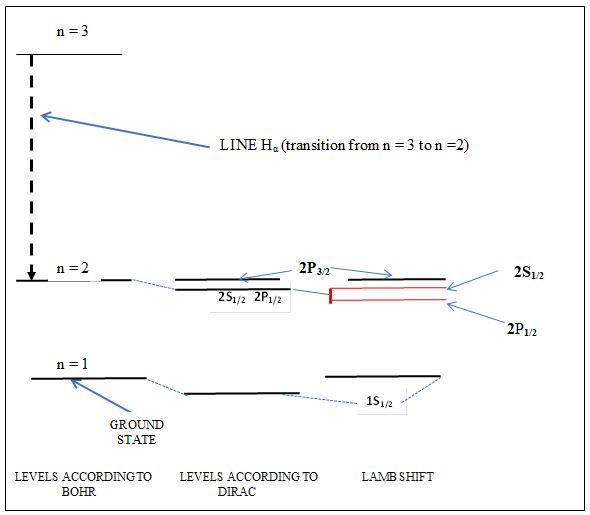

[**Volume II: Energy**](./volume-II.md)

[**Previous: 6.1. Electronic energy levels according to atomic models.**](./vol-II-chap-6-sect-1.md) 

***

## 6.2 Splitting of degenerated electronic energy levels in the hydrogen atom.  

The first example of a solution of the Schrodinger equation to the Bohr atom model indicated that the quantization of the energy levels $E_n = -R/n^2$, where n is the principal quantum number and $R = (m_e)(q_e^4)/[2(ђ^2)] = 13.6 eV$ is the Rydberg constant for the hydrogen atom. However, when the Dirac equation was considered, the expression for the electronic levels of the hydrogen atom was $E_{nj}= -(\frac{R}{n^2})[1+(\frac{α^2}{n^2})(\frac{n}{j+½}- \frac{3}{4})]$, where $R$ is the Rydberg constant and the fine structure constant $α= \frac{q_e^2}{ђc}=7.297 \times 10^{-3}≈\frac{1}{137}$. The quantum number $j = l + s = l ± ½$. Note that the first term is the Bohr energy and the next term is proportional to $α^2$, which is a very small quantity but not zero.

In the usual spectroscopic notation the first levels of the fine structure in the hydrogen atom are designated as follows: the ground state is the first level and corresponds to $1S_{1/2}$ ($n = 1$, $l = 0$, $j =1/2$). According to the Dirac solution given above for $E_{nj}$ the next two levels are degenerate states: the levels $2S_{1/2}$ ($n = 2$, $l = 0$, $j = ½$, when $s = +½$ ) and $2P_{1/2}$ ($n = 2$, $l = 1$, $j = ½$, when  $s = -½$). Then comes the level $2P_{3/2}$ ($n = 2$, $l = 1$, $j = 3/2$) which is followed again by two degenerate states $3S_{1/2}$ ($n = 3$, $l = 0$, $j = ½$) and $3P_{1/2}$ ($n = 3$, $l = 1$, $j = 3/2$), and so on. The following energies measured in eV have been calculated for the first four levels:

For $n = 1$ and $j =1/2$, level $1S_{1/2}$:  $E =-(\frac{R}{1})[1+(\frac{α^2}{1}) (\frac{1}{½+½}- \frac{3}{4})]=$ $-(13.6)[1+(\frac{α^2}{1})(\frac{1}{4})]  ≈13.6$

For $n = 2$ and $j =1/2$, level $2S_{1/2}$:  $E =-(\frac{R}{4})[1+(\frac{α^2}{4}) (\frac{2}{½+½}- \frac{3}{4})]=$ $-(\frac{13.6}{4})[1+(\frac{α^2}{4})(\frac{5}{4})]  ≈3.4$

For $n = 2$ and $j =1/2$, level $2P_{1/2}$:  $E =-(\frac{R}{4})[1+(\frac{α^2}{4}) (\frac{2}{½+½}- \frac{3}{4})]=$ $-(\frac{13.6}{4})[1+(\frac{α^2}{4})(\frac{5}{4})]  ≈3.4$

For $n = 3$ and $j = 3/2$, level $2P_{3/2}$:  $E =-(\frac{R}{9})[1+(\frac{α^2}{9}) (\frac{3}{2}- \frac{3}{4})]=$ $-(\frac{13.6}{9})[1+(\frac{α^2}{9})(\frac{3}{4})]  ≈1.5$

Considering previous data, we obtain the following spacings between neighboring levels: between $1S_{1/2}$ and $2S_{1/2}$: 13.6 – 3.4 = 10.2, while between $2S_{1/2}$ and $2P_{1/2}$: 3.4 – 3.4 = 0 (degenerate levels according to Dirac) and between $2P_{1/2}$ and $2P_{3/2}$: 3.4 – 1.5 = 1.9. The null separation between the energies of the $2S_{1/2}$ and $2P_{1/2}$ states was a consequence of having assumed that the only interaction between the electron and the proton of the nucleus was due to a Coulombian potential between such charges. (See figure 6.5).

<figure markdown>
{width="480"}
<figcaption> (Image credit: elaborated by the authors.)
</figcaption>
</figure>

**Figure 6.5.** Electronic levels for the first levels of the hydrogen atom. (The positions of the levels are not to scale. The fine structure and the splitting of the levels corresponding to n = 3 are not shown. 

### Lamb shift measurements.

Beginning in 1947, Lamb and Retherford measured with an accuracy of one part in ten thousand the transitions between the $2S_{1/2}$ and $2P_{1/2}$ levels. According to Dirac's theory, these levels should have the same energy (degenerate states) and there could be no radiative transitions between them. These states have the same quantum numbers $n$ and $j$: the radial number $n = 2$ and the total angular momentum number $j = ½$. However, the orbital angular momentum quantum numbers are different: $l = 0$ for the $2S_{1/2}$ state and $l = 1$ for the $2P_{1/2}$ state.

Lamb and Retherford confirmed that the $2S_{1/2}$ level was above the $2P_{1/2}$ level and that the separation was 0.033 $cm^{-1}$ (about the order of 1000 MHz). The first measured value was 1060 MHz and later on the value of 1,057.845 MHz was obtained. The theoretical calculation made by Bethe in 1947 was 1040 MHz; afterwards the value of 1,057.853 MHz was reported.

In their experiment Lamb and Retherford took advantage of two facts: 

(1) the observed separation between the $2S_{1/2}$ and $2P_{1/2}$ levels turned out to be of the order of microwave frequencies, which fluctuate between $10^{-5}$ eV and $10^{-3}$ eV (the first experimentally measured value was $4.4 \times 10^{-4} eV$), and 

(2) the $2S_{1/2}$ state is a metastable state with a half-life relatively long and does not decay rapidly to the $1S_{1/2}$ ground state, whereas the $2P_{1/2}$ state has a much shorter half-life. When a transition corresponding to a radio frequency is induced from the $2P_{1/2}$ or $2P_{3/2}$ levels, the atom loses its metastability and in $10^{-9}$ seconds it decays to the ground state without emitting radiation.

The experimental design consisted of four regions for the following purposes: dissociation of the molecular hydrogen ($R_{dis}$), bombardment of the electrons ($R_b$), application of an external radiofrequency ($R_{rf}$), and detection ($R_{det}$). Different actions were carried out in each region, which are described below according to the following stages:

$STG_1$: *Production of atomic hydrogen in the* $R_{dis}$ *region*. The $H_2$ molecules are heated up to 2500º C in an oven where the atoms dissociate in a percentage of the order of 64%; then the atoms pass through a double slit and hit a diode in a vacuum.

$STG_2$: *Excitation of atoms at the* $2S_{1/2}$ *level in the* $R_b$ *region*. Inside the diode a current of electrons are emitted at the cathode and directed towards the anode. Along the way, these electrons bombard the hydrogen atoms coming from the oven and produce excited atomic states, among which is the $2S_{1/2}$ state, which is metastable. The $2S_{1/2}$ states cannot decay to the $1S_{1/2}$ ground state because there is a selection rule indicating that transitions only occur if there is a change in the quantum number $l$, which is zero for both states.

After a small recoil deflection, the excited atoms move on to a metal surface from which they can eject electrons and so be detected. Between the bombardment region ($R_b$) and the detection region ($R_{det}$) it passes through the region ($R_{rf}$) where a radiofrequency field is applied.

$STG_3$: *Application of a microwave field to the excited atoms in the* $R_{rf}$ *region*. The excited atoms are directed to a metallic surface where they produce an output signal of electrons that can be detected. If the frequency of the external oscillating field is zero, the atoms in the metastable state have time to cross the radio frequency region ($R_{rf}$) before de-exciting. However, if that frequency corresponds precisely to the difference in energies between the $2S_{1/2}$ state and the closest state in energy, such as the $2P_{1/2}$ level, then the atoms in the metastable state will no longer be in that state and therefore fewer atoms will reach a tungsten metallic plate placed after the $R_{rf}$ region.

The half-life for the $2S_{1/2}$ state is 1/7 seconds while for the $2P_{1/2}$ state it is $1.6 \times 10^{-9}$ seconds. Before de-exciting, the atoms in the first state (the metastable) can travel a distance of the order of 10 cm, while the atoms in the second state only manage to travel $1.3 \times 10^{-3}$ cm and therefore do not reach the metallic plate and will no longer be detected in the next stage $E_4$.

$STG_4$: *Detection of atoms in metastable state after passing through the* $R_{rf}$ *region*. The atoms that remained in the $2S_{1/2}$ state and managed to cross the $R_{rf}$ region have a long half-life; therefore, they have time to reach the tungsten plate which is sensitive only to atoms in the metastable state. The following sequence of three processes occurred on this plate: 
	
(1) the hydrogen atoms are de-excited when they collide with the atoms of the plate, causing the release of electrons from this plate;

(2) the electrons are collected and form an electrical current that is amplified and

(3) the amplified current is sent to a galvanometer for recording and measurement; when decreases in this current are observed in percentages that vary between 30% and 80%, it means that a transition is induced from the metastable state to another that was no longer metastable and therefore the electron does not reach the metal plate.

$STG_5$: *Application of an external magnetic field to the* $R_{rf}$ *region*. In practice it was difficult to adjust the frequency of the oscillating field to induce the transition to the $2P_{1/2}$ level, while keeping the intensity of the microwave field constant. To solve this difficulty, an external magnetic field was applied in the $R_F$ region, which produced an extra doubling of the fine structure levels. Under these conditions, the frequency of the oscillating field was fixed and the intensity of the magnetic field was varied. The minima in the readings of the galvanometer indicated the presence of induced transitions from the metastable state to other short life expectancy states, such as the $2P_{1/2}$ and $2P_{3/2}$ states. 

$STG_6$: *Graphing of readings and extrapolation to the null field of the* $R_{det}$ *region*. For a fixed oscillation frequency of the microwave field, a minimum in the current registered in the galvanometer indicated a decrease in the number of atoms in a metastable state arriving at the metal plate. Afterwards, the points with coordinates defined by the oscillation frequency (R) and the external magnetic field (B) were graphed and the value extrapolated to the null field was read on the graph to obtain the separation between the $2S_{1/2}$ and $2P_{1/2}$ levels. Thus, the Lamb shift was determined indirectly as the separation energy $ΔL$ between two supposedly degenerate levels (Figure. 6.6).

     

	
**Figure 6.6.**  Lamb shift measurement: graph of the measured values of Radio Frequency (R) as a function of the applied magnetic field (B). The lines in blue correspond to the $2P_{3/2}$ level, in red to the $2S_{1/2}$ level and in green to the $2P_{1/2}$ level; $ΔL$ indicates the separation between the supposedly degenerate levels for a null external magnetic field.

After having analyzed how the Lamb-Retherford experiment allowed to measure the separation between the $2S_{1/2}$ and $2P_{1/2}$ levels, let us consider what the treatment of quantum electrodynamics consists of, and qualitatively explain such a shift in the previously considered degenerated energy states of the electron in the hydrogen atom. 

The type of interaction in which an electron emits and absorbs a virtual photon is called self-energy. This implies that a charged particle such as an electron suffers the effects of the field it generates: an electron is itself an electric charge dressed by its own self-champ. Therefore, any electron not only suffers the effect of external electromagnetic fields but is also a source of its own field that produces effects such as the change in the value (renormalization) of it mass and charge. The breaking of this experimentally observed degeneracy of levels was due to an extra perturbation caused by the interaction of the electron field with itself that creates and destroys a virtual photon.

Quantum electrodynamics considers in a quantized way both, the energy levels of the electron and the electromagnetic radiation field that includes real photons (those due to external fields) as well as virtual photons (those that exist due to vacuum fluctuations). For example, Figure 6.7 represents an interaction between two electrons (e-) in which the exchange of a virtual photon (γ) occurs.  

	
	

	(Images credit: CC Wikimedia Commons)

**Figure 6.7.** Feynman diagram showing how a photon is emitted by one electron (the left one) and then absorbed by the second electron (the right one).

***

[**Next: 6.3. Identification of concepts and descriptions of models.**](./vol-II-chap-6-sect-3.md)