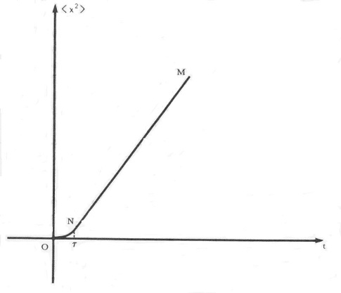
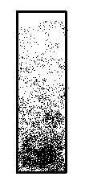
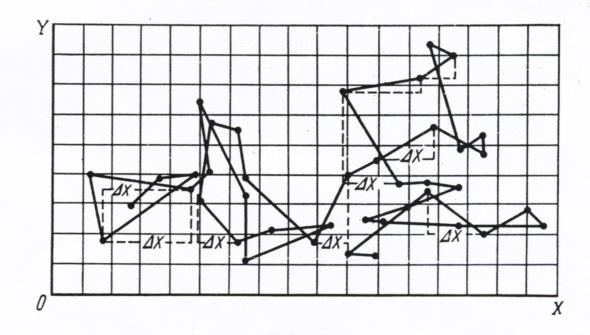

## 7.  Brownian motions and specific heats

Under what conditions is statistical mechanics necessary?

The systems studied by physics can be characterized in terms of three of their properties: size (T), velocity (V), and number (N). When N is very large, it is impossible to solve the equations of motion for all the degrees of freedom of the system; in such conditions, statistical mechanics is required. 

Statistical mechanics is the branch of physics where, based on a microscopic model of the system under study, mathematical procedures are applied, essentially probabilistic, to calculate values of macroscopic quantities that describe the physical properties of the system. Given the system model and the statistical procedure to describe and apply the distribution function of their accessible states, average values, fluctuations, deviations, correlations and other functions of a statistical nature are usually calculated. 

The detailed content of the chapter is:

<blockquote>

### 7. Brownian motion and specific heats.
**7.1.	 Experimental results concerning the Brownian motion.** 
**7.2.	Statistical mechanical calculations of the specific heat in solids.** 
        Dulong and Petit classic model. 
        Einstein's quantum model. 
        Debye's quantum model. 
**7.3.	 Procedures to solve problems and explain solutions.** 
        Obtention of Einstein´s equation according to Langevin.

</blockquote>

This Chapter 7 is dedicated to the first calculations in statistical mechanics: Section 7.1 is about Brownian motion, with contributions from Einstein for the theoretical point of view and from Perrin for the experimental point of view. We consider the 1926 Physics Nobel Lecture Discontinuous Structure of Matter by J.B. Perrin. 

Section 7.2 refers to the calculation of specific heat at constant volume in solids, where the models of Dulong and Petit, Einstein and Debye are considered.

In section 7.3 we apply Procedures to solve problems and explain solution to obtain Einstein's equation of Brownian motion, as developed by Paul Langevin.

## 7.1. Experimental results concerning the Brownian motion.

To calculate average values of quantities related to physical observables, interpretation models and calculation procedures need to be proposed and tested. The models describe with a certain level of approximation the probability distribution functions about the possible configurational states of the system or microstates. The procedures for counting and mathematically operating with the formal representations of these configurational states serve to explain the observed behavior of the physical system. 

Albert Einstein (1879-1955) carried out in 1905 one of the first statistical mechanics calculations to explain the Brownian movement, having the audacity to assume the existence of two types of molecules: the Brownian particles (pollen) and the molecules of the liquid medium (water). In addition, he identified the root mean square displacement of the Brownian particle instead of its velocity as the appropriate observable characteristic and related the random motion of a particle to the diffusion of many particles.

In the article *On the Motion Required by the Molecular Kinetic Theory of Heat of Particles Suspended in Fluids at Rest* Einstein stated the following: *“In this article it will be shown that, according to the molecular-kinetic theory of heat, bodies of a microscopically visible size suspended in liquids must carry out, as a result of thermal molecular movements, movements of such a magnitude that they can be easily observed with a microscope”*.

Einstein started from the fact that atoms have a real and not hypothetical existence and that therefore a fluid like water has an atomic structure. At that time, the real existence of the atom was questioned as a physical component of matter and not as an explanatory hypothesis, uncertain and perhaps unnecessary, useful for codifying certain regularities. Einstein considered that a particle immersed in an aqueous solution will experience collisions and make erratic movements, as a consequence of a pressure similar to the osmotic pressure exerted by the atoms of the fluid on the dissolved particle. 

The expression $D = (RT)/(6πηaN_A)$ is called the Stokes-Einstein equation, where the diffusion coefficient ($D$) is linear with temperature ($T$) and the constant of proportionality depends on the size ($a$) of the particle, viscosity ($η$) of the fluid (viscosity is the resistance to flow). The equation contains also universal constants such as the universal gas constant ($R$) and Avogadro's number ($N_A$). Avogadro's number is the number of molecules that contain equal volumes of gases at fixed temperatures and pressures. 

The diffusion of the particles can be seen as a probabilistic process where the variable is the displacement and not the velocity: the average displacement in the X-direction ($λ_x$) of the suspended particles depends on the diffusion coefficient ($D$) and on a time ($t$) of observation during which the displacement in $x$ occurs. That is to say $λ_x=\sqrt{x^2}=\sqrt{2Dt} $. 

Einstein used the two previous equations that define $D$ and $λ_x$ and predicted that the root mean square deviation of the random displacements in an X direction had a linear behavior with respect to the temperature T of the liquid and the time $t$ during which the Brownian particle suffers collisions with surrounding water molecules:

<blockquote>

$<ΔX^2> =$ $[(kT)/(3πηa)]$ $(t)$

</blockquote>

In the previous equation, the Boltzmann constant $k = R/N_A$ where $N_A$ is Avogadro's number and $R$ is the universal gas constant (Figure 7.1).

  
(Images credit: CC Wikimedia Commons)

**Figure 7.1.** Graph of the equation obtained by Einstein.

In Figure 7.1, the time t on the horizontal axis indicates two moments: before the collisions (segment O to N) the Brownian particle is placed in the liquid and moves freely until the collisions begin and during the collisions (segment N to M), the trajectory of the Brownian particle changes randomly satisfying Einstein's linear equation. In section 7.3 we obtain this equation by following Langevin procedure.

Einstein's theoretical work contributed to the following: (1) to demonstrate the discontinuous structure of matter and prove the existence of atoms; (2) to develop ideas and procedures of statistical mechanics, which lays the foundations of thermodynamics, and (3) to test experimentally ideas derived from statistical calculations that led to the exact measurement of quantities such as Avogadro's number and the mass of the hydrogen molecule.

The first observations of Brownian motion were made in 1785 by Jan Ingenhousz 
(1730-1799), who described the "erratic" motion of carbon particles on the surface of alcohol. In 1827, the botanist Robert Brown (1773-1858) observed under a microscope the random movements of pollen grains from the plant *Clarkia pulchell* suspended in water. He published his results in a book with the not so brief title of *“A brief account of microscopical observations made in the months of June, July and August, 1827, on the particles contained in the pollen of plants; and on the general existence of active molecules in organic and inorganic bodies”*.

Many years later in 1910, Jean Perrin (1870-1942) published the results of his work in the article *"Brownian motion and molecular reality"* and in the book *Les atoms* edited in French in 1914 and translated into English in 1916. The reported results verified Einstein's theory.

Perrin carried out experiments on sedimentation (the settling of suspended particles caused by gravity) and was able to prove the validity of the analogy between the molecules of a gas and the particles suspended in a liquid. He observed the movement of the particles through a microscope, whose eyepiece was equipped with a grid that served as a coordinate system (Figure 7.2). He showed that the displacement of particles resulted in a certain vertical distribution and counted the number of particles at different depths in a drop of water; the concentration was higher at greater depths.

<table cellspacing="0" cellpadding="0">
<tbody>
   <tr>
      <td>
        
     </td>
     <td>
        
     </td>
   </tr>
   </tbody>
</table> 

Source:  images taken from the book Les atomes by Perrin.

**Figure 7.2.** Distribution of equilibrium heights of particles within a gravitational field (left image) and successive positions recorded every 30 seconds; the projections of displacements in the x-direction are also indicated (right image). Both images come from the book *Les atoms*.

To carry out his experiments, Perrin first very carefully prepared particles of the same radius ($0.53 \times 10^{-6}$ m) and then on the microscope reticule, every 30 seconds, he marked the successive positions of a chosen particle for equal time intervals; there were of the order of 1014 collisions per second. Then he plotted those points on a piece of paper and joined them to determine the displacements of the corresponding particle and calculated the mean square value of those displacements. These experiments supported the discontinuity of matter in favor of a previously questioned atomic structure.

By substituting his measurements in Einstein's equation, Perrin obtained the value of Avogadro's number ($N_A$). The following Table 7.1 contains the values obtained by Einstein and by Perrin; numerical values in the third column are multiplied by the factor $10^{23}$.

<table cellspacing="0" cellpadding="0">
<tbody>
   <tr>
   <th colspan="3">
    VALUES OF AVOGADRO'S NUMBER $N_A$ CALCULATED BY EINSTEIN AND MEASURED BY PERRIN 
 </th>
  </tr>
  <tr>
      <td>
AUTHOR
</td>
     <td>
PUBLICATION
</td>
     <td>
$N_A$
     </td>
</tr>
<tr>
      <td>
Einstein
</td>
     <td>
Doctoral thesis completed on April 30 and accepted on June 24, 1905.
</td>
     <td>
2.1
     </td>
</tr>
<tr>
      <td>
Einstein
</td>
     <td>
Appendix in the article published in January 1906.
</td>
     <td>
4.15
     </td>
</tr>
<tr>
      <td>
Einstein
</td>
     <td>
Correction of an error in the previous calculation and a new result published in 1907.
</td>
     <td>
6.6
     </td>
</tr>
<tr>
      <td>
Perrin
</td>
     <td>
Book "Les Atomes" published in 1913.
</td>
     <td>
6.85
     </td>
</tr>
   </tbody>
</table> 

Source: information contained in Pais´ book.

The Physics Nobel Prize was awarded in 1926 to Jean Baptiste Perrin "for his work on the discontinuous structure of matter, and especially for his discovery of sedimentation equilibrium". Next we describe the title, the reference and the subtitles of this Nobel Lecture. Then we include two lists: one of those key concepts most frequently employed in the Lecture, and another of the main essential issues considered in the Lecture that requires physical and mathematical models for their representation and interpretation. In both lists a selection is made of concepts and models mostly related to Brownian motion. If in the second list a complete paragraph is quoted from the Lecture, then it is indicated in cursive letters. 

**J.B. Perrin (1870-1942).**

<blockquote>

PERRIN J. B. **Discontinuous Structure of Matter**

Nobel Lecture, December 11, 1926

- *Introduction*
- *The Brownian movement*
- *Law of the vertical distribution of an emulsion*
- *Non-diluted emulsions*
- *Measurements of the Brownian movement*
- *The molecular reality*
- *Monomolecular films*
- *The discontinuous structure of the atom*

MLA style: Jean Baptiste Perrin – Nobel Lecture. NobelPrize.org. Nobel Prize Outreach AB 2023. Mon. 23 Jan 2023.

https://www.nobelprize.org/prizes/physics/1926/perrin/lecture/

</blockquote>

<table cellspacing="0" cellpadding="0">
<tbody>
   <tr>
   <th colspan="3">
    Concepts in Perrin´s Lecture.
    </th>
  </tr>
  
  <tr>
      <td>

•	fluid \
•	divisibility infinite of matter \
•	supersaturated solution \
•	crystal \
•	resolving power of our senses \
•	atom \
•	molecule \
•	chemical species \
•	continuous movement \
•	rule of multiple proportions 

</td>
     <td>
     
•	atomic weight \
•	Avogadro’s hypothesis \
•	Avogadro’s number \
•	valence \
•	structural formulae \
•	mean velocity of the gas molecules \
•	viscosity \
•	mean free path \
•	liquid in equilibrium

</td>
     <td>

•	osmotic pressure \
•	rarefaction in a gas \
•	fractional distillation \
•	non-diluted emulsions \
•	coefficient of diffusion \
•	Stokes’ law \
•	rotational Brownian motion \
•	cathode rays \
•	electron \
•	nuclear structure \
•	transmutations of elements
     </td>
</tr>
   </tbody>
</table> 

<table cellspacing="0" cellpadding="0">
<tbody>
   <tr>
   <th colspan="1">
   Issues requiring explaining models in Perrin´s Lecture (1)
    </th>
  </tr>
  
  <tr>
<td>

•	The appearance or disappearance of molecules in chemical reactions imply the existence of a small number of simple indestructible bodies which can always be recovered without any change in their nature: the atoms. \
•	The fundamental laws of chemistry concern the discontinuity between chemical species and their discontinuous variation according to the rule of multiple proportions. Understanding these laws requires that compounds molecules contain whole number of atoms. \
•	According to Avogadro’s hypothesis equal numbers of heavy or light molecules develop equal pressures at the same temperature and in equal volumes: When gaseous masses, at the same temperature and pressure, occupy equal volumes, they all contain the same number of molecules. \
•	Crystallography refers to laws of discontinuity of elementary cells which are repeated periodically along the three dimensions of the crystal lattice. \
•	The kinetic theory of gases indicates that matter is made of elastic molecules which are on the average fairly widely separated from one another so that, between two collisions, each molecule can move in a straight line, the duration of the collision being negligible in relation to that of the free path. \
•	As Clausius observed, the molecules are all the smaller as the mean free path. \
•	Brownian motion is observed when a microscopic particle placed in water (or any other liquid), instead of falling in a regular manner exhibits a continuous and perfectly irregular agitation. … The Brownian movement (an experimental fact) leads us to the hypothesis of the molecules. \
•	A stable emulsion is comparable to a solution. An emulsion is formed when a large number of identical particles (grains) are in suspension in a liquid. It will be assumed that Avogadro’s law applies to emulsions as it does to gases. \
•	The law of Van’t Hoff is an extension of Avogadro’s law to solutions: Equal numbers of molecules, regardless of the kind, in the gaseous state or dissolved, exert – at the same temperature and in equal volumes – equal pressures on the walls detaining them. \
•	In a vertical column of a gas in equilibrium the density decreases as the altitude increases. \
•	A non-diluted emulsion is comparable to a compressed liquid of which the molecules would be visible. \
•	In a stable emulsion made of equal grains each one of them has an effective weight equal to its actual downward weight reduced by the upward push that according with Archimedes’ principle is equal to the weight of the liquid displaced by the volume of each grain. \
•	The equilibrium distribution of an emulsion is due to the Brownian movement…. In an emulsion the mean square of the horizontal displacement of a grain is proportional to the duration of each free rectilinear displacement. Such displacements are due to a great number of collisions of the surrounding molecules of the liquid with the grain molecules. \
•	There is a diffusion for the grains of an emulsion just as for the molecules of a solution. Tthe steady state in a vertical column of emulsion is produced and maintained by the interplay of two opposing actions, gravity and the Brownian movement… At each level the flow through diffusion towards the poor regions is equal to that which gravity produces towards the rich regions. \
•	To calculate the flow produced by gravity, the mean velocity of fall of a grain animated by a Brownian movement is calculated by Stokes’ law, which applies to the uniform fall in a viscous liquid of a large sphere. \
•	There exists equality between the mean energy of translation and the mean energy of rotation. \
•	Einstein’s formulae were checked by seeing whether they led always to the same value for Avogadro’s number. \
•	Different values for the Avogadro’s number were obtained depending on the experimental procedure used: distribution of emulsions analogous to gases, emulsions analogous to liquids, fluctuations in concentrated emulsions, translational Brownian movement or rotational Brownian movement.

</td>
</tr>
   </tbody>
</table> 

<table cellspacing="0" cellpadding="0">
<tbody>
   <tr>
   <th colspan="1">
   Issues requiring explaining models in Perrin´s Lecture (2)
    </th>
  </tr>
  
  <tr>
<td>

•	Avogadro’s number has been obtained by means of measurements relating other phenomena such as: critical opalescence, the blueness of the sky, light diffused by gases, black-body radiation, measurements of the electric charges of charged microscopic dust or radioactivity. \
•	The objective reality of molecules and atoms which was doubted twenty years ago, can today be accepted as a principle the consequences of which can always be proved. \
•	Further contributions by Perrin to improve the knowledge of the manner in which matter is discontinuous: \
-- in 1895: indication that cathode rays have a negative electric charge and attempts to measure its relation charge to mass; \
-- in 1901: assumption that the atom has a structure like a solar system, revealing that the atom as well as the nucleus are discontinuous and have their own components; \
-- in 1920: consideration that atoms can be condensations of a whole number of hydrogen atoms, the small differences which exist are explained by the large variations of internal energy which may accompany their condensations; \
-- in 1920: indication that the loss of energy which must accompany the condensation of hydrogen into helium suffices alone to account for approximately one hundred milliard years of solar radiation at the present rate; \
-- in 1923: interpretation of Rutherford transmutations of elements not as being the effect of an explosive disintegration but on the contrary, as an integration (the helium nucleus combines with the nucleus that it has hit, to form a radioactive atom which soon expels a proton, and that there finally remains an atom which is three units heavier than the atom that has been hit).

</td>
</tr>
   </tbody>
</table> 

[**7.2. Statistical mechanical calculations of the specific heat in solids**](https://github.com/modphysnobel/pbook1/blob/main/docs/vol-II/vol-II-chap-7-sect-2.md)

