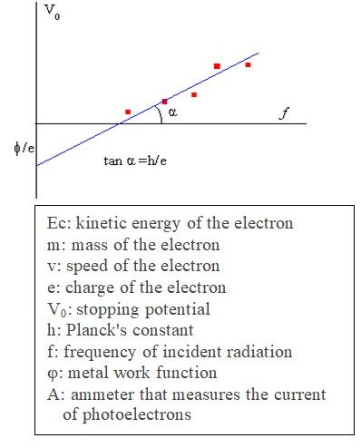

## 8.2. Energy transformations in photocells and in Light Emitting Diodes

Despite the existence of the first law of Thermodynamics establishing the conservation of energy, the second law indicates that in any transformation of energy the entropy increases or at least is maintained equal. This is a serious but inevitable condition imposed on any practical application of energy transforming devices.  Photocells and LEDs are important technological devices that minimize in effective ways their corresponding dissipation processes.  

### A photocell is an energy transforming device.

Photocells convert light energy into an electric current in a similar way as in the photoelectric effect. There are three main types of photocells having specific functions:

Photoconductive cells mainly function as light detectors. These devices have a beam of infrared light shining permanently on a light-dependent resistor and producing a steady electric current. When the beam is interrupted current is reduced. This change is detected by an electronic circuit that triggers specific actions like opening a door, sounding an alarm, turning on a faucet, …

Photoemissive cells mainly function as light amplifiers where light knocks electrons from a cathode to an anode, increasing the current flow through an external circuit. These devices serve to detect different kinds of radiations or to intensify the dim light of a night-time sensor.

Photovoltaic cells mainly function as power producers like miniature power plants generating a constant supply of electricity to be used to power electric appliances and solar panels or to charge batteries. In such devices light makes electrons move between layers of the material producing a voltage and a current in an external circuit.  

For more information consult <https://en.wikipedia.org/wiki/Solar_cell>

### Experimental evidence and Einstein´s explanation of the photoelectric effect.

As a matter of fact, in the photoelectric effect the energy of the photoelectrons that leave the metal is equal to the energy of the incoming photons minus the energy required by the electrons to be liberated from the surface of the metal (the work function). 

It is for the application of the conservation of energy to the photoelectric effect that Einstein was recognized in 1921 with a Physics Nobel Prize. The Physics Nobel Committee explained that such Prize was awarded “for his services to Theoretical Physics, and especially for his discovery of the law of the photoelectric effect”. However, his Nobel Lecture was related to relativity theories; it was already considered in Section 4.2. 

In a famous paper *On a heuristic point of view concerning the generation and conversion of light*, published in Annalen der Physik, 17, 132, (1905), Einstein wrote: *“The quanta of energy penetrate the surface of the material and their respective energies are at least in part changed into the kinetic energy of electrons.”*

The photoelectric effect consists of the emission of electrons by certain metals due to the action of light radiation of certain frequencies, causing the generation of an electric current as a consequence of the release of electrons that were trapped inside the metal. In metals there are electrons that move more or less freely through the crystal lattice; however, they will remain inside the metal surface unless they receive enough energy from the outside to overcome the metal work function (φ).

The emission of the photoelectrons can be detected in an experimental setup using an ammeter (A) like the one shown in Figure 8.1. The stopping potential ($V_0$) is the potential difference required to stop the fastest electrons, such that the photoelectric current is zero. The quantity $eV_0$ measures the kinetic energy $E_c = ½mv^2$ of the most energetic photoelectrons. This energy is equal to difference between the energy (hf) of the incident electromagnetic radiation and the energy that the electrons need to be released from the metal which corresponds to the work function (φ) characteristic of the metal.

$E_c = ½mv^2=eV_0=hf-φ$

<table cellspacing="0" cellpadding="0">
<tbody>
   <tr>
      <td>
        
     </td>
     <td>
        
     </td>
   </tr>
   </tbody>
</table> 
(Image credit: CC Wikimedia Commons)

**Figure 8.1.** Experimental device to detect the photoelectric effect: Einstein equation (upper left part) and the braking potential as a function of frequency (graph at the right). The red dots are experimental values. The box indicates the meaning of the physical quantities.

The classical electromagnetic theory was formulated by Maxwell between 1864 and 1873. This theory summarizes all the existing knowledge about electricity and magnetism in four mathematical formulas and predicts that the electromagnetic field is a wave traveling at the speed of light $c=1⁄\sqrt{ε_0 μ_0}$, whose value is $3 \times 10^8$ m/s, where $ε_0$ is the electrical permittivity and $μ_0$ the magnetic permeability, both in vacuum. This fact was verified experimentally by Heinrich Hertz (1857-1894). In 1887 he showed that light is an electromagnetic wave and discovered the photoelectric effect.

Maxwell's theory is a wave theory and requires that the radiated energy be distributed uniformly and continuously in the wave front that propagates from the emitting source to the receiving device. According to this wave theory, light of any frequency should produce photoelectric emission. Given enough time, the illuminated electron could accumulate the energy necessary to be liberated from the metal, even if the intensity of the radiation was very weak. 

According to classical electromagnetism, for an intensity of $10^{-10} W/m^2$ and a wavelength of $λ = 500$ nm (1 nm = $10^{-9}$ m), around 5 hours should pass before the emission of photoelectrons. However, the first experimental results showed that the emission of photoelectrons was almost instantaneous with an estimated delay of $10^{-9}$ seconds.

In the first experiments about the photoelectric effect, carried out in 1887 by Heinrich Hertz and Wilhelm Hallwachs (1859-1922), a well-polished zinc plate was connected to an electroscope. When the metal was illuminated with ultraviolet light coming from the jumping spark of a voltaic arc the ejected electrons could charge the electroscope (Figure 8.2).

**Figure 8.2.** Experimental device used by Hertz and Hallwachs.

In 1899 Joseph John Thomson (1856-1940) and in 1902 Philipp Lenard (1862-1947) independently demonstrated that the action of light on a metallic surface was the cause of the emission of free negative charges that were identified as electrons. Further experimental results needed satisfactory explanations that could not be provided by the classical electromagnetic theory:

(1) Increasing the intensity of the radiation increases the number of electrons leaving the metal but did not increase their energy and therefore their speed: the energy of the emitted electrons doesn't depend on the intensity of the light but on its frequency. 

(2) For each type of metal there is a minimum or threshold frequency below which photoelectrons are not produced no matter how intense the radiation is. It corresponds to a minimum energy to liberate the electron and produce the photoelectric effect. This is the work function (φ) characteristic of each metal. 

(3) The stopping potential $V_0$ measures the kinetic energy of the fastest photoelectrons ($v_{max}$) such that $½m(v_{max})^2 = eV_0$. The maximum of this kinetic energy was independent of light incoming intensity and for certain voltages the magnitude of the photoelectron current reached a saturation limit.

Since 1916 Robert Millikan (1868-1953) carried out experiments for analyzing the linear relationship between the variables $V_0$ and $f$ in Einstein's equation $E_c = ½mv^2 = eV_0 = hf – φ$. After much testing he derived three consequences (see the graph shown earlier in Figure 8.1):

1. The ordinate at the origin ($f = 0$) implies that $eV_0 = – φ$; therefore $φ/e$ measures the starting energy in electron-volts.

2. The straight line $V_0 = (hf – φ)/e$ has a slope equal to $h/e$. Taking into account that the charge of the electron is $e = 1.6 \times 10^{-19}$ coulombs, the value of Planck's constant can be obtained by measuring the slope of the straight line formed by experimental data (red dots in Figure 8.1)

3. The point of intersection with the horizontal axis ($V_0 = 0$) determines the threshold frequency ($f_0 = φ/h$) below which there is no emission of photoelectrons.

Millikan published his results in a paper entitled *A Direct Photoelectric Determination of Planck´s “h”*. Phys. Rev. 7, 355 (1916). Later on, Gerald Holton explained How Robert Millikan experimentally tested Einstein's photoelectric theory in *Centennial Focus: Millikan's Measurement of Planck's Constant*. Phys. Rev. Focus 3, 23, April 22 (1999). 

Einstein’s explanation can be summarized as follows:

1.	The energy of the electromagnetic radiation is quantized and is made up of photons.

2.	The intensity of the radiation depends on the number of photons whose energy is $hf$. 

3.	The conservation of mechanical energy law implies that the kinetic energy with which the photoelectrons are released is equal to the energy of the incident radiation minus the energy necessary to extract the photoelectrons from the  metal (work function).

4.	There is a threshold frequency below which the photoelectric effect does not occur.

Einstein's explanation coincided with the experimental facts and although he said the same thing as Planck (energy is discontinuous and it goes into packets) it was differently applied. Einstein's original contribution consisted in quantizing all types of radiation and establishing a connection between the wave nature of light (waves with frequency $f$) and the corpuscular nature of light (photons with energy $E = hf$). In this way, the quantization of energy becomes a fundamental property of electromagnetic waves: its intensity depends on the number of photons and its energy is a function of frequency.

Einstein took up Planck's work and transcended it: the quantization of energy is no longer a calculation artifice but a fundamental physical property of all electromagnetic radiations. If the energy of a thermal oscillator in a hot substance is quantized (Planck's hypothesis), by conservation of energy, the emitted radiation must also be quantized (Einstein's hypothesis). If this quantization condition is valid for the interaction between the incident radiation and the resonators of the blackbody cavity (the Planck oscillators), it must also be valid when electromagnetic radiation is transferred to the photoelectrons (photoelectric effect).

It is also important to point out different “philosophical” positions regarding what the explanation of physical phenomena means: it was the search of the absolute for Planck and the pursue of simplicity for Einstein. The use of Einstein's reasoning is surprising for its originality and audacity, since it gives a very simple explanation of the photoelectric effect: the photons passed their energy in fixed quantities to atoms inside the metal, knocking some of their electrons out of them, so producing an electric current. Furthermore, Einstein solved the discrepancy between the experimental results and the classical theory of electromagnetic radiation by generalizing the concept of photon as tha quantum of electromagnetic radiation.

Einstein applied a whole new reasoning process and introduced the revolutionary hypothesis of the quantization of radiation energy (photons). He used the ideal gas model of particles to make an analogy with the quantized radiation model. He considered the entropy change of an ideal gas at constant temperature when the volume changes reversibily. From this he concluded, comparing equations, that the physical behavior of both systems must be equivalent: if the ideal gas refers to material "particles", the electromagnetic radiation must also refer to “particles”, in this case photons.

An important application of the photoelectric effect was made by K.M. Siegbahn (1918-2007) who received the 1981 Physics Nobel Prize “for his contribution to the development of high-resolution electron spectroscopy”. According to the Nobel Physics Committee**: Siegbahn *developed highly accurate measurements of energy levels in atoms by irradiating them with photons and measuring the energy of the electrons emitted using the photoelectric effect*. His Nobel Lecture Electron Spectroscopy for Atoms, Molecules and Condensed Matter is a complete description of his contributions.
    
MLA style: Kai M. Siegbahn – Facts. NobelPrize.org. Nobel Prize Outreach AB 2023. Wed. 3 May 2023. <https://www.nobelprize.org/prizes/physics/1981/siegbahn/facts/>

### A Nobel Prize recognition that a LED is an energy saving device.

A diode is an electronic component with two terminals (a cathode and an anode) that conducts current primarily in one direction. It has zero resistance in one direction and high resistance in the other. A semiconductor diode is a crystalline piece of a semiconductor material with a p-n junction connecting the two electrical terminals. 

The n-region of the semiconductor has free electrons (excess electrons) and the p-region has free holes (absence or lack of electrons). When a positive voltage is applied to the p-region and a negative one to the n-region, the electrons on the n-region are pushed to the p-region and the electrons flow through the p material beyond the semiconductor boundaries.

A Light Emitting Diode (LED) is a semiconductor diode that generates light when it is traversed by an electric current. As a photocell generates a current when a radiation impacts on a metal, in a sort of inverse photoelectric effect a LED generates light when a current traverse a semiconductor. Depending on the material of the semiconductor the emitted light will be of different frequency corresponding to red, green, yellow, amber, or infrared colors.

Excerpts from 2014 Nobel Press release: *New light to illuminate the world.*

MLA style: Press release. NobelPrize.org. Nobel Prize Outreach AB 2023. Wed. 3 May 2023. <https://www.nobelprize.org/prizes/physics/2014/press-release/>

*When* ***Isamu Akasaki, Hiroshi Amano*** and ***Shuji Nakamura*** *produced bright blue light beams from their semi-conductors in the early 1990s, they triggered a fundamental transformation of lighting technology. Red and green diodes had been around for a long time but without blue light, white lamps could not be created. Despite considerable efforts, both in the scientific community and in industry, the blue LED had remained a challenge for three decades.*

*They succeeded where everyone else had failed. Akasaki worked together with Amano at the University of Nagoya, while Nakamura was employed at Nichia Chemicals, a small company in Tokushima. Their inventions were revolutionary. Incandescent light bulbs lit the 20th century; the 21st century will be lit by LED lamps.*

*White LED lamps emit a bright white light, are long-lasting and energy-efficient. They are constantly improved, getting more efficient with higher luminous flux (measured in lumen) per unit electrical input power (measured in watt). The most recent record is just over 300 lm/W, which can be compared to 16 for regular light bulbs and close to 70 for fluorescent lamps. As about one fourth of world electricity consumption is used for lighting purposes, the LEDs contribute to saving the Earth’s resources. Materials consumption is also diminished as LEDs last up to 100,000 hours, compared to 1,000 for incandescent bulbs and 10,000 hours for fluorescent lights.*

*The LED lamp holds great promise for increasing the quality of life for over 1.5 billion people around the world who lack access to electricity grids: due to low power requirements it can be powered by cheap local solar power.*

*The invention of the efficient blue LED is just twenty years old, but it has already contributed to create white light in an entirely new manner to the benefit of us all.*

For more information:

*Popular Science Background: Blue LEDs – Filling the world with new light.*
MLA style: Popular information. NobelPrize.org. Nobel Prize Outreach AB 2023. Wed. 3 May 2023. 
https://www.nobelprize.org/prizes/physics/2014/popular-information/
	
*Scientific Background: Efficient blue light-emitting diodes leading to bright and energy-saving white light sources.*
MLA style: Advanced information. NobelPrize.org. Nobel Prize Outreach AB 2023. Wed. 3 May 2023. <https://www.nobelprize.org/prizes/physics/2014/advanced-information/>
 
*Light-emitting diode*. <https://en.wikipedia.org/wiki/Light-emitting_diode>

In what follows we describe the content of the corresponding 2014 Nobel Lectures, all of them delivered on December 8 that year.

ISAMU AKASAKI: **Fascinated Journeys into Blue Light.**

1.	*INTRODUCTION*
2.	*LED RESEARCH IN THE EARLY DAYS*
3.   *BRIEF HISTORY OF RESEARCH ON GaN-BASED MATERIALS AND DEVICES* \
    3.1. *Early attempts at development of GaN blue LED* \
    3.2. *Reconsideration of growth technology* 
4. *CREATION OF GaN SINGLE CRYSTAL WITH EXCELLENT QUALITY* 
    4.1. *Development of low-temperature buffer layer technology in MOVPE* \
    4.2. *Model for the growth mode*
5. *DISCOVERY OF p-TYPE GaN AND DEMONSTRATION OF p-n JUNCTION BLUE/ UV LED*
6. *CONDUCTIVITY CONTROL OF n-TYPE GaN AND NITRIDE ALLOYS*
7. *BRIEF HISTORY OF NITRIDE-BASED BLUE LEDs*
8. *DEVELOPMENT OF NITRIDE-BASED LDs AND OTHER DEVICES*
9. *SUMMARY AND FUTURE EXPECTATIONS*

MLA style: Isamu Akasaki – Nobel Lecture. NobelPrize.org. Nobel Prize Outreach AB 2023. Wed. 3 May 2023. 
<https://www.nobelprize.org/prizes/physics/2014/akasaki/lecture/>

HIROSHI AMANO:  **Growth of GaN on Sapphire via Low-Temperature Deposited Buffer Layer and Realization of p-Type GaN by Mg Doping Followed by LowEnergy Electron Beam Irradiation.**

1.	*MOTIVATION FOR STARTING BLUE LED RESEARCH*
2.	*DIFFICULTY OF REALIZING HIGH-PERFORMANCE BLUE LEDs BASED ON GaN*
3.	*FUNDING SITUATION OF OUR LABORATORY IN THE MID-1980S AND THE DIFFICULTY OF GROWING GaN ON A SAPPHIRE SUBSTRATE*
4.	*LOW-TEMPERATURE DEPOSITED BUFFER LAYER*
5.	*REALIZATION OF p-TYPE GaN*
6.	*ATTEMPTS TO GROW InGaN*
7.	*CONTRIBUTION OF InGaN-BASED BLUE LEDs TO ENERGY SAVING*

MLA style: Hiroshi Amano – Nobel Lecture. NobelPrize.org. Nobel Prize Outreach AB 2023. Wed. 3 May 2023. 
<https://www.nobelprize.org/prizes/physics/2014/amano/lecture/>

SHUJI NAKAMURA: **Background Story of the Invention of Efficient Blue InGaN Light Emitting Diodes.**

1.	*INTRODUCTION AND IMPACT OF WHITE LIGHT EMITTING DIODES*
2.	*MATERIAL OF CHOICE: ZnSe VS. GaN*
3.	*DEVELOPMENT OF GaN*
4.	*DEVELOPMENT OF InGaN* \
    4.1	*InGaN based devices*\
    4.2	*Material Properties of InGaN*
5.	*HISTORICAL DEVELOPMENT OF InGaN BASED LEDS* \
    5.1	*Luminous Efficacy* \
    5.2	*Significant Milestones on the Journey to the White LED* \
    5.3	*Contributions to the Efficient Blue LED*
6.	*FORWARD LOOKING*

MLA style: Shuji Nakamura – Nobel Lecture. NobelPrize.org. Nobel Prize Outreach AB 2023. Wed. 3 May 2023. 
https://www.nobelprize.org/prizes/physics/2014/nakamura/lecture/

[**8.3. Anthropological spaces for the development of collective intelligence**](https://github.com/modphysnobel/pbook1/blob/main/docs/vol-II/vol-II-chap-8-sect-3.md)