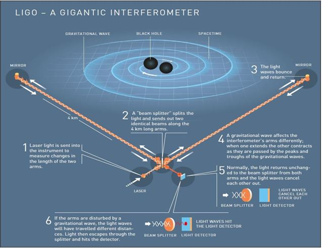

## 10.2.	Gravitational astronomy.

Until very recently the gravitational force had resisted any experimental demonstration that the boson representing its quantum field really exists: the graviton. One of the problems is that the estimated interaction time of this particle is of the order of years. Such times are much shorter for the bosons that correspond to the other three forces of nature. If we indicate these times in seconds, for the photon, the quantum of electromagnetic force, it is between $10^{-14}$ and $10^{-20}$, for the gluon, the quantum of the strong force, it is less than $10^{-22}$ and for the $W^+$, $W^-$ and $Z^0$ particles, the quanta of the weak force, it is between $10^{-8}$ and $10^{-13}$. 

The quanta associated with gravitational, electromagnetic, and strong interactions have zero mass and infinite range, while the weak force messenger, the gluon, has finite mass and short range. Another fact characterizes the type of propagation of two of these interactions: while photons propagate through electromagnetic waves, gravitons do so through gravitational waves. According to Thorne, next table describes the main difference between these waves:

<!-- HTML Table 1.1.1-->
<table width="100%">
    <tr>
    <th>
    Electomagnetic waves
        </th>
     <th>
Gravitational waves
        </th>
        </tr>
     <tr>
    <td>
    The oscillations propagate through three-dimensional space. 
    </td>
    <td>
    The oscillations propagate through the very space-time “fabric” or shape of which the universe is made.
    </td>
    </tr>
    <tr>
    <td>
    The waves are incoherent superposition of emissions produced by individual charged particles, atoms or molecules. 
    </td>
    <td>
    The waves are emitted coherently by the bulk motion of matter or energy.
    </td>
    </tr>
    <tr>
    <td>
    They are too easily absorbed and scattered by matter between their source and Earth. 
    </td>
    <td>
    They are never significantly absorbed or scattered by matter, even when emitted in the earliest moments of the Universe´s life.
    </td>
    </tr>
</table>

Source: Kip S. Thorne's 2017 Physics Nobel Lecture LIGO and Gravitational Waves III.

MLA style: Kip S. Thorne – Nobel Lecture. NobelPrize.org. Nobel Prize Outreach AB 2023. Sun. 4 Jun 2023. 
<https://www.nobelprize.org/prizes/physics/2017/thorne/lecture/>

An interference pattern produced by gravitational waves was detected and measured on 14 September 2015, after more than forty years of collaboration of over one thousand researchers from nearly twenty countries. However, it was not reported until February 11, 2016 because its authors wanted to refine their calculations.

The observation of gravitational wave interferences indicated that very far away in the past a violent change in the structure of spacetime was originated by the collision of two massive black holes during a few tenths of a second, more than a thousand million years ago. The difference in masses before the collision (29 and 36 solar masses) and after the collision (62 solar masses) resulted in energy dissipated (3 solar masses) in the form of gravitational waves.

The LIGO detector was just a laser interferometer with two arms forming an L, a beam splitter in the corner of the L and mirrors at the beginning and end of each arm whose length was 4 km. It functioned as follows: light coming from an external laser arrived at the beam splitter after which two signals traveled in different directions and reflected back and forth many times along the interferometer arms. Finally, these signals overlapped in the beam-splitter from where it was registered in a photodetector (see steps 5 and 6 in Figure 10.2) 

When the interferometer’s arms did not change length, both signals traveled equal distances, and no interference pattern was formed. Nevertheless, gravitational waves shrink and lengthen spacetime and therefore modify the distances traveled by the laser radiation in the arms of the interferometer. Under these conditions the component waves arrived out of phase and produced an interference pattern. The compressions and expansions of space-time generated the observed gravitational wave interference pattern so much expected (Figure 10.2).

Source: Figure 3 taken from the document *The Nobel Prize in Physics 2017.*
             MLA style: Popular information. NobelPrize.org. Nobel Prize Outreach AB 2023. Wed. 17 May 2023. <https://www.nobelprize.org/prizes/physics/2017/popular-information/>

**Figure 10.2.** ***Figure 3.*** *How to catch a gravitational wave. The world’s first captured gravitational waves were created in a violent collision between two black holes, 1.3 billion lightyears away. When these waves passed the Earth, 1.3 billion years later, they had weakened considerably: the disturbance in spacetime that LIGO measured was thousands of times smaller than an atomic nucleus.*

Next we deal with the 2017 Nobel Lectures, all of them delivered on December 8, 2017. When the text of the Lecture contains subtitles, we include them.

- R. WEISS: **LIGO and Gravitational Waves I.**

Source: MLA style: Rainer Weiss – Nobel Lecture. NobelPrize.org. Nobel Prize Outreach AB 2023. Mon. 15 May 2023. https://www.nobelprize.org/prizes/physics/2017/weiss/lecture/

In what follows we present some excerpts of this Lecture skipping references and figures. In section 10.3 we include Weiss descriptions related to the evolution of the project.

…..

*The three of us will give talks with the same title, “LIGO and the Discovery of Gravitational Waves”, but focus on different aspects. I will discuss some of the early history of gravitational waves and develop the concepts to understand the detectors as well as the challenges faced in measuring strains as small as* $10^{–21}$. *Barry will show how the LIGO project organized to make steady improvements and ultimately carry out a successful scientific program. He will describe the detections as well as ideas to improve the detectors driven by the new science we hope to learn. Kip will look at the broader aspects of the new field of gravitational wave astronomy. He will tell of the critical role numerical relativity and understanding the quantum mechanics of precision measurements has played. He will also give a vision of the science that could come from an investigation of the gravitational wave sky from periods of fractions of milliseconds to tens of billions of years.*

…..

*In 1915, a little over 100 years ago, Einstein published the General Theory of Relativity (GR), a new theory of gravitation which replaced the Newtonian force by the idea that mass distorts the geometry of space and the flow of time. … GR also provided some new phenomena open to measurement; small effects difficult to measure but profound in their importance. These were the prediction that clocks ran more slowly in strong gravitational fields than weak ones and that starlight passing the limb of the sun would be deflected toward the sun, the so-called bending of light.*

…..

*In 1916 Einstein wrote a paper showing some of the ideas discussed above by perturbation calculations using linearized versions of his full field equations. It is in this paper he first describes gravitational waves.*
*They travel at the speed of light and are transverse waves much as electromagnetic waves, but rather than exerting forces on charges, they distort space perpendicular to the direction along which they propagate.*

…..

*It is clear we live in very weak gravity. … In other words, it takes enormous amounts of energy to distort space.*

…..

*An example one might have expected Einstein to use is the gravitational radiation emitted by the collision of two trains, a man-made event of significant energy transfer. … Another possibility might have been to estimate the change one might be able to detect in observing a binary star system through a telescope. The two stars orbiting each other would lead to the loss of energy by gravitational radiation and would be changing their period as they fall toward each other. … It took until the mid-1970s with discovery of pulsars and vastly improved time keeping to perform the measurements of a binary star system which showed evidence for energy loss due to the radiation of gravitational waves.*

- B.C. Barish: **LIGO and Gravitational Waves II.**

Source: MLA style: Barry C. Barish – Nobel Lecture. NobelPrize.org. Nobel Prize Outreach AB 2023. Mon. 15 May 2023.
<https://www.nobelprize.org/prizes/physics/2017/barish/lecture/>

INTRODUCTION \
THE LIGO LABORATORY \
THE LIGO SCIENTIFIC COLLABORATION (LSC) \
INITIAL LIGO PERFORMANCE AND SCIENCE \
ADVANCED LIGO \
THE BLACK HOLE MERGER EVENT (GW150914) \
MORE BLACK HOLE MERGERS \
SCIENCE IMPLICATIONS OF THE OBSERVED BLACK HOLE MERGERS \
VIRGO DETECTS GRAVITATIONAL WAVES \
NEUTRON STAR BINARY MERGER \
FUTURE DIRECTIONS FOR LIGO AND GRAVITATIONAL WAVES \
THE FUTURE \
FINAL REMARKS AND REFLECTIONS \
LIGO – SOME KEY MEMBERS

Next we present some excerpts of this Nobel Lecture. In section 10.3 we include more details reported by Barish in his Nobel Lecture in connection with the organization of the project.

*In these three lectures, Rai, Kip and I tell the story of LIGO and gravitational waves in three parts. Rai covers the physics of gravitational waves, the experimental challenges and some of the pioneering interferometer work. He highlights the experimental challenges and some important early innovations that were proposed, tested at small-scale and have been incorporated in the LIGO interferometers.*

*In this lecture, I describe the LIGO project and, the improvements that led to detection of merging black holes in Advanced LIGO. I also describe some key features of the interferometers, some implications of the discoveries, and finally, how we envision the evolution of LIGO over the coming decade.*

*Kip will talk about some early personal history, theoretical advances that were crucial to making and interpreting the LIGO, and finally, his vision of the future opportunities in this new field of science.*

…..

*The basic scheme for LIGO was to use a special high power stabilized single-line laser that entered the interferometer and was split into two beams transported in perpendicular directions. …. In the simplest version of the interferometer, the equal length arms are adjusted such that the reflected light from mirrors at the far ends arrive back at the same time, and inverting one, the two beams cancel each other, and no light is recorded in the photodetector. ….. The Initial and Advanced LIGO gravitational wave detectors are Michelson interferometers with 4 km long arms.*

…..

*When a gravitational wave crosses the interferometer, it stretches one arm and compresses the other, at the frequency of the gravitational wave. Consequently, the light from the two arms returns at slightly different times (or phase) and the two beams no longer completely cancel. This process reverses itself, stretching the other arm and squeezing the initial arm at the frequency of the gravitational wave.*

…..

*The resulting frequency and time-dependent amount of light is recorded by a photo-sensor and recorded as the waveform from the passage of a gravitational wave. The experimental challenge is to make the interferometer sensitive to the incredibly tiny distortions of spacetime that come from a gravitational wave, while at the same time, suppressing the various background noise sources.*

…..

*Therefore, there is a very high premium in LIGO on increasing the range we can search, and consequently, we spend a good fraction of our time improving the sensitivity, rather than taking very long data runs.* 

*Both use Fabry-Perot cavities to increase the interaction time with a gravitational wave, and power recycling to increase the effective laser power. Signal recycling at the output (dark) port is a new feature of Advanced LIGO, and this changes the control and readout systems. Signal recycling enables tuning the sensitivity response to the physics goals, presently black hole and neutron star mergers.*

- S. THORNE: **LIGO and Gravitational Waves III.**

Source: MLA style: Kip S. Thorne – Nobel Lecture. NobelPrize.org. Nobel Prize Outreach AB 2023. Mon. 15 May 2023. 
<https://www.nobelprize.org/prizes/physics/2017/thorne/lecture/>

The content of this Lecture is quite long and detailed, so we just include titles and subtitles.  

INTRODUCTION AND OVERVIEW \
SOME EARLY PERSONAL HISTORY: 1962–1976 \
SOURCES OF GRAVITATIONAL WAVES \
INFORMATION CARRIED BY GRAVITATIONAL WAVES, AND COMPUTATION OF GRAVITATIONAL WAVEFORMS 

<!DOCTYPE html>
<html>
 <body>
  <ul type = "circle">
   <li>Observables from a Compact Binary’s Inspiral Waves </li>
   <li>Post-Newtonian Approximation for Computing Inspiral Waveforms </li> 
<li>Numerical Relativity for Computing Merger Waveforms</li>  
<li>Geometrodynamics in BBH Mergers </li>  
  </ul>
 </body>
</html>
 	
THEORISTS’ CONTRIBUTIONS TO UNDERSTANDING AND CONTROLLING NOISE IN THE LIGO INTERFEROMETERS 

<!DOCTYPE html>
<html>
 <body>
  <ul type = "circle">
   <li>Scattered-Light Noise </li>
   <li>Gravitational noise </li> 
<li>Thermal Noise</li>  
<li>Quantum Noise and the Standard Quantum Limit for a Gravitational Interferometer</li>  
<li>Quantum Fluctuations, Quantum Nondemolition, and Squeezed Vacuum</li> 
  </ul>
 </body>
</html>

THE FUTURE: FOUR GRAVITATIONAL FREQUENCY BANDS

<!DOCTYPE html>
<html>
 <body>
  <ul type = "circle">
   <li>LISA: The Laser Interferometer Space Antenna </li>
   <li>PTAs: Pulsar Timing Arrays</li> 
<li>CMB Polarization</li>  
  </ul>
 </body>
</html>

THE FUTURE: PROBING THE UNIVERSE WITH GRAVITATIONAL WAVES

<!DOCTYPE html>
<html>
 <body>
  <ul type = "circle">
   <li>Multi-Messenger Astronomy</li>
   <li>Exploring Black Holes and Geometrodynamics with Gravitational Waves</li> 
<li>Exploring the First One Second of our Universe’s Life</li>  
  </ul>
 </body>
</html>
	
CONCLUSION
	
*The fact of having detected gravitational waves manifests three characteristics of how physics is done in our time:* 

1.	*Broad and deep theoretical advances*

*The predictions of Einstein's theory of general relativity, according to which the dimensions and scope of three-dimensional space are interrelated with the fourth dimension of time, were revised and updated. This fact is a consequence of the presence of very massive objects that produce the curvature of space-time where gravitational waves can be produced and propagated. Because these waves carry energy, they can produce observable effects.*

2.	*Multidisciplinary and international collaborations*

*The work was recognized in 2017 with the Nobel Prize in Physics to only three scientists, but has involved the collaboration of many people for more than 40 years. Participation in what became the LIGO project was initiated by Weiss and Thorne around 1980; then Barish led the participation of more than a thousand scientists (theoretical and experimental physicists, engineers, technologists and administrators). In August 2017 LIG0 and the Italian detector VIRGO simultaneously recorded three new events.*

3.	*Powerful detection and recording instruments*

*The two arms of the LIGO interferometer are two tunnels perpendicular to each other. At the end of each tunnel of length* $d = 4 km$ *there is a mirror that reflects the light coming from a laser. The two beams of reflected light then overlap after traveling an effective distance on each arm that differs from d in much very small but significant amounts. By the effect of the gravitational wave, while the length in one arm of the interferometer is shortened, in the other arm it lengthens. Then the light travels different distances in each arm and the electromagnetic waves arrive out of phase to the meeting point where they produce interference.  This effect is amplified if the laser light bounces off the mirrors many times to increase the total distance traveled and make the difference in the lengths of each arm more evident.* 

[**10.3. Organization and evaluation of learning communities.**](https://github.com/modphysnobel/pbook1/blob/main/docs/vol-III/vol-III-chap-10-sect-3.md)