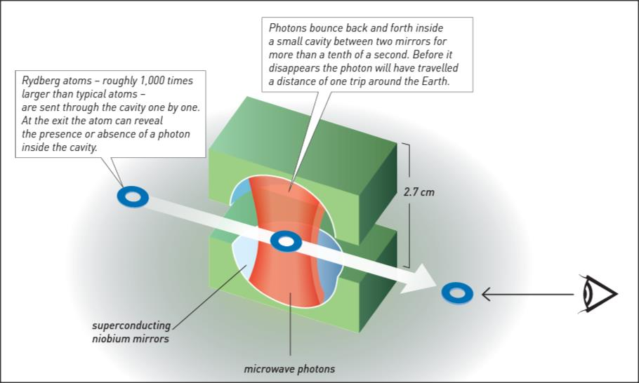
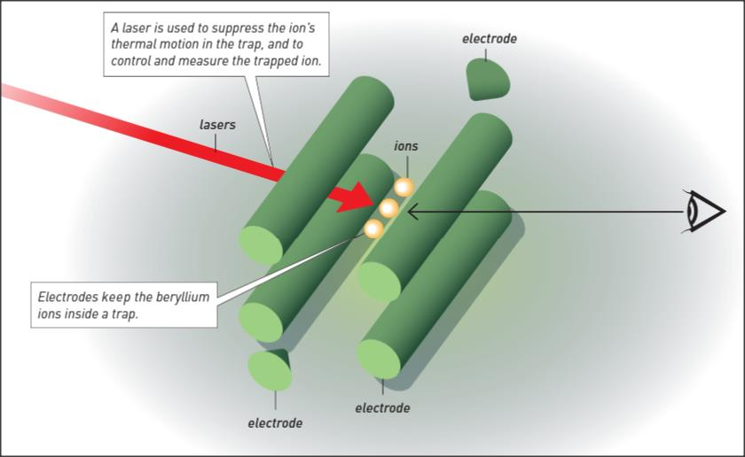

[**Volume III: Waves**](./volume-III.md)

[**Previous: 11.1. Microscopic observation of solids.**](./vol-III-chap-11-sect-1.md) 

***

## 11.2 Production of new materials and study of individual quantum systems.

This section deals with two issues that have been innovative and important in connection with the performance of critical experiments: materials describing what to study (the graphene) and methods explaining how to proceed (control of photons and ions). 

!!! info "Production and applications of graphene."

	In what follows we include information taken from the document *Information for the Public: Graphene-the perfect atomic lattice*.

	Graphene is a virtually perfect two-dimensional lattice and one atom thick. It consists of a hexagonal lattice of carbon atoms flooded with delocalized electrons. It is a two-dimensional electronic system of very high quality. In a millimeter of graphite, like that which exists in pencils, there are three million layers of graphene, one on top of the other. 

	Using normal Scotch tape and working at room temperature, in 2004 Geim and Novoselov managed to detach a layer of graphene from a piece of graphite. They obtained a two-dimensional material, with only length and width. It is a monolayer with two surfaces, one above and one below, separated by a layer the thickness of an atom. When that very thin layer of graphene is rolled up, carbon nanotubes are formed; when it is folded like a football fullerene is obtained (see the 1996 Chemistry Nobel Prize awarded jointly to Robert F. Curl Jr., Sir Harold W. Kroto, and Richard E. Smalley "for their discovery of fullerenes").

	The crystallographic structure of graphene resembles that of graphite, determined by means of X-rays in 1924 by John Desmond Bernal (1901-1971). Since the geometry of graphene corresponds to that of a two-dimensional surface, it shows surprising properties: 

	- “It is one of the thinnest materials and at the same time the most resistant.
	- It is as good a conductor of electricity as copper. 
	- It is a better conductor of heat than silver or copper.
	- It is almost completely transparent (up to 98%); however, even a very light gas like helium cannot pass through it. 
	- It is very light and at the same time very resistant: if a hammock of one square meter were built with this material, it would weigh 0.77 mg and could support without breaking objects up to 4 kg, such as a cat for example.
	- Electrons travels in graphene as having no mass and at a constant speed of one million meters per second (light velocity is 300 million meters per second).
	- It can be used as an extremely sensitive sensor that could register even the smallest levels of pollution.
	- The material remains stable at room temperature and does not oxidize in contact with air.
	- The electric charge carriers in graphene monolayers behave as massless fermions, while in graphene double layers such charge carriers do manifest mass.”

	WORK (Geim and Novoselov): “Carbon exists in several different natural forms. A material consisting of carbon atoms arranged in a hexagonal lattice and only one atom thick was long considered a purely theoretical construction. In 2004 Andre Geim and Konstantin Novoselov successfully produced this material, graphene, and mapped its properties: incredibly thin but still incredibly strong, good heat and electrical conductivity, almost entirely transparent yet very dense. Graphene creates new possibilities within materials technology and electronics.”

	We deal with Geim´s Nobel Lecture *Random Walk to Graphen* in next section 11.3.

	NOBEL LECTURE: *Graphene: Materials in the Flatlan* by K. Novoselov.

	*GRAPHENE AND ITS UNUSUAL PROPERTIES*

	I. TWO-DIMENSIONAL CRYSTALS  
	Stability of 2D crystals  
	Graphene creation  
	Other 2D crystals  
	Out to Spaceland: 2D-based heterostructures

	II. CHIRAL QUASIPARTICLES AND THE ELECTRONIC PROPERTIES OF GRAPHENE  
	Linear dispersion relation and chirality  
	The Klein paradox  
	Half-integer quantum Hall effect  
	Effect of mechanical deformation  
	Graphene optics  
	Bilayer graphene

	III. GRAPHENE APPLICATIONS  
	Graphene support  
	Transparent conductive coating  
	Graphene transistors  
	Graphene composites  
	Other applications

!!! info "Methods for individual control of photons and ions."

	In what follows we refer to the document *Information for the Public: Particle control in a quantum world*, published by The Royal Swedish Academy of Sciences:

	Single particles are not easily isolated in the quantum domain because they lose their properties as soon as they interact with their surrounding environment. However, research groups leaded by Haroche and Wineland have independently observed, examined, controlled, and counted individual quantum particles without destroying them. While Haroche controlled and measured trapped photons by sending atoms through a trap formed by a microwave cavity, Wineland trapped electrically charged atoms, or ions, controlling and measuring them with light, or photons.  

	Next we discuss each one of these experiments and then consider the quantum paradox associated with Schrödinger’s cat and the critical experimental processes to build super-fast computers and extremely precise clocks.
	
	*Haroche´s experiments.* The experimental procedure for controlling single photons in a trap consist in three steps: (1) Rydberg atoms  are specially prepared in a cavity in vacuum and at a temperature of almost absolute zero;  (2) the Rydberg atoms interact with microwave photons inside a small cavity between two superconducting mirrors, and (3) the microwave photons trapped inside the cavity bounce back and forth for almost a tenth of a second before they are lost or absorbed. 

	A Rydberg atom has electronically excited states quite close to ionization energy of the atom; this is the energy required to completely liberate an electron from the ionic core of an atom. When the Rydberg atom traverses the cavity, it interacts with the microwave photon and consequently the atom changes the phase of its quantum state. This phase shift can be measured when the atom exits the cavity, thereby revealing the presence or absence of an interaction with one photon inside the cavity. With no photon there is no phase shift. Many quantum manipulations can be performed with the trapped photons due to its long lifetime. (See Figure 11.1).
	
	{width="520"}

	(Source: MLA style: Popular information. NobelPrize.org. Nobel Prize Outreach AB 2023. Tue. 27 Jun 2023. https://www.nobelprize.org/prizes/physics/2012/popular-information/ © Johan Jarnestad/The Royal Swedish Academy of Sciences)

	**Figure 11.1.** Experimental setting for trapping individual photons (reproduced from Figure 3 in *Information for the Public: Particle control in a quantum world*).

	*Wineland´s experiments.* The experimental procedure for controlling single ions in a trap consist in the following: (1) electrically charged atoms (ions) were trapped by electric fields produced by electrodes, and (2) a laser suppressed the ion’s thermal motion in the trap and generated a coherent quantum superposition of two ion’s energy states: one state is in a lowest energy level and the other one is in a higher energy level excited by a laser pulse. (See Figure 11.2).

	“A trapped ion has an oscillating movement, which is quantized at low temperature. An ion therefore has two sets of quantized levels: vibrational modes that characterize the motion in the trap (also called external states) and electronic levels that describe the internal quantum state of the ion. Individual ions can now be manipulated and observed in situ by using photons with only minimal interaction with the environment.”
	
	{width="520"}
	
	(Source: MLA style: Popular information. NobelPrize.org. Nobel Prize Outreach AB 2023. Tue. 27 Jun 2023. https://www.nobelprize.org/prizes/physics/2012/popular-information/ © Johan Jarnestad/The Royal Swedish Academy of Sciences)

	**Figure 11.2.** Experimental setting for trapping individual ions (reproduced from Figure 2 in *Information for the Public: Particle control in a quantum world*.)

	In previous experiments quantum states were observed through quantum non-demolition measurements where two-level systems were coupled to a quantized harmonic oscillator.  In Haroche case it was a highly excited atom with two Rydberg levels coupled by a microwave field. In Wineland case the two-level system consisted of an ion in two levels coupled by laser light. The quantized harmonic oscillator described the microwave field in the cavity or the ion’s motion in the trap. Next we quote some excerpts taken from *Information for the Public: Particle control in a quantum world.*

!!! info "Paradoxes of quantum mechanics."

	“Quantum mechanics describes a microscopic world invisible to the naked eye, where events occur contrary to our expectations and experiences with physical phenomena in the macroscopic, classical world. Physics in the quantum world has some inherent uncertainty or randomness to it. One example of this contrary behaviour is superposition, where a quantum particle can be in several different states simultaneously.” …..
	
	……

	…. In 1952, Erwin Schrödinger (1887-1961) wrote: “We never experiment with just one electron or atom or (small) molecule. In thought-experiments we sometimes assume that we do; this invariably entails ridiculous consequences...”. 

	“In order to illustrate the absurd consequences of moving between the micro-world of quantum physics and our every-day macro-world, Schrödinger described a thought experiment with a cat: Schrödinger’s cat is completely isolated from the outside world inside a box. The box also contains a bottle of deadly cyanide which is released only after the decay of some radioactive atom, also inside the box.”
	
	…..

	“The radioactive decay is governed by the laws of quantum mechanics, according to which the radioactive material is in a superposition state of both having decayed and not yet decayed. Therefore the cat must also be in a superposition state of being both dead and alive. Now, if you peek inside the box, you risk killing the cat because the quantum superposition is so sensitive to interaction with the environment that the slightest attempt to observe the cat would immediately ‘collapse’ the ‘cat-state’ to one of the two possible outcomes – dead or alive.” ….
	
	….
	
	“Both Nobel Laureates of 2012 have been able to map the quantum cat-state when it encounters outside world. They have devised creative experiments and managed to show in great detail how the act of measuring actually causes the quantum state to collapse and loose its superposition character. Instead of Schrödinger’s cat, Haroche and Wineland trap quantum particles and put them in cat-like superposition states. These quantum objects are not really macroscopic as a cat, but they are still quite large by quantum standards.”
	
	“Inside Haroche’s cavity microwave photons are put in cat-like states with opposite phases at the same time, like a stopwatch with a needle that spins both clockwise and counterclockwise simultaneously. The microwave field inside the cavity is then probed with Rydberg atoms. The result is another unintelligible quantum effect called entanglement. Entanglement has also been described by Erwin Schrödinger and can occur between two or more quantum particles that have no direct contact but still can read and affect the properties of each other. Entanglement of the microwave field and Rydberg atoms allowed Haroche to map the life and death of the cat-like state inside his cavity, following it step by step, atom by atom, as it underwent a transition from the quantum superposition of states to a well defined state of classical physics.”

!!! info "On the verge of a new computer revolution."

	“A possible application of ion traps that many scientists dream of is the quantum computer. In present-day classical computers the smallest unit of information is a bit that takes the value of either 1 or 0. In a quantum computer, however, the basic unit of information – a quantum bit or qubit – can be 1 and 0 at the same time. Two quantum bits can simultaneously take on four values – 00, 01, 10 and 11 – and each additional qubit doubles the amount of possible states. For n quantum bits there are 2n possible states, and a quantum computer of only 300 qubits could hold $2^{300}$ values simultaneously, more than the number of atoms in the universe.”

	“Wineland’s group was the first in the world to demonstrate a quantum operation with two quantum bits. Since control operations have already been achieved with a few qubits, there is in principle no reason to believe that it should not be possible to achieve such operations with many more qubits. However, to build such a quantum computer is an enormous practical challenge. One has to satisfy two opposing requirements: the qubits need to be adequately isolated from their environment in order not to destroy their quantum properties, yet they must also be able to communicate with the outside world in order to pass on the results of their calculations.” ….

!!! info "New clocks."

	“David Wineland and his team of researchers have also used ions in a trap to build a clock that is a hundred times more precise than the caesium-based atomic clocks which are currently the standard for our measurement of time. Time is kept by setting, or synchronizing all clocks against one standard. Caesium clocks operate in the microwave range whereas Wineland’s ion clocks use visible light – hence their name: optical clocks. An optical clock can consist of just one ion or two ions in a trap. With two ions, one is used as the clock and the other is used to read the clock without destroying its state, or causing it to miss a tick. The precision of an optical clock is better than one part in $10^{17}$, which means that if one had started to measure time at the beginning of the universe in the Big Bang about 14 billion years ago, the optical clock would only have been off by about five seconds today.”

	For more advanced explanations consult Scientific background: *Measuring and manipulating individual quantum systems.*

	Next, for each laureate we quote the section WORK and the title and subtitles of their lectures.
 
	WORK (Haroche): “When it comes to the smallest components of our universe, our usual understanding of how the world works ceases to apply. We have entered the realm of quantum physics. For a long time, many quantum phenomena could only be examined theoretically. Starting in the 1980s, Serge Haroche has designed ingenious experiments to study quantum phenomena when matter and light interact. Haroche has been able to capture photons using another kind of trap–two mirrors which they can bounce between. This device allowed Haroche to study the photons by passing atoms through the trap.”

	NOBEL LECTURE: *Controlling Photons in a Box and Exploring the Quantum to Classical Boundary.* S. Haroche.

	Control of single particles in a quantum world  
	A personal account of the early days of cavity quantum electrodynamics  
	Counting photons without destroying them: a new photon box and circular rydberg atoms  
	Quantum feedback  
	Field state reconstruction  
	Schrödinger cat states of light and decoherence studies  
	Quantum information in cavity qed  
	Perspectives for the work of ens  
	Relation to other domains in quantum information science  
	Acknowledgments

	WORK (Wineland): “When it comes to the smallest components of our universe, our usual understanding of how the world works ceases to apply. We have entered the realm of quantum physics. For a long time, many quantum phenomena could only be examined theoretically. Starting in the late 1970s, David Wineland has designed ingenious experiments to study quantum phenomena when matter and light interact. Using electric fields, Wineland has successfully captured electrically charged atoms, or ions, in a kind of trap and studied them with the help of small packets of light, or photons.”

	NOBEL LECTURE: *Superposition, Entanglement, and Raising Schrödinger’s Cat* by D. J. Wineland.

	I. Introduction  
	II. Some early steps towards quantum control  
	III. Controlling the quantum levels of individual trapped ions  
	IV. Manipulating ion motion at the quantum level  
	V. Schrödinger’s cat  
	VI. Enter quantum information  
	A. Quantum simulation  
	B. Spectroscopy and quantum metrology  
	VII. Summary  
	VIII. Acknowledgements

***

[**Next: 11.3. Phases in a learning and research process.**](./vol-III-chap-11-sect-3.md)