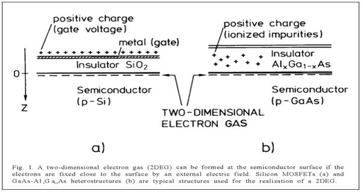
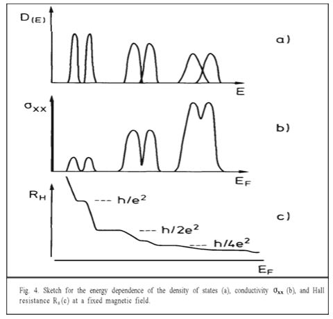
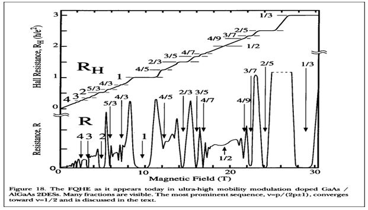

[**Volume III: Waves**](./volume-III.md)

[**Previous: 12.1. Bose-Einstein condensation, superfluidity and superconductivity.*](./vol-III-chap-12-sect-1.md) 

***

## 12.2.	Quantum Hall effects.

If an electric current flows through a conductor located in a magnetic field, this field exerts a transverse force on the carrier of moving charges, which tends to push them to one side of the conductor. The accumulation of charges on the sides of the conductor will balance this magnetic force, producing a measurable voltage between the two sides of the conductor. The presence of this measurable transverse voltage is called the Hall effect; it was discovered in 1879 by Edwin H. Hall (1855-1938). Hall performed his experiments at room temperature and with moderate magnetic fields of less than one tesla (T). 

Almost a century later, in 1980, Klaus von Klitzing discovered the quantum Hall effect in an interface between a metal and a semiconductor in a very clean material. Changes in the magnetic field resulted in changes in the Hall conductance that vary in steps of whole-number multiples of a constant. According to von Klitzing the quantized Hall resistance values was an indication that normal Ohmic resistance disappeared, and that the material became a sort of a superconductor. See his 1985 Nobel Lecture *The Quantized Hall Effect* (Figures 12.8 and 12.9 are from this Lecture).

{width="520"}

**Figure 12.8.** Experimental conditions for observing the quantized Hall effect.

{width="520"}

**Figure 12.9.** Experimental results reported in von Klitzing Nobel Lecture; (h is Planck constant and e the charge of the electron).

!!! info "Integral and Fractional Quantum Hall Effects."

	In experiments with the electron gas realized during 1982-1983, Störmer and Tsui worked on severe conditions of temperatures and magnetic fields (around -272°C and nearly 30 T). Although the electrons usually repel each other because they are fermions, according to Laughlin the reported fractional quantization was because the electron gas behaved as a new type of quantum fluid integrated by composite fermions that can condense and are produced by fractionally charged “quasiparticles”.

	In his 1998 Nobel Lecture *The Fractional Quantum Hall Effect* Störmer explains the main difference between IQHE (Integer Quantum Hall Effect) and FQHE (Fractional Quantum Hall Effect) (See Figure 12.10): *The IQHE can be understood solely on the basis of the quantized motion of individual 2D electrons in the presence of a magnetic field and random fluctuations of the interface potential which creates localized states. …. The origin of FQHE is interaction between electrons. It is therefore termed a many-particle effect or an electron correlation effect, since the charged electrons are avoiding each other by correlating their relative motion in an intricate manner.*

	{width="520"}

	(Source: MLA style: Horst L. Störmer – Nobel Lecture. NobelPrize.org. Nobel Prize Outreach AB 2023. Mon. 19 Jun 2023. <https://www.nobelprize.org/prizes/physics/1998/stormer/lecture/>)	

	**Figure 12.10.** Hall Resistance ($R_H$) showing many fractional values.

	The theorist of the three laureates, R.B. Laughlin, closed his Nobel lecture *Fractional Quantization* by saying: “Fractional quantum Hall quasiparticles are the elementary excitations of a distinct state of matter that cannot be deformed into noninteracting electrons without crossing a phase boundary. That means they are different from electrons in the only sensible way we have of defining different, and in particular are not adiabatic images of electrons the way quasiparticle excitations of metals and band insulators are.”
	
	(Source: MLA style: Robert B. Laughlin – Nobel Lecture. NobelPrize.org. Nobel Prize Outreach AB 2023.    Mon. 19 Jun 2023. <https://www.nobelprize.org/prizes/physics/1998/laughlin/lecture/>)

	For more details on this Nobel Prize see the Nobel Lecture *Interplay of Disorder and Interaction in Two-Dimensional Electron Gas in Intense Magnetic Fields* by D.C. Tsui.

***

[**Next: 12.3.	Analysis of learning trajectories.**](./vol-III-chap-12-sect-3.md)