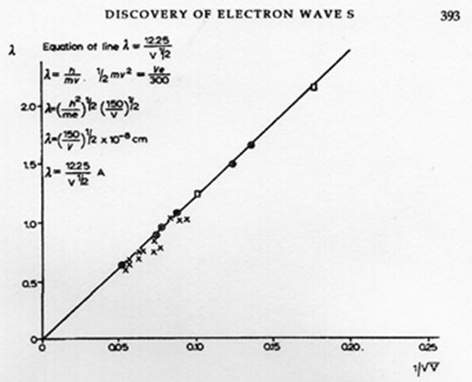
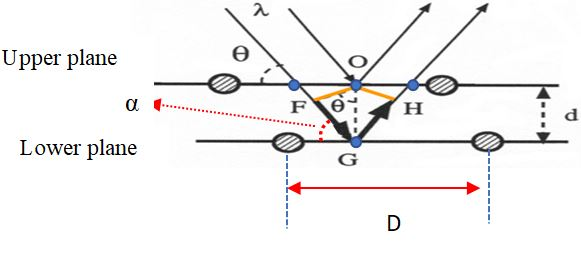

## 9.  Matter waves and quantum mechanics principles. 

*What is light made off?  Is it a wave or a corpuscle?*

By following Maxwell's theory and its experimental confirmation by Hertz, light is an electromagnetic radiation. It behaves like a wave when it propagates but interacts with matter as a quantum particle, the photon. Light behaves as a wave or as a corpuscle depending on the type of experiment where energy-matter is produced, detected, applied or transformed. The detailed content of the chapter is:

<blockquote>

### 9.   Matter waves and quantum mechanics principles. 
**9.1. From a theoretical proposition to an experimental demonstration.** 
The de Broglie hypothesis. 
Electron diffraction. 
**9.2. Correspondence and uncertainty principles in Quantum Physics.** 
Representation of the superposition of a sine waves packet. 
Does light behave as a wave or a corpuscle? 
Principles of correspondence and uncertainty. 
**9.3. Communication formats for describing scientific texts.** 
Nobel Lectures by L. de Broglie, C. J. Davisson, G. P. Thomson, N. Bohr, and W. Heisenberg.

</blockquote>

In Section 9.1 the existence of matter waves is considered, first from a theoretical point of view by explaining the de Broglie's hypothesis (Physics Nobel Prize in 1929) and then from an experimental point of view by analyzing the observations of electron diffraction by Davison and Thomson (Physics Nobel Prize in 1937).

The formulation of an appropriate mechanical description of the energy states of the electron and its movements around the nucleus gave rise to what was called wave mechanics because the movements of electrons were treated in terms of probabilistic matter waves. Later on, the name was changed into quantum mechanics implying that the movement is quantized both for radiation in terms of photons and for matter composed of atoms that are no longer indivisible and contains electrons in quantized energy states. The formulation of this new mechanics of the microscopic world required new principles: the correspondence principle proposed by Bohr (Physics Nobel Prize in 1922) and the uncertainty principle proposed by Heisenberg (Physics Nobel Prize in 1932). This issue is considered in section 9.2.

In Section 9.3 we apply *Communication formats for describing scientific texts* to describe diagrams and designs that refer to the organization of contents, and dialogues and discourses that concern the application of procedures. Examples of these communication formats are analyzed in Nobel Lectures related to matter waves and diffraction of electrons as well as to correspondence and uncertainty principles.  

## 9.1. From a theoretical proposition to an experimental demonstration. 

The quantization relationship $E = nhν$ connects the concept of energy (E), characteristic of particles, with frequency (ν) which is a typically wave property. The constant of proportionality is Planck's constant $h$, of the order of $10^{-27}$ erg.sec. The equation proposed by de Broglie $p = h/λ$ also connects a corpuscular property, the linear momentum (p), with a wave property, the wavelength (λ); again, the constant of proportionality is $h$. The equation $E = nhν$ refers to the quantization of energy and the equation $p = h/ λ$ concerns matter waves.

*The de Broglie hypothesis*

In 1924, Louis de Broglie presented his doctoral thesis *Investigations on the theory of quantum* where he proposed that material particles had wave properties; there he combined classical concepts of mechanics and optics with modern ideas of relativity and quantum treatments.

According to Einstein $E = mc^2$ and according to Planck $E = hν$ when $n = 1$. We also have the velocity of light $c = λν$, then $m = E/(c^2) = hν/(c^2) = hν/(cλν) = h/(cλ)$, from where $λ = h/(mc)$. This relationship applies to photons where $p = mc$, but de Broglie generalized it for every particle of mass $m$, velocity $v$, and linear momentum $p = mv$; that is, $λ = h/(mv) = h/p$ and therefore $p = h/ λ$. Particles satisfying this condition demonstrates the existence of matter waves. The following relativistic considerations were considered to obtain de Broglie’s equation $p = h/ λ$.

1. According to the theory of special relativity, the relation $E = hν$ applies to a photon observed in a fixed reference frame. Therefore, de Broglie assumed that a similar equation can be written for the same photon but observed from its own reference system. If in such a reference system the characteristic frequency of the photon is $ν_0$, then $hν_0 = m_0c^2$. 

The term $hν_0$ is an indication that a vibrational wave could be represented by the sinusoidal function $A_0 ≈ sin(2πν_0t_0)$ where $A_0$ is the amplitude and $t_0$ is the time measured in the reference system at rest.

2. The Lorentz transformations that relates the time $t_0$ to the time $t$ measured in a reference frame that moves with velocity $v$ in the $x$ direction with respect to the frame of the photon is $t_0= γ[t-\frac{vx}{c^2} ]$ where the relativistic parameter $γ=[ 1 - β^2 ]^{(-1⁄2)}$ with $β= \frac{v}{c}$.

In accordance with the above, the sinusoidal function in the system at rest can be written as $A(x,t)≈sin[2πν_0 γ(t-\frac{vx}{c^2} )]$, while for the moving system we will have $A(x,t)≈sin[2πν(t-\frac{x}{w})]$. This second equation represents a wave of frequency $ν$ and phase velocity $w =λν$, where $ν= γν_0$ and $w=  \frac{c^2}{v}$.

3. For the photon in the laboratory reference system $E = mc^2 = hν$. Substituting in this equation the relation $ν= γν_0$ we obtain $E = hν=hγν_0$.  Besides, using the relativistic relation $m = γm_0$ it results $E =mc^2= γm_0 c^2$. From $E = hγν_0 = γm_0 c^2w$ it can be obtained  $hν_0=m_0 c^2$.

Using the relationships $w= λν$, $w= \frac{c^2}{v}$, $ν= γν_0$, $m =γm_0$ and $hν_0=m_0 c^2$ it results

$λ=  \frac{w}{ν}=  (\frac{c^2⁄v}{ν}= \frac{c^2}{v(γν_0 )}   = (\frac{hc^2}{v})(\frac{1}{hγν_0})= (\frac{hc^2}{v})(\frac{1}{γm_0 c^2})= \frac{h}{mv+}= \frac{h}{p}$

In his article *A tentative theory of light quanta*, published in Phil. Mag. 47, 446 (1924), de Broglie wrote: *"We are inclined to suppose that everybody in motion can be accompanied by a wave and that it is impossible to separate the motion of the body from the propagation of the wave."*

To have an idea of the order of magnitude of the wavelength assigned by de Broglie to particles previously considered as corpuscles, see the following table Table 9.1. The second column shows the values of $λ$ measured in Ångstroms ($1Å = 10^{-10} m$) or in Fermis ($1F = 10^{-5}Å = 10^{-15} m$). Last column indicates the value of the energy with which the electrons are accelerated, expressed in electron-volts (eV) or in the corresponding temperature in Kelvin degrees (K).

<!-- HTML Table 1.1.1-->
<table width="100%">
<tr>
        <th colspan="3">
Table 9.1. Values of de Broglie wavelengths
</th>
 </tr>
    <tr>
    <th>
    PARTICLE
        </th>
     <th>
WAVELENGHT (λ)
        </th>
    <th>
ENERGY
    </th>
        </tr>
     <tr>
    <td>
    electron
    </td>
    <td>
    12.2  Å
    </td>
     <td>
    1.0 eV
    </td>
    </tr>
    <tr>
    <td>
    electron
    </td>
    <td>
    1.2  Å
    </td>
     <td>
    100 eV
    </td>
    </tr>
    <tr>
    <td>
    electron
    </td>
    <td>
    0.12 Å
    </td>
     <td>
    10,000 eV
    </td>
    </tr>
      <tr>
    <td>
    proton
    </td>
    <td>
    0.009 Å
    </td>
     <td>
    1 keV
    </td>
    </tr>
     <tr>
    <td>
    proton
    </td>
    <td>
   28.6 F
    </td>
     <td>
    1 MeV
    </td>
    </tr>
     <tr>
    <td>
    proton
    </td>
    <td>
   0.73 F
    </td>
     <td>
    1 GeV
    </td>
    </tr>
    <tr>
    <td>
   neutron
    </td>
    <td>
   1.5 Å
    </td>
     <td>
    300 K
    </td>
    </tr>
    <tr>
    <td>
   neutron
    </td>
    <td>
   9.0 F
    </td>
     <td>
    10 MeV
    </td>
    </tr>
     <tr>
    <td>
   Helium atoms
    </td>
    <td>
   0.75 Å
    </td>
     <td>
    300 K
    </td>
    </tr>
</table>

Source: taken from Table 2.1 (p. 65) in French and Taylor (1978).

*Electron diffraction.*

For an atom of mass $m$, radius $r$ and velocity $v$, its linear momentum is $p = mv$, the magnitude of its quantized angular momentum is $L = rp = nh/(2π)$. For $n = 1$, $p = h/(2πr)$. If $r = a_0$ is the Bohr radius $p = h/(2πa_0)$ and the de Broglie relation $λ = h/p = h/[h/(2πa_0)] = 2πa_0$. This means that the wavelength associated to the electron is of the order of the Bohr radius ($λ ≈ a_0 = 0.529 Å$).

The previous condition implies the possibility of obtaining diffraction patterns of matter waves if a beam of electrons passes through a double slit of the size of a0. This would resemble the light wave diffraction experiment performed in 1801 by Thomas Young (1773 – 1829) in 1801. The first experiments to detect matter waves were carried out around 1927, in an industrial laboratory in the United States by Clinton Davisson and Lester Germer (1896 -1971) and in a university laboratory in England by George Paget Thomson.

If an electron acquires its velocity $v$ due to the action of a potential difference $V$, in the case that $v << c$ we have that $½mev^2 = qeV$, where $m_e$ and $q_e$ are, respectively, the mass and charge of the electron. Therefore $p^2 = (mev)^2= 2meqeV$. Thus, de Broglie's hypothesis is represented by the straight line $λ= \frac{h}{p}= (\frac{h}{(2m_e q_e )^{½}})(\frac{1}{\sqrt{V}})$ (see Figure 9.1), reproduces Figure 4 from Davisson's Nobel Lecture *The Discovery of Electron Waves*:

 https://www.nobelprize.org/prizes/physics/1937/davisson/lecture/

Source: Figure 4 from Davisson's Nobel Lecture The Discovery of Electron Waves: https://www.nobelprize.org/prizes/physics/1937/davisson/lecture/

**Figure 9.1.** Graph of the equation $λ= (\frac{h}{\sqrt{2m_e q_e}})(\frac{1}{\sqrt{V}})$ reported by Davisson.

Davisson and Germer obtained $λ =1.66 Å$ for the diffraction of electrons when they used the values of the charge and mass of the electron and the experimental data for the voltage $V = 54$ volts. Their calculation was $λ=(\frac{h}{\sqrt{2m_e q_e}})(V^{-½})=\frac{12.25}{7.35}=1.66$ with $[V^{½}= 7.35]$. 

The result observed in the diffraction of electrons coincides with the corresponding values of $λ$ measured from the diffraction patterns obtained when X-rays hit upon crystals. According to the well-known Bragg formula, proposed in the years 1913-1914 by William Henry Bragg (1862 - 1942) and his son William Lawrence Bragg (1890 - 1971), the diffracted wavelength for X-rays is $nλ = 2dsinθ$. In this equation $d$ is the distance between the planes of the crystal atoms and $θ$ is the scattering angle formed between the direction of the incident radiation and the dispersion planes of the crystal lattice. The index $n = 1, 2, 3…$ indicates the order of diffraction (Figure 9.2).

Source: adapted from  https://es.wikipedia.org/wiki/Archivo:Difraccion.png

**Figure 9.2.** Diagram to obtain the Bragg formula $nλ = 2dsinθ$.

Bragg formula indicates that the diffraction of the incident radiation of wavelength (λ) is produced when the fronts of the incident waves are reflected by the crystal atoms. Previous figure shows that the distance $S = FG + GH$ corresponds to the difference in the paths traveled by the wave reflected in the upper plane with respect to the wave reflected in the lower plane. Figure 9.2 shows that $FG = GH = dsinθ$ because these distances are the hypotenuses of right triangles $FGO$ and $HGO$ (corresponding vertices are shown in blue). Bragg's formula implies that the total distance $S$ is equal to an integer multiple of $λ$, that is $S = 2dsinθ = nλ$.
			          
If in the Bragg formula the distance between the crystal planes $d$ is replaced by the distance $D$ between nearby atoms in a shell of the crystal $d = Dsin(α)$, with $α$ the angle between the crystal planes and the direction of incidence of radiation. From Figure 9.2 $θ = (π/2 – α)$ and therefore $nλ =2dsinθ = 2[Dsin(α)][sin(π/2 - α)]$. Using the trigonometric relations $sin(π/2 - α) = cos(α)$ and $2cos(α)sin(α) = sin(2α)$, we  obtain  $nλ = Dsin(2α)$. For $D = 2.15 Å$ and an angle $α = 50º$, for $n = 1$ Thomson obtained $λ =1.65 Å$, comparable with the value reported by Davisson and Germer:  $λ =1.66 Å$.

[**9.2. Correspondence and uncertainty principles in Quantum Physics.**](https://github.com/modphysnobel/pbook1/blob/main/docs/vol-III/vol-III-chap-9-sect-2.md)