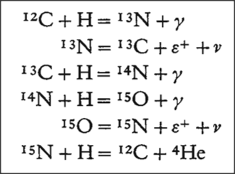

[**Volume IV: Universe**](./volume-IV.md)

[**Previous: 13.3. Levels of operation of the mechanisms of knowing.**](./vol-IV-chap-13-sect-3.md) 

***

## 14. Evolution of cosmology.

!!! abstract "Introduction"

	*What do we understand by cosmology?* 

	In this chapter we consider those Physics Nobel laureates that have contributed to improve our understanding of cosmology: the study of the origin and evolution of the universe. It refers to existing objects and observed phenomena detected outside the Earth. It implies very high energies, successes that are very old and had occurred long time ago. Up to now, explanations of some phenomena are still unclear and incomplete.

	**Learning objectives of Chapter 14.**

	After this Chapter you should be able to: 

	- Describe some Nobel laureate’s explanations of the structure and functioning of stars, pulsars, and black holes. 
	- Describe some Nobel laureate’s explanations of the structure and functioning of neutrino oscillations, background radiations, accelerated expansion, and exoplanets. 
	- Analyze Peebles’ Nobel Lecture *How Physical Cosmology Grew* in terms of the components of contextualization of learning.

!!! abstract "Description of content of Chapter 14."
 
	**Section 14.1.  Stars, pulsars, and black holes.**

	This section considers the Physics Nobel Prizes awarded in 1967 (the production of energy in stars like the Sun), in 1983 (the evolution of stars and the creation of elements), in 1974 (the observation of pulsars with radio telescopes), in 1993 (the discovery of a binary pulsar and the existence of gravitational waves) and in 2020 (the formation and detection of a black hole).

	**Section 14.2. Neutrino oscillations, background radiations, accelerating expansion, and exoplanets.**

	This section considers the Physics Nobel Prizes awarded in 1995 (the first detection of neutrinos), in 2002 (the detection of cosmic neutrinos and the discovery of X-ray sources) and in 2015 (the discovery of neutrino oscillations). It also includes the Prizes awarded in 1978 (the discovery of cosmic microwave background radiation), in 2006 (the discovery of the anisotropy of the cosmic microwave background radiation), in 2011 (the discovery of the accelerating expansion of the universe) and in 2019 (theoretical discoveries in physical cosmology and the discovery of an exoplanet orbiting a solar-type star). 

	**Section 14.3. Contextualization of learning about the universe.** 

	The three elements of contextualization of learning (problematic situation, generating questions, and learning and evaluation activities) are applied to the analysis of Peebles´ Nobel Lecture *How Physical Cosmology Grew.* 

	In the following Sections 14.1 and 14.2 we indicate the year of the Physics Nobel Prize award and to whom and for what kind of research. Then, we quote the document called *WORK* containing brief descriptions of the main contributions made by each laureate. For identification purposes, we indicate in parentheses the name of the corresponding laureates. Afterward, in PHYSICS CONTENT we summarize information taken from documents such as *Award ceremony speech, Press release, Speed read, Popular information*, and *Advanced information*. When required, selected excerpts are indicated in between quotation marks. We also include complementary information in Appendix 14.1 which refers to the titles and subtitles of Nobel Lectures, as well as all the references related to each Prize in MLA format. Appendix 14.2 contains excerpts of the complete Peebles´ Lecture. 

## 14.1. Stars, pulsars, and black holes.

In what follows, PNP means Physics Nobel Prize.

!!! info "PNP1967"

	**PNP1967:** awarded to Hans Albrecht Bethe "for his contributions to the theory of nuclear reactions, especially his discoveries concerning the energy production in stars".

	WORK (Bethe): “The discovery of fission—the splitting of heavy nuclei—revealed the liberation of large quantities of energy; an effect now exploited in nuclear reactors. This energy is generated by differences in mass. Energy is also liberated when light nuclei combine to form heavier ones, i.e. fusion. In 1938, Hans Bethe proved that fusion produces the enormous energy emitted by stars. He proposed two different processes, both of which result in hydrogen nuclei fusing with helium nuclei.”

	PHYSICS CONTENT (based on *Award ceremony speech* and on *Speed read: Stellar Nuclear Reactors*).

	- In the 1920s Arthur Eddington indicated that the innermost part of the sun is a hot gas mainly consisting of hydrogen and helium atoms which at the intense temperatures and pressures release energy when they fuse and create heavier atoms. 

	- Radioactivity was a possible explanation, but it was discarded by estimating that the sun might not contain enough radioactive substances to produce its energy.  

	- Considering Rutherford´s model of the atom and the possibility to produce transmutations of the chemical elements, it remained the question of the stability of protons and neutrons inside the nuclei. 

	- Gamow proposed the application of nuclear physics to astronomy implying that the velocities of the protons at the high temperature of the sun would be able to produce enough energy. Nevertheless, reactions in atomic reactors are different, they are very fast and artificially produced by neutrons. 

	- Bethe proposed two different processes, both of which resulted in hydrogen nuclei fusing with helium nuclei: (1) two protons collide and form a nucleus of heavy hydrogen, the surplus of electric charge vanishing in the form of a positive electron, afterwards helium nucleus are formed with four protons when more protons are captured, and (2) the presence of carbon which will practically not be consumed but acts as a catalyst.

	- In his Nobel Lecture Bethe considered first the reaction $H+H=D+ε^+ +ν$, where $H$ and $D$ corresponded, respectively, to hydrogen and deuterium, $ε^+$ to a positron and $ν$ to a neutrino. The second process required the presence of carbon and was represented by the following cycle of reactions:

	{width="350"}

!!! info "PNP1983"

	**PNP1983:** divided equally between Subramanyan Chandrasekhar "for his theoretical studies of the physical processes of importance to the structure and evolution of the stars" and William Alfred Fowler "for his theoretical and experimental studies of the nuclear reactions of importance in the formation of the chemical elements in the universe".

	WORK (Chandrasekhar): “Stars in the universe form from clouds of gas and dust. When these clouds are pulled together by gravitational force, energy is released in the form of heat. And when a high enough temperature is reached, reactions among the atomic nuclei in the star’s interior begin. Beginning in the 1930s, Subramanyan Chandrasekhar formulated theories for the development that stars subsequently undergo. He showed that when the hydrogen fuel of stars of a certain size begins to run out, it collapses into a compact, brilliant star known as a white dwarf.”

	WORK (Fowler): “Stars in the universe form from clouds of gas and dust. When these clouds are pulled together by gravitational force, energy is released in the form of heat. And when a high enough temperature is reached, reactions among the atomic nuclei in the star’s interior begin. These reactions are what causes radiation from stars. In the 1950s William Fowler showed how these nuclear reactions also account for how various elements are formed. These processes have created the elements that make up our earth and other heavenly bodies in the universe.”

	PHYSICS CONTENT (based on *Press release* and *Speed read: Death of a Star & Alchemy in the Stars*).

	- In the 1920s, scientists considered that when a star burns off all its energy supply a white dwarf emerges from the burnt-out ashes. 

	- In 1939, Bethe showed that the Sun generates energy as heat and light by squashing hydrogen atoms together to form helium.

	- In 1930, Chandrasekhar proposed that stars more than 1.4 times the mass of the Sun, like stable white dwarf, will collapse under the force of their own weight. 

	- If the original star was up to 2-3 times the mass of the Sun, after explosion a highly dense neutron star will be formed. In stars more than 2-3 times the mass of the Sun the force of gravity becomes so strong that matter disappears entirely into a black hole.

	- Stars bigger than the Sun, can fuse heavier elements than helium, creating all the elements up to iron which requires too much energy as the one produced when a large star dies in a supernova explosion. 

	- In 1950, Fowler and his colleagues studied how the chemical elements are generated within the stars through nuclear reactions. They made theoretical calculations of the steps involved in such nuclear reactions and interpreted experimental results from particle accelerators for describing the behavior of elements. 

!!! info "PNP1974"

	**PNP1974:** awarded jointly to Sir Martin Ryle and Antony Hewish "for their pioneering research in radio astrophysics: Ryle for his observations and inventions, in particular of the aperture synthesis technique, and Hewish for his decisive role in the discovery of pulsars".

	WORK (Ryle): “Stars and other astronomical objects emit not only visible light, but also radio waves. In the 1940s Martin Ryle developed a telescope designed to capture radio waves and methods for reading and processing the data received. By connecting a number of telescopes several kilometers from one another, he created the equivalent of a telescope as large as the entire surface between the individual telescopes. This paved the way for a precise mapping of stars and galaxies and a clearer picture of the universe’s evolution.”

	WORK (Hewish): “Stars and other astronomical objects emit not only visible light, but also radio waves. In 1967 Antony Hewish and Jocelyn Bell discovered a previously unknown source of radiation that emitted radio waves in the form of pulses at intervals that were extremely regular. It turned out that this type of astronomical object, which became known as pulsars, has a core consisting of an extremely compact star, a neutron star. Their discovery allowed scientists to prove these stars exist.”

	PHYSICS CONTENT (based on *Press release* and *Speed read: Radio Stars*).

	- Radio astronomy is the study of the universe made by detecting and analyzing radio waves emitted by stars and other cosmological objects. Those objects have been registered over distances thousands of millions of lightyears or more. All these happened many years ago, at the beginning of the universe. A light year is the distance that light travels during a year of 31,556 952 seconds at a speed of 299 792 458 m/s. Such distance is the product of velocity multiplied by time; it corresponds to 9.460 536 207 $ \times 10^{15}$ meters per second, nearly $10^{16}$ m/s.

	- The aperture synthesis technique developed by Martin Ryle consisted in connecting a series of small mutually adjustable and steerable radio antennae attached to large receiver dishes. All these antennae were pointing out in the same direction of observation. The positions of the radio telescopes were adjustable within nearly 5 kilometers and considered that the earth turns once a day in relation to the celestial sphere.

	- Hewish and Bell discovered a dense, burnt-out remains of a massive neutron star that had been formed as a consequence of a supernova explosion. When viewed from Earth, this object was observed spinning around rapidly and emitting shorts radio wave pulses, extremely regularly and almost every second. This revealed the presence of a neutron star: the nucleus of the pulsar. That star was surrounded with a plasma, a gas conducting electricity; the whole system was immersed in a turning strong magnetic field.

!!! info "PNP1993"

	**PNP1993:** awarded jointly to Russell A. Hulse and Joseph H. Taylor Jr. "for the discovery of a new type of pulsar, a discovery that has opened up new possibilities for the study of gravitation".

	WORK (Russell and Taylor): “Pulsars are very compact stars that radiate radio waves with very regular variations. In 1974 Russell Hulse and James Taylor discovered a pulsar comprised of two stars in very close proximity that rotate around each other. Hulse and Taylor could demonstrate that the stars’ radiation and movements correspond with Einstein’s general theory of relativity. Among other things, this theory predicts that the pulsar would emit energy in the form of gravitational waves, which should result in slowly declining intervals. Taylor was able to confirm this in 1978.”

	PHYSICS CONTENT (based on *Press release* and *Speed read: Catching Gravity´s Waves*).

	- In 1915 Einstein explained that gravity is caused by changes in the geometry of space and time: space-time curves near the presence of massive bodies such as very big stars. He also predicted the formation of ripples of gravitational radiation as these bodies move through the cosmos. In 1919 Arthur Eddington announced the deflection of starlight passing near the surface of the sun; this was verified during solar eclipse expeditions.

	- In 1960 Robert Dicke performed experiments for verifying the equivalence principle (the identity between gravitational and inertial mass) by considering the sun’s gravitational field on Earth. In 1964 Irwin Shapiro predicted and experimentally verified using radar echoes from Mercury, that different signals passing through an intense gravitational field need more time to pass through that field.

	- In 1967 the first pulsar was discovered by Antony Hewish in the radioastronomy laboratory in Cambridge, England. In 1974 Russell Hulse and Joseph Taylor discovered a binary pulsar using the 300-m radio telescope at Arecibo, Puerto Rico. They also tested the prediction of Einstein’s theory of general relativity that an astronomical system losing energy might emit gravitational waves.
 
	- Hulse discovered a pair of pulsars close enough together, spiraling very fast in orbit around each other. Taylor confirmed Einstein’s prediction by showing that the two pulsars were behaving almost exactly as predicted by the theory. The change in the orbit period was assumed to occur because the system was emitting energy in the form of gravitational waves. 

	- Beginning in the 1970s the LIGO detector was developed using laser technology to measure small changes in length caused by gravitational waves. Later, in 2015 gravitational waves were detected for the first time and in 2017 the Physics Nobel Prize was awarded to Rainer Weiss, Barry C. Barish and Kip S. Thorne "for decisive contributions to the LIGO detector and the observation of gravitational waves". LIGO stands for Laser Interferometer Gravitational-Wave Observatory. (See for more information the Section 10.2. Gravitational astronomy, Chapter 10. Interferences of electromagnetic and gravitational waves, Volume III. Waves.)

!!! info "PNP2020"

	**PNP2020:** divided, one half awarded to Roger Penrose "for the discovery that black hole formation is a robust prediction of the general theory of relativity", the other half jointly to Reinhard Genzel and Andrea Ghez "for the discovery of a supermassive compact object at the centre of our galaxy".

	WORK (Penrose): “A black hole is a supermassive compact object with a gravitational force so large that nothing, not even light, can escape from it. In 1964, Roger Penrose proposed critical mathematical tools to describe black holes. He showed that Einstein’s general theory of relativity means the formation of black holes must be seen as a natural process in the development of the universe. He was also able to describe black holes in detail: at their farthest depths is a singularity where all known laws of nature dissolve.”

	WORK (Genzel and Ghez): “A black hole is a supermassive compact object with a gravitational force so large that nothing, not even light, can escape from it. Since nothing, not even light, can escape black holes, they can only be observed by the radiation and the movement of nearby objects. Since the 1990s, Reinhard Genzel and Andrea Ghez with their respective research teams, have developed and refined techniques for studying the movement of stars. Observations of stars in the area around Sagittarius A* in the middle of our galaxy, the Milky Way, revealed a super massive black hole.”

	PHYSICS CONTENT (based on *Press release* and *Popular information*).

	- At the end of the 18th century, John Michell and Pierre Simon de Laplace mentioned that heavenly bodies could become so dense that they would be invisible.

	- In 1915 Albert Einstein presented his first version of a theory of general relativity as a new foundation for understanding gravity: the force that bends space and slows time. Around that time Karl Schwarzschild described how heavy masses can bend space and time. Einstein predicted that extremely heavy objects could form a black hole by encapsulating a singularity in space. Blach holes are surrounded by an event horizon that *sweeps around the mass at its center like a veil* that hides the black hole.

	- In 1930s Robert Oppenheimer calculated how a massive gigantic star explodes as a supernova when it is run out of fuel and then collapses into extremely densely packed remnants, so heavy that gravity pulls everything inside, even light.

	- In 1963, the identification of the radio source 3C 48 signaled the discovery of a quasar: a “quasi-stellar radio source”.  These are the brightest objects in the universe; it is assumed that they are luminous active galactic nucleus whose radiant electromagnetic energy is powered by a supermassive black hole surrounded by a gaseous hot accretion disc.

	- In 1965 Roger Penrose proved that the existence of black holes was a direct consequence of the general theory of relativity. He analyzed the inner structure of black holes and studied the gravitational conditions that nearby the immediate vicinity of those invisible objects capture everything that enters them. Penrose conceived the notion of *trapped force* as a mathematical tool needed to describe what happens in a black hole when all incoming radiation points toward its center, hiding a singularity, a boundary where time and space end. *Time then replaces space and all possible paths point inwards, the flow of time carrying everything towards an inescapable end at the singularity.*

	- Since 1990, two teams of astronomers headed by Reinhard Genzel and Andrea Ghez, discovered that a supermassive black hole governed the orbits of stars at the center of our galaxy in a region called Sagittarius A*. Although the two teams worked independently, the measurements obtained by each one of them were in excellent agreement. They refined new techniques to compensate for distortions caused by the Earth’s atmosphere and build unique instruments for observing stars movements during systematic research projects of nearly thirty years.

	- Using the orbits of the stars as guides, the two teams produced the most convincing evidence that nearby Sagittarius A* there was hiding an invisible supermassive object: a black hole that was formed when a massive star collapsed under its own gravity. Starting in 1992 they mapped the entire orbit of one of the brightest stars, the one identified as S2, which completes an orbit at the center of the galaxy in less than 16 years. They found that the radial velocity of S2 increases as it approached Sagittarius A* and decreased as it moved away along its elliptical orbit. A black hole was the only possible explanation of this observed effect.

***

[**Next: 14.2. Neutrino oscillations, background radiations, accelerating expansion, and exoplanets.**](https://github.com/modphysnobel/pbook1/blob/main/docs/vol-IV/vol-IV-chap-14-sect-2.md)