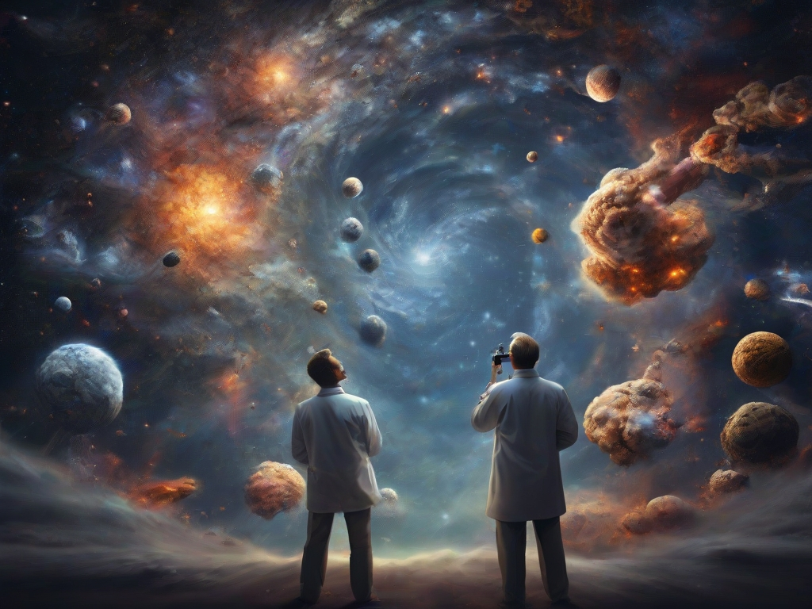

[**Home**](../index.md)

***

## IV. UNIVERSE

{width="840"}

(Image credit: [Leonardo AI](https://leonardo.ai/))

***

This is the fourth book of the series EXPLORING MODERN PHYSICS VIA NOBEL PRIZES. It refers to understanding the universe. According to Carl Sagan: “the universe is all that existed, exists and will exist”. Understanding requires asking questions and proposing answers that foster the improvement of knowledge. It means to bite the unknown.

The study of the universe is like archaeology in the sense that it concerns the reconstruction of what is past and like history because it consists in the interpretation of what has been registered. The traces of the past serve to interpret the present and propose radiographies of possible futures.

Physics, as a natural science, deals with objects and forces acting in macroscopic regions at the beginning of time and in microscopic regions observed in modern accelerators of particles. Social sciences refer to individuals and their evolving societies whose properties and tendencies are studied in terms of these reference systems: the individuals or the societies.

We review and comment those essential nodes of a cognitive network of explanations, discoveries, and inventions that have been recognized with Physics Nobel Prizes and Prizes in Economic Sciences in Memory of Alfred Nobel. Theories and experiments and the ways of building and applying concepts and models are quite different in universes integrated by particles or waves and energy, as compared with those universes where the participants are humans or societies. In both universes Mathematics are bridges for solving problems and ladders for attaining better and better explanations. 

Sometimes in natural and social sciences the descriptions and explanations of data and their consequences are accessible before the synthesis of their representations, interpretations and predictions could be proposed and tested. Sometimes, the facts and their probable causes can be understood and communicated in coherent and consistent ways before new observable and measurable results present challenging questions to be solved in terms of similar causal relationships. 

***

The content of this Volume is the following:

## 13.    Development of knowledge in high energy physics.     
### 13.1  [Steps in the development of Nuclear Physics.](vol-IV/vol-IV-chap-13-sect-1.md).
### 13.2  [Steps in the development of Particle Physics.](vol-IV/vol-IV-chap-13-sect-2.md).
### 13.3  [Levels of operation of the mechanisms of knowing.](vol-IV/vol-IV-chap-13-sect-3.md).

## 14.    Evolution of cosmology.
### 14.1 [Stars, pulsars and black holes](vol-IV-chap-14-sect-1.md).
### 14.2 [Neutrinos and radiations](vol-IV-chap-14-sect-2.md).
### 14.3 [Contextualization of learning about the universe](vol-IV-chap-14-sect-3.md).

## 15.    Universes composed by humans and societies.
### 15.1 [Selection of Prizes in Economic Sciences in Memory of Alfred Nobel dealing with econometry and some economic theories.](vol-IV-chap-15-sect-1.md).
### 15.2 [Description of the 1969 Prize to Ragnar Frisch and Jan Tinbergen “for having developed and applied dynamic models for the analysis of economic processes”.](vol-IV-chap-15-sect-2.md).
### 15.3 [Description of the 2021 Prize to David Card “for his empirical contributions to labour economics” and to Joshua D. Angrist and Guido W. Imbens “for their methodological contributions to the analysis of causal relationships”.](vol-IV-chap-15-sect-3.md).

***

Created: 2023-03-12; Updated: 2023-11-24 

Barojas-Weber, J.R., & Lizárraga-Celaya, C. (2023).
_Modern Physics through Nobel Prizes_.

[Creative Commons:  Attribution-NonCommercial-ShareAlike 4.0 International](https://creativecommons.org/licenses/by-nc-sa/4.0/legalcode)

